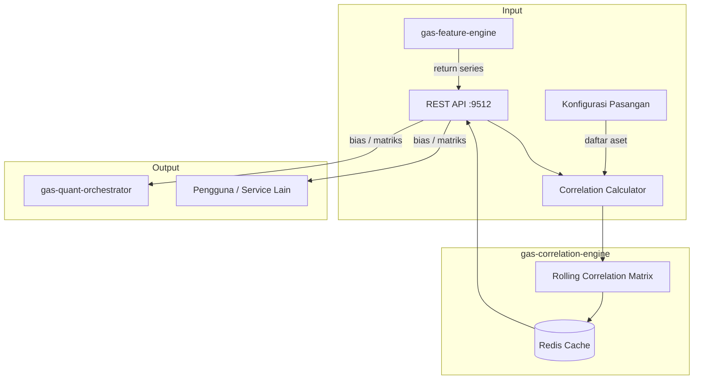

🚀 SERVICE TEMPLATE – @goldenaistrategy
📛 SERVICE NAME
gas-correlation	API	9512	Cross-Asset Correlation (Dalio)	Rolling correlation & intermarket bias	Multi-simbol → Correlation → Bias	Planned																

🧱 0. INSTALASI ENVIRONMENT
🐍 Python
<isi langkah instalasi python environment>
🐳 Docker
<isi langkah instalasi docker & docker compose>
⚙️ 1. TUTORIAL MANAGEMENT SERVICE
🐍 Python Mode
▶️ Run
<command run>
⛔ Stop
<command stop>
🔄 Restart
<command restart>
❌ Delete Environment
<command delete env>
🐳 Docker Mode
▶️ Build & Run
<command build & run>
📊 Check Status
<command cek status>
⛔ Stop
<command stop>
🔄 Restart
<command restart>
❌ Delete Container / Image
<command delete>

📦 2. SETUP GITHUB (FIRST TIME)
echo "# gas-correlation" >> README.md
git init
git add README.md
git commit -m "first commit"
git branch -M main
git remote add origin https://github.com/Muhamadridwanjr/gas-correlation.git
git push -u origin main
…or push an existing repository from the command line
git remote add origin https://github.com/Muhamadridwanjr/gas-correlation.git
git branch -M main
git push -u origin main

📛 4. CONTAINER NAMING
<ketentuan nama container = nama project>
🌐 5. HEALTH CHECK (STATUS 200 OK)
Endpoint
<endpoint-url>
Expected Response
<response contoh>
🧪 6. DEBUG & LOGGING
Docker Logs
<command docker logs>
Application Logs
<setup logging>
Healthcheck Configuration
<docker healthcheck config>
🟢 7. CONTAINER STATUS
<expected: Up (healthy)>
🔗 8. INTEGRASI GAS-GATEWAY-API
Configuration
<env / config url>
Request Example
<request example>
🧠 9. INTEGRASI DENGAN @goldenaistrategy
<standarisasi service dalam ecosystem>
🔄 10. KOMUNIKASI ANTAR SERVICE
Network Configuration
<docker network config>
Service Communication
<contoh komunikasi antar service>
📁 STRUKTUR PROJECT
# 🔗 GAS Correlation Engine

**Bagian dari Ekosistem GAS (Gas Automatic Strategy) – Edge Legendary Layer (VPS 5)**  
Service yang terinspirasi dari **Ray Dalio** dan pendekatan **All Weather Portfolio**, yang menekankan pentingnya memahami korelasi antar aset untuk membangun portofolio yang seimbang dan mengidentifikasi peluang trading berdasarkan pergerakan aset terkait. Service ini menghitung korelasi bergulir (rolling correlation) antara berbagai aset (forex, komoditas, indeks, crypto) dan memberikan **bias** (bullish/bearish) untuk suatu aset berdasarkan pergerakan aset lain yang berkorelasi kuat.

---

## 📋 Daftar Isi

- [Ikhtisar](#ikhtisar)
- [Arsitektur](#arsitektur)
- [Alur Kerja](#alur-kerja)
- [Fitur Utama](#fitur-utama)
- [Teknologi](#teknologi)
- [Struktur Direktori](#struktur-direktori)
- [Instalasi & Menjalankan](#instalasi--menjalankan)
- [Konfigurasi](#konfigurasi)
- [API Reference](#api-reference)
- [Integrasi dengan Service Lain](#integrasi-dengan-service-lain)
- [Pengujian](#pengujian)
- [Pengembangan](#pengembangan)
- [Kontribusi (Tim Internal)](#kontribusi-tim-internal)
- [Lisensi & Kredit](#lisensi--kredit)

---

## 🔍 Ikhtisar

**gas-correlation-engine** adalah service yang memonitor hubungan statistik antar aset secara real‑time. Dengan mengetahui aset mana yang bergerak searah (korelasi positif) atau berlawanan (korelasi negatif), trader dapat:

- **Mengonfirmasi sinyal**: Jika suatu aset memberikan sinyal beli, dan aset yang berkorelasi positif juga menguat, sinyal semakin kuat.
- **Mendeteksi divergensi**: Jika dua aset yang biasanya berkorelasi positif tiba‑tiba bergerak terpisah, itu bisa menjadi sinyal pembalikan.
- **Mengelola risiko**: Dengan mengetahui korelasi, kita dapat menghindari overexposure pada aset yang bergerak sama.
- **Mendapatkan bias**: Misalnya, jika DXY (indeks dolar) menguat, biasanya emas (XAUUSD) melemah (korelasi negatif). Service ini akan memberikan bias **bearish** untuk XAUUSD ketika DXY naik signifikan.

Service ini menggunakan data harga dari `gas-feature-engine` (returns) untuk menghitung korelasi bergulir (rolling correlation) dengan periode tertentu (misal 20, 50, 100). Hasilnya adalah matriks korelasi antar aset yang selalu diperbarui.

---

## 🏗️ Arsitektur



### Komponen Utama
- **REST API** (port 9512) – Menerima permintaan untuk mendapatkan matriks korelasi atau bias untuk aset tertentu.
- **Correlation Calculator** – Inti perhitungan: mengambil data return beberapa aset, menghitung korelasi berpasangan secara rolling.
- **Rolling Correlation Matrix** – Menyimpan matriks korelasi terkini di memori/cache.
- **Redis Cache** – Menyimpan hasil perhitungan untuk periode tertentu agar tidak perlu menghitung ulang setiap kali ada permintaan.

---

## 🔄 Alur Kerja

1. **Inisialisasi**: Service memiliki daftar aset yang akan dipantau (bisa dari konfigurasi atau dinamis). Daftar ini bisa mencakup mayor, cross, komoditas, indeks, crypto.
2. **Pengambilan Data**: Secara periodik (misal setiap menit), service mengambil data return terbaru dari `gas-feature-engine` untuk semua aset dalam daftar.
3. **Perhitungan Korelasi**:
   - Untuk setiap pasangan aset, hitung korelasi Pearson bergulir (rolling window) dengan periode yang telah ditentukan (misal 20, 50, 100).
   - Simpan hasilnya di Redis dengan struktur yang memudahkan akses.
4. **Serving**:
   - Ketika ada permintaan `GET /correlation/matrix`, service mengembalikan matriks korelasi terkini.
   - Ketika ada permintaan `POST /bias` dengan simbol tertentu, service menganalisis perubahan harga aset lain yang berkorelasi kuat dan memberikan bias (bullish/bearish/neutral).
5. **Bias Calculation**:
   - Ambil daftar aset yang memiliki korelasi absolut tinggi (misal > 0.7) dengan aset target.
   - Untuk setiap aset tersebut, lihat perubahan harga terbaru (return 1 periode).
   - Jika aset dengan korelasi positif bergerak naik, beri sinyal bullish pada target. Jika turun, bearish.
   - Jika aset dengan korelasi negatif bergerak naik, beri sinyal bearish pada target (karena berlawanan).
   - Agregasi sinyal dari beberapa aset menjadi bias final.

**Contoh Request Bias:**
```json
{
  "symbol": "XAUUSD",
  "window": 20,
  "threshold": 0.7
}
```

**Contoh Response:**
```json
{
  "symbol": "XAUUSD",
  "bias": "BEARISH",
  "confidence": 0.75,
  "factors": [
    {"symbol": "DXY", "correlation": -0.85, "change": 0.002, "contribution": "bearish"},
    {"symbol": "US10Y", "correlation": -0.65, "change": 0.005, "contribution": "bearish"}
  ]
}
```

---

## ✨ Fitur Utama

- **Rolling Correlation Matrix**: Hitung korelasi bergulir untuk periode yang dapat dikonfigurasi (20, 50, 100).
- **Multi‑aset**: Dapat memantau puluhan aset sekaligus (forex, komoditas, indeks, crypto).
- **Bias Otomatis**: Memberikan bias (bullish/bearish) untuk aset berdasarkan pergerakan aset lain yang berkorelasi.
- **Threshold Configurable**: Ambang batas korelasi untuk menentukan aset mana yang dianggap signifikan.
- **Caching**: Hasil perhitungan disimpan di Redis untuk akses cepat.
- **Extensible**: Mudah menambah aset baru atau mengubah periode.

---

## 🛠️ Teknologi

- **Bahasa:** Python 3.11+
- **Web Framework:** FastAPI (REST)
- **Komputasi:** `numpy`, `pandas` (untuk perhitungan korelasi)
- **Cache:** Redis (`redis.asyncio`)
- **Market Data Client:** HTTP ke `gas-feature-engine` untuk mendapatkan return series
- **Container:** Docker, Docker Compose

---

## 📁 Struktur Direktori

```
gas-correlation-engine/
├── src/
│   ├── __init__.py
│   ├── main.py                     # Entry point FastAPI
│   ├── config.py                    # Pydantic settings
│   ├── api/
│   │   ├── __init__.py
│   │   ├── routes.py                # Endpoint /correlation, /bias
│   │   └── models.py                # Pydantic models
│   ├── core/
│   │   ├── __init__.py
│   │   ├── calculator.py             # Perhitungan korelasi
│   │   ├── bias.py                   # Logika bias
│   │   ├── asset_manager.py          # Kelola daftar aset
│   │   └── exceptions.py
│   ├── clients/
│   │   ├── __init__.py
│   │   └── feature_client.py         # Ambil return dari feature-engine
│   ├── cache/
│   │   ├── __init__.py
│   │   └── redis_cache.py
│   ├── lib/
│   │   ├── logger.py
│   │   └── utils.py
│   └── workers/
│       └── correlation_updater.py     # Background update korelasi
├── tests/
├── Dockerfile
├── docker-compose.yml
├── .env.example
├── requirements.txt
└── README.md
```

---

## ⚙️ Instalasi & Menjalankan

### Prasyarat
- Python 3.11+
- Redis server
- `gas-feature-engine` (9499) berjalan (untuk mengambil return series)

### Langkah Cepat (Development)

1. Clone repositori (internal):
   ```bash
   git clone https://github.com/gasstrategy/gas-correlation-engine.git
   cd gas-correlation-engine
   ```

2. Buat virtual environment:
   ```bash
   python -m venv venv
   source venv/bin/activate
   ```

3. Install dependencies:
   ```bash
   pip install -r requirements-dev.txt
   ```

4. Copy environment:
   ```bash
   cp .env.example .env
   # Isi REDIS_URL, FEATURE_ENGINE_URL, daftar aset, dll.
   ```

5. Jalankan Redis (jika belum):
   ```bash
   docker run -d -p 6379:6379 redis
   ```

6. Jalankan service:
   ```bash
   uvicorn src.main:app --reload --port 9512
   ```

### Dengan Docker Compose

```yaml
version: '3.8'
services:
  redis:
    image: redis:alpine
    ports:
      - "6379:6379"

  correlation:
    build: .
    ports:
      - "9512:9512"
    environment:
      - REDIS_URL=redis://redis:6379
      - FEATURE_ENGINE_URL=http://gas-feature-engine:9499
      - ASSET_LIST=["XAUUSD","DXY","EURUSD","GBPUSD","BTCUSD","ETHUSD","US30","SPX500"]
    depends_on:
      - redis
```

Jalankan:
```bash
docker-compose up -d
```

---

## 🔧 Konfigurasi

Environment variables (file `.env`):

| Variabel | Default | Deskripsi |
|----------|---------|-----------|
| `PORT` | 9512 | Port REST API |
| `REDIS_URL` | redis://localhost:6379 | Koneksi Redis |
| `FEATURE_ENGINE_URL` | http://gas-feature-engine:9499 | URL untuk ambil return series |
| `FEATURE_ENGINE_API_KEY` | (opsional) | API key jika diperlukan |
| `ASSET_LIST` | ["XAUUSD","DXY","EURUSD","GBPUSD","BTCUSD","ETHUSD","US30","SPX500"] | Daftar aset yang dipantau (JSON array) |
| `CORRELATION_WINDOWS` | [20, 50, 100] | Periode rolling correlation (JSON array) |
| `UPDATE_INTERVAL` | 60 | Interval update korelasi (detik) |
| `CACHE_TTL` | 60 | TTL cache hasil (detik) |
| `DEFAULT_THRESHOLD` | 0.7 | Ambang batas korelasi untuk bias |
| `LOG_LEVEL` | INFO | Level logging |
| `ENVIRONMENT` | development | production/staging/development |

---

## 📡 API Reference

### `GET /correlation/matrix` – Mendapatkan matriks korelasi terkini

**Parameter Query:**
- `window` (int, optional) – Periode rolling (default 20). Jika tidak ada, kembalikan semua periode.

**Response:**
```json
{
  "window": 20,
  "matrix": {
    "XAUUSD": {
      "DXY": -0.85,
      "EURUSD": 0.23,
      "BTCUSD": -0.12,
      ...
    },
    ...
  }
}
```

### `GET /correlation/pair` – Mendapatkan korelasi antara dua aset

**Parameter Query:**
- `symbol1` (string, required)
- `symbol2` (string, required)
- `window` (int, optional) – default 20

**Response:**
```json
{
  "symbol1": "XAUUSD",
  "symbol2": "DXY",
  "window": 20,
  "correlation": -0.85
}
```

### `POST /bias` – Mendapatkan bias untuk suatu aset

**Request Body:**
```json
{
  "symbol": "XAUUSD",
  "window": 20,
  "threshold": 0.7,
  "include_factors": true
}
```

**Response:**
```json
{
  "symbol": "XAUUSD",
  "window": 20,
  "bias": "BEARISH",
  "confidence": 0.75,
  "factors": [
    {"symbol": "DXY", "correlation": -0.85, "return": 0.002, "contribution": "bearish"},
    {"symbol": "US10Y", "correlation": -0.65, "return": 0.005, "contribution": "bearish"}
  ]
}
```

### `GET /health` – Health check
```json
{"status": "ok"}
```

### `GET /assets` – Mendapatkan daftar aset yang dipantau

---

## 🔗 Integrasi dengan Service Lain

- **`gas-feature-engine` (9499)** – Menyediakan return series untuk semua aset.
- **`gas-quant-orchestrator` (9500)** – Menggunakan bias untuk memperkaya skor sinyal.
- **`gas-market-phase-engine` (9510)** – Fase pasar dapat mempengaruhi interpretasi korelasi (misal saat krisis, korelasi cenderung meningkat).
- **`gas-risk-engine` (9511)** – Korelasi digunakan untuk menghitung risiko portofolio.
- **Redis** – Cache dan penyimpanan state.

---

## 🧪 Pengujian

```bash
pytest tests/ -v
# dengan coverage
pytest --cov=src tests/
```

Unit test mencakup:
- Perhitungan korelasi dengan data dummy.
- Logika bias.
- Cache.
- Validasi input.

---

## 👨‍💻 Pengembangan

### Menambah Aset Baru
Cukup tambahkan simbol ke dalam `ASSET_LIST` di konfigurasi. Service akan otomatis mengambil data dan menghitung korelasi.

### Menambah Metode Korelasi
Selain Pearson, bisa ditambahkan korelasi Spearman atau Kendall. Implementasi di `calculator.py`.

### Aturan Kode
- Type hints wajib.
- Docstring untuk fungsi publik.
- Ikuti PEP 8 (black).
- Pastikan semua test lulus.

---

## 🔒 Kontribusi (Tim Internal)

Repositori ini bersifat **private** – hanya untuk tim internal GAS.  
Untuk berkontribusi:

1. Buat branch baru (`feature/`, `fix/`).
2. Commit dengan pesan jelas.
3. Buka Pull Request ke `develop`.
4. Tunggu review dan minimal satu approval.

**Aturan Penting:**
- Jangan commit kredensial.
- Gunakan environment variable untuk konfigurasi.
- Jangan sebarkan kode ke luar tim.

---

## 📄 Lisensi & Kredit

**Hak Cipta © 2025 Muhamad RidwanJr dan Tim GAS.**  
Seluruh hak cipta dilindungi undang-undang. Tidak untuk disebarluaskan tanpa izin tertulis.

Service ini dikembangkan sebagai bagian dari ekosistem **Golden AI Strategy**, terinspirasi dari prinsip All Weather Portfolio Ray Dalio.

---

**🔥 GAS Correlation Engine – Memahami Interkoneksi Pasar**
✅ FINAL CHECKLIST
[ ] Container name sesuai project  
[ ] Status container: Up (healthy)  
[ ] Endpoint mengembalikan 200 OK  
[ ] Tidak ada error pada logs  
[ ] Terintegrasi dengan GAS Gateway API  
[ ] Antar service dapat saling berkomunikasi  