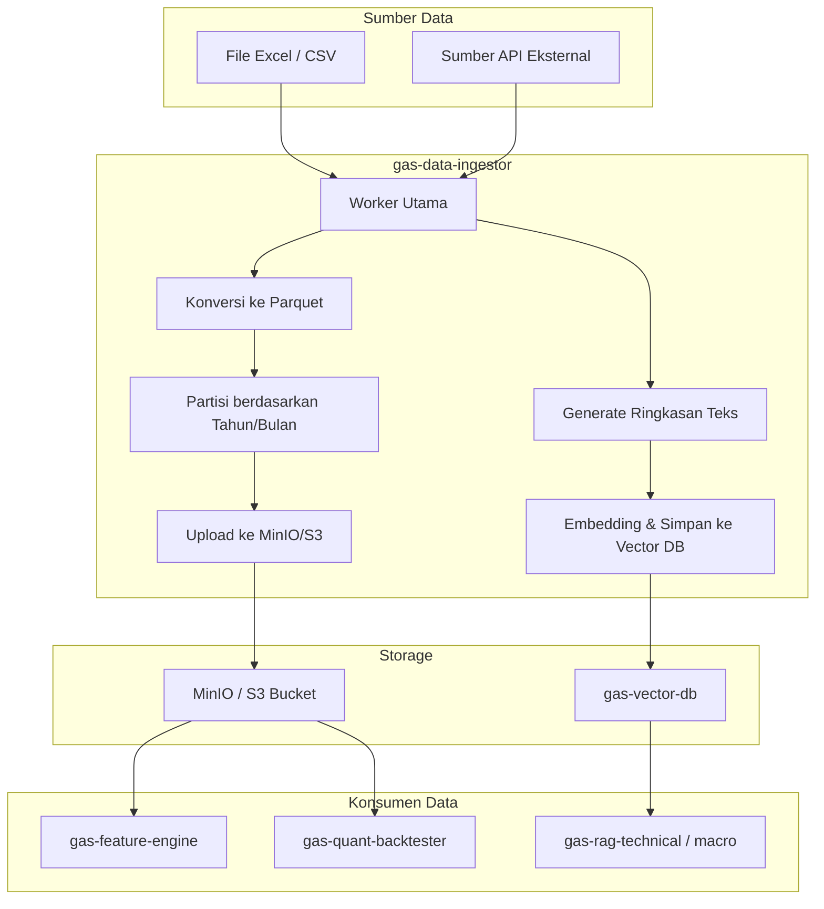

🚀 SERVICE TEMPLATE – @goldenaistrategy
📛 SERVICE NAME
gas-data-ingestor	Worker	9604	Data Warehouse Entry	Konversi OHLCV (seperti dataset Gold 8.8M baris lo) ke Parquet dan simpan di MinIO/S3.	Provider → Ingestor → MinIO (raw) + Vector DB							
🧱 0. INSTALASI ENVIRONMENT
🐍 Python
<isi langkah instalasi python environment>
🐳 Docker
<isi langkah instalasi docker & docker compose>
⚙️ 1. TUTORIAL MANAGEMENT SERVICE
🐍 Python Mode
▶️ Run
<command run>
⛔ Stop
<command stop>
🔄 Restart
<command restart>
❌ Delete Environment
<command delete env>
🐳 Docker Mode
▶️ Build & Run
<command build & run>
📊 Check Status
<command cek status>
⛔ Stop
<command stop>
🔄 Restart
<command restart>
❌ Delete Container / Image
<command delete>
📦 2. SETUP GITHUB (FIRST TIME)
echo "# gas-data-ingestor" >> README.md
git init
git add README.md
git commit -m "first commit"
git branch -M main
git remote add origin https://github.com/Muhamadridwanjr/gas-data-ingestor.git
git push -u origin main
…or push an existing repository from the command line
git remote add origin https://github.com/Muhamadridwanjr/gas-data-ingestor.git
git branch -M main
git push -u origin main
🔁 3. UPDATE PROJECT (COMMIT & PUSH)
<git add / commit / push commands>
📛 4. CONTAINER NAMING
<ketentuan nama container = nama project>
🌐 5. HEALTH CHECK (STATUS 200 OK)
Endpoint
<endpoint-url>
Expected Response
<response contoh>
🧪 6. DEBUG & LOGGING
Docker Logs
<command docker logs>
Application Logs
<setup logging>
Healthcheck Configuration
<docker healthcheck config>
🟢 7. CONTAINER STATUS
<expected: Up (healthy)>
🔗 8. INTEGRASI GAS-GATEWAY-API
Configuration
<env / config url>
Request Example
<request example>
🧠 9. INTEGRASI DENGAN @goldenaistrategy
<standarisasi service dalam ecosystem>
🔄 10. KOMUNIKASI ANTAR SERVICE
Network Configuration
<docker network config>
Service Communication
<contoh komunikasi antar service>
📁 STRUKTUR PROJECT
# 📦 GAS Data Ingestor

**Bagian dari Ekosistem GAS (Gas Automatic Strategy) – Layer Data (VPS 5)**  
Worker service yang bertugas menarik dataset historis OHLCV (Open, High, Low, Close, Volume) dari berbagai sumber (file Excel/CSV, API eksternal, atau database), mengonversinya ke format **Parquet** yang terkompresi dan efisien, lalu menyimpannya di **object storage** (MinIO / S3). Selain itu, service ini juga dapat menghasilkan **ringkasan periodik** dari data tersebut untuk di‑embed dan disimpan di `gas-vector-db`, sehingga dapat digunakan oleh RAG engine untuk analisis konteks historis.

---

## 📋 Daftar Isi

- [Ikhtisar](#ikhtisar)
- [Arsitektur](#arsitektur)
- [Alur Kerja](#alur-kerja)
- [Fitur Utama](#fitur-utama)
- [Teknologi](#teknologi)
- [Struktur Direktori](#struktur-direktori)
- [Instalasi & Menjalankan](#instalasi--menjalankan)
- [Konfigurasi](#konfigurasi)
- [API Reference](#api-reference)
- [Integrasi dengan Service Lain](#integrasi-dengan-service-lain)
- [Pengujian](#pengujian)
- [Pengembangan](#pengembangan)
- [Kontribusi (Tim Internal)](#kontribusi-tim-internal)
- [Lisensi & Kredit](#lisensi--kredit)

---

## 🔍 Ikhtisar

**gas-data-ingestor** adalah komponen yang menjembatani data historis besar (seperti dataset Gold 8,8 juta baris dari 2004–2026) dengan seluruh ekosistem GAS. Data mentah yang biasanya tersimpan dalam format Excel/CSV perlu diubah menjadi format yang lebih efisien (Parquet) dan disimpan di penyimpanan yang dapat diakses secara cepat oleh service lain, terutama `gas-feature-engine` dan `gas-quant-backtester`. Selain itu, untuk keperluan RAG (Retrieval-Augmented Generation), data ini perlu diringkas menjadi deskripsi tekstual per periode (minggu/bulan/tahun) yang kemudian di‑embed dan disimpan di vector database.

Service ini dirancang untuk berjalan secara **scheduled** (misal setiap hari) atau dipicu secara manual untuk menambahkan data baru atau memperbarui data yang ada.

---

## 🏗️ Arsitektur



### Komponen Utama
- **Ingester Worker** – Membaca data mentah, membersihkan, dan memvalidasi format.
- **Parquet Converter** – Mengubah data menjadi kolomnar, mengaplikasikan kompresi ZSTD, dan membagi menjadi partisi berdasarkan waktu (tahun/bulan).
- **MinIO/S3 Client** – Mengunggah file Parquet ke bucket yang telah ditentukan.
- **Summary Generator** – Membuat ringkasan tekstual per periode (misal: "Tahun 2008: harga tertinggi 1000, terendah 700, volatilitas tinggi, dll.").
- **Vector DB Client** – Mengirim ringkasan yang telah di‑embed ke `gas-vector-db`.

---

## 🔄 Alur Kerja

1. **Pemicu**:
   - Secara manual via admin API (`POST /ingest`).
   - Terjadwal (cron) setiap hari untuk menambahkan data baru.
2. **Baca Data**:
   - Jika sumber adalah file Excel/CSV, baca dengan pandas dalam **chunks** (misal 100.000 baris per chunk) untuk menghindari memori overload.
   - Jika sumber adalah API, lakukan panggilan dengan paginasi.
3. **Bersihkan & Validasi**:
   - Pastikan tidak ada nilai null pada kolom wajib (timestamp, open, high, low, close).
   - Konversi timestamp ke UNIX time (int).
4. **Konversi ke Parquet**:
   - Simpan setiap chunk sebagai file Parquet sementara, dengan kompresi ZSTD.
   - Tentukan partisi: misal `symbol=XAUUSD/year=2025/month=01/data.parquet`.
5. **Upload ke MinIO/S3**:
   - Unggah file-file tersebut ke bucket yang sesuai.
   - Hapus file sementara setelah upload sukses.
6. **Generate Ringkasan (Opsional)**:
   - Untuk setiap periode (misal bulanan), buat ringkasan teks yang mencakup statistik: open, close, high, low, volume rata‑rata, return, volatilitas.
   - Simpan ringkasan dalam format yang siap di‑embed.
7. **Embed & Simpan ke Vector DB**:
   - Panggil `gas-vector-db` endpoint `/collections/market_summaries/documents` dengan embedding dari ringkasan.
8. **Catat Log**:
   - Simpan log proses (sukses/gagal) di database untuk monitoring.

---

## ✨ Fitur Utama

- **Penanganan Dataset Besar**: Baca file besar secara streaming/chunking, konversi ke Parquet dengan kompresi.
- **Partisi Cerdas**: Data disimpan dalam struktur folder `symbol/year/month/` untuk query cepat.
- **Multi‑Sumber**: Dapat membaca dari file lokal (Excel/CSV), API, atau bahkan database.
- **Ringkasan Otomatis**: Menghasilkan ringkasan tekstual untuk RAG.
- **Integrasi Vector DB**: Mengirim ringkasan ke `gas-vector-db` secara otomatis.
- **Schedulable**: Dapat dijalankan secara periodik menggunakan cron atau scheduler internal.
- **Idempotent**: Jika data sudah ada, tidak akan diduplikasi (berdasarkan timestamp).

---

## 🛠️ Teknologi

- **Bahasa:** Python 3.11+
- **Pemrosesan Data:** `pandas`, `numpy`, `pyarrow` (untuk Parquet)
- **Object Storage:** `boto3` (untuk S3) atau `minio` (untuk MinIO)
- **Embedding:** `openai` atau `vertexai` library (jika perlu generate embedding)
- **Vector DB Client:** HTTP client ke `gas-vector-db`
- **Scheduling:** `apscheduler` atau cron job di host
- **Container:** Docker, Docker Compose

---

## 📁 Struktur Direktori

```
gas-data-ingestor/
├── src/
│   ├── __init__.py
│   ├── main.py                     # Entry point (scheduler atau CLI)
│   ├── config.py                    # Pydantic settings
│   ├── ingestor/
│   │   ├── __init__.py
│   │   ├── base.py                  # Base class untuk sumber data
│   │   ├── excel_reader.py          # Baca dari Excel/CSV
│   │   ├── api_reader.py             # Baca dari API
│   │   └── validator.py              # Validasi data
│   ├── converter/
│   │   ├── __init__.py
│   │   └── parquet_writer.py         # Konversi ke Parquet + partisi
│   ├── storage/
│   │   ├── __init__.py
│   │   └── s3_client.py              # Upload ke MinIO/S3
│   ├── summarizer/
│   │   ├── __init__.py
│   │   ├── text_generator.py         # Buat ringkasan per periode
│   │   └── embedder.py               # Embed ringkasan & kirim ke vector DB
│   ├── lib/
│   │   ├── logger.py
│   │   └── utils.py
│   └── workers/                      # (opsional) background tasks
├── tests/
├── Dockerfile
├── docker-compose.yml
├── .env.example
├── requirements.txt
└── README.md
```

---

## ⚙️ Instalasi & Menjalankan

### Prasyarat
- Python 3.11+
- MinIO atau S3-compatible storage
- `gas-vector-db` berjalan (untuk menyimpan ringkasan)
- (Opsional) `gas-market-data-processor` untuk akses data historis

### Langkah Cepat (Development)

1. Clone repositori (internal):
   ```bash
   git clone https://github.com/gasstrategy/gas-data-ingestor.git
   cd gas-data-ingestor
   ```

2. Buat virtual environment:
   ```bash
   python -m venv venv
   source venv/bin/activate
   ```

3. Install dependencies:
   ```bash
   pip install -r requirements-dev.txt
   ```

4. Copy environment:
   ```bash
   cp .env.example .env
   # Isi konfigurasi: sumber data, MinIO/S3, vector DB URL, dll.
   ```

5. Jalankan service untuk sekali proses:
   ```bash
   python src/main.py --ingest
   ```

6. Atau jalankan scheduler:
   ```bash
   python src/main.py --schedule
   ```

### Dengan Docker Compose

```yaml
version: '3.8'
services:
  minio:
    image: minio/minio
    command: server /data --console-address ":9001"
    ports:
      - "9000:9000"
      - "9001:9001"
    environment:
      MINIO_ROOT_USER: minioadmin
      MINIO_ROOT_PASSWORD: minioadmin
    volumes:
      - minio_data:/data

  createbuckets:
    image: minio/mc
    depends_on:
      - minio
    entrypoint: >
      /bin/sh -c "
      sleep 5;
      /usr/bin/mc config host add myminio http://minio:9000 minioadmin minioadmin;
      /usr/bin/mc mb myminio/gas-data;
      /usr/bin/mc policy set public myminio/gas-data;
      exit 0;
      "

  ingestor:
    build: .
    environment:
      - STORAGE_TYPE=s3
      - S3_ENDPOINT=http://minio:9000
      - S3_ACCESS_KEY=minioadmin
      - S3_SECRET_KEY=minioadmin
      - S3_BUCKET=gas-data
      - VECTOR_DB_URL=http://gas-vector-db:9004
      - SOURCE_TYPE=excel
      - SOURCE_PATH=/data/gold_2004_2026.csv
    volumes:
      - ./data:/data   # mount folder berisi file Excel/CSV
    depends_on:
      - minio
      - createbuckets
```

Jalankan:
```bash
docker-compose up -d
```

---

## 🔧 Konfigurasi

Environment variables (file `.env`):

| Variabel | Default | Deskripsi |
|----------|---------|-----------|
| `STORAGE_TYPE` | `minio` | `minio` atau `s3` |
| `S3_ENDPOINT` | `http://localhost:9000` | Endpoint MinIO/S3 |
| `S3_ACCESS_KEY` | `minioadmin` | Access key |
| `S3_SECRET_KEY` | `minioadmin` | Secret key |
| `S3_BUCKET` | `gas-data` | Bucket tujuan |
| `SOURCE_TYPE` | `excel` | `excel`, `csv`, `api` |
| `SOURCE_PATH` | `/data/gold.csv` | Path ke file (untuk excel/csv) |
| `SOURCE_API_URL` | (opsional) | URL API untuk sumber data |
| `SOURCE_API_KEY` | (opsional) | API key |
| `CHUNK_SIZE` | 100000 | Jumlah baris per chunk saat baca file |
| `PARTITION_BY` | `["year","month"]` | Kolom partisi (JSON array) |
| `GENERATE_SUMMARY` | `true` | Aktifkan pembuatan ringkasan |
| `SUMMARY_PERIOD` | `month` | `day`, `week`, `month`, `year` |
| `VECTOR_DB_URL` | `http://gas-vector-db:9004` | URL vector DB |
| `VECTOR_DB_COLLECTION` | `market_summaries` | Nama koleksi |
| `EMBEDDING_MODEL` | `text-embedding-3-small` | Model embedding (OpenAI) |
| `OPENAI_API_KEY` | (opsional) | Jika pakai OpenAI |
| `LOG_LEVEL` | `INFO` | Level logging |
| `ENVIRONMENT` | `development` | `production`/`staging` |

---

## 📡 API Reference

Service ini terutama berjalan sebagai worker, tetapi menyediakan endpoint REST sederhana untuk administrasi.

### `POST /ingest` – Memicu proses ingestion secara manual

**Request Body:**
```json
{
  "source_type": "excel",
  "source_path": "/data/gold.csv",
  "symbol": "XAUUSD",
  "generate_summary": true
}
```

**Response:** `202 Accepted` dengan `job_id`.

### `GET /ingest/{job_id}` – Status job

### `GET /health` – Health check

---

## 🔗 Integrasi dengan Service Lain

- **`gas-vector-db` (9004)** – Menyimpan ringkasan yang telah di‑embed untuk keperluan RAG.
- **`gas-feature-engine` (9499)** – Dapat mengakses data Parquet di MinIO untuk menghitung fitur jangka panjang.
- **`gas-quant-backtester` (9504)** – Membaca data historis dari MinIO untuk simulasi.
- **`gas-rag-technical` / `gas-rag-macro`** – Menggunakan ringkasan di vector DB untuk konteks analisis.

---

## 🧪 Pengujian

```bash
pytest tests/ -v
# dengan coverage
pytest --cov=src tests/
```

Unit test mencakup:
- Pembacaan file CSV dalam chunk.
- Konversi ke Parquet.
- Upload ke MinIO mock.
- Generate ringkasan dan embedding (mock).
- Endpoint API.

---

## 👨‍💻 Pengembangan

### Menambah Sumber Data Baru
1. Buat class baru di `ingestor/` yang mewarisi `BaseSource`.
2. Implementasikan metode `read()` yang menghasilkan iterator chunk.
3. Daftarkan di factory.

### Aturan Kode
- Type hints wajib.
- Docstring untuk fungsi publik.
- Ikuti PEP 8 (black).
- Pastikan semua test lulus.

---

## 🔒 Kontribusi (Tim Internal)

Repositori ini bersifat **private** – hanya untuk tim internal GAS.  
Untuk berkontribusi:

1. Buat branch baru (`feature/`, `fix/`).
2. Commit dengan pesan jelas.
3. Buka Pull Request ke `develop`.
4. Tunggu review dan minimal satu approval.

**Aturan Penting:**
- Jangan commit kredensial.
- Gunakan environment variable untuk konfigurasi.
- Jangan sebarkan kode ke luar tim.

---

## 📄 Lisensi & Kredit

**Hak Cipta © 2025 Muhamad RidwanJr dan Tim GAS.**  
Seluruh hak cipta dilindungi undang-undang. Tidak untuk disebarluaskan tanpa izin tertulis.

Service ini dikembangkan sebagai bagian dari ekosistem **Golden AI Strategy**.

---

**🔥 GAS Data Ingestor – Jembatan Data Historis Menuju Analisis Cerdas**
✅ FINAL CHECKLIST
[ ] Container name sesuai project  
[ ] Status container: Up (healthy)  
[ ] Endpoint mengembalikan 200 OK  
[ ] Tidak ada error pada logs  
[ ] Terintegrasi dengan GAS Gateway API  
[ ] Antar service dapat saling berkomunikasi  