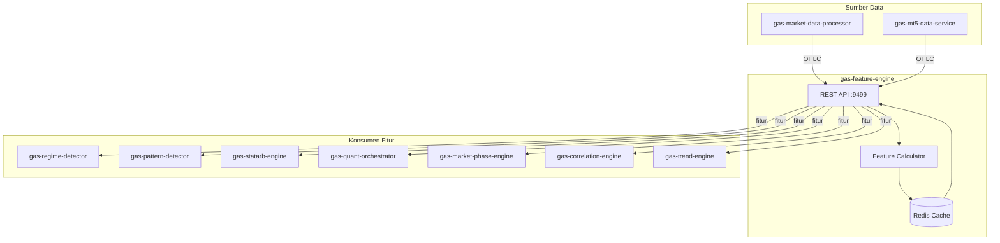

🚀 SERVICE TEMPLATE – @goldenaistrategy
📛 SERVICE NAME
gas-feature-engine	API	9499	Feature Engineering	Returns, Volatilitas, Z-score, dll	Market Data → FeatureEngine → Fitur	Planned																
🧱 0. INSTALASI ENVIRONMENT
🐍 Python
<isi langkah instalasi python environment>
🐳 Docker
<isi langkah instalasi docker & docker compose>
⚙️ 1. TUTORIAL MANAGEMENT SERVICE
🐍 Python Mode
▶️ Run
<command run>
⛔ Stop
<command stop>
🔄 Restart
<command restart>
❌ Delete Environment
<command delete env>
🐳 Docker Mode
▶️ Build & Run
<command build & run>
📊 Check Status
<command cek status>
⛔ Stop
<command stop>
🔄 Restart
<command restart>
❌ Delete Container / Image
<command delete>

📦 2. SETUP GITHUB (FIRST TIME)

echo "# gas-feature-engine" >> README.md
git init
git add README.md
git commit -m "first commit"
git branch -M main
git remote add origin https://github.com/Muhamadridwanjr/gas-feature-engine.git
git push -u origin main
…or push an existing repository from the command line
git remote add origin https://github.com/Muhamadridwanjr/gas-feature-engine.git
git branch -M main
git push -u origin main
📛 4. CONTAINER NAMING
<ketentuan nama container = nama project>
🌐 5. HEALTH CHECK (STATUS 200 OK)
Endpoint
<endpoint-url>
Expected Response
<response contoh>
🧪 6. DEBUG & LOGGING
Docker Logs
<command docker logs>
Application Logs
<setup logging>
Healthcheck Configuration
<docker healthcheck config>
🟢 7. CONTAINER STATUS
<expected: Up (healthy)>
🔗 8. INTEGRASI GAS-GATEWAY-API
Configuration
<env / config url>
Request Example
<request example>
🧠 9. INTEGRASI DENGAN @goldenaistrategy
<standarisasi service dalam ecosystem>
🔄 10. KOMUNIKASI ANTAR SERVICE
Network Configuration
<docker network config>
Service Communication
<contoh komunikasi antar service>
📁 STRUKTUR PROJECT
# 📊 GAS Feature Engine

**Bagian dari Ekosistem GAS (Gas Automatic Strategy) – Quant Layer (VPS 5)**  
Service yang bertugas mengubah data OHLC mentah menjadi fitur numerik siap pakai untuk engine quant lainnya. Fitur yang dihasilkan mencakup returns, volatilitas, z‑score, momentum, dan berbagai indikator statistik yang menjadi bahan baku bagi `gas-pattern-detector`, `gas-regime-detector`, `gas-statarb-engine`, dan `gas-quant-orchestrator`.

---

## 📋 Daftar Isi

- [Ikhtisar](#ikhtisar)
- [Arsitektur](#arsitektur)
- [Alur Kerja](#alur-kerja)
- [Fitur Utama](#fitur-utama)
- [Teknologi](#teknologi)
- [Struktur Direktori](#struktur-direktori)
- [Instalasi & Menjalankan](#instalasi--menjalankan)
- [Konfigurasi](#konfigurasi)
- [API Reference](#api-reference)
- [Integrasi dengan Service Lain](#integrasi-dengan-service-lain)
- [Pengujian](#pengujian)
- [Pengembangan](#pengembangan)
- [Kontribusi (Tim Internal)](#kontribusi-tim-internal)
- [Lisensi & Kredit](#lisensi--kredit)

---

## 🔍 Ikhtisar

**gas-feature-engine** adalah fondasi dari semua analisis kuantitatif di ekosistem GAS. Data OHLC mentah dari `gas-market-data-processor` atau `gas-mt5-data-service` diubah menjadi deret fitur yang terstandarisasi. Fitur‑fitur ini kemudian digunakan oleh engine lain untuk mendeteksi regime, mencari pola tersembunyi, melakukan stat arb, dan menghasilkan sinyal trading.

Dengan memisahkan feature engineering menjadi service tersendiri, kita mencapai:
- **Reusability**: Semua engine quant menggunakan fitur yang sama, konsisten.
- **Efisiensi**: Perhitungan fitur dilakukan sekali, hasilnya di‑cache.
- **Skalabilitas**: Bisa di‑scale horizontal jika beban tinggi.

---

## 🏗️ Arsitektur



### Komponen Utama
- **REST API** (port 9499) – Menerima permintaan fitur untuk satu atau banyak simbol.
- **Feature Calculator** – Inti perhitungan: returns, rolling statistics, z‑score, dll.
- **Redis Cache** – Menyimpan hasil fitur untuk periode tertentu agar tidak perlu hitung ulang.

---

## 🔄 Alur Kerja

1. **Service konsumen** (misal `gas-regime-detector`) mengirim request `POST /features` dengan parameter simbol, timeframe, dan daftar fitur yang diinginkan.
2. **Feature engine** memeriksa cache Redis berdasarkan `{simbol}:{timeframe}:{fitur}`. Jika ada dan belum expired, kembalikan data dari cache.
3. Jika tidak ada, ambil data OHLC dari `gas-market-data-processor` (atau dari database internal).
4. Hitung fitur yang diminta menggunakan algoritma internal (pandas/numpy).
5. Simpan hasil ke cache dengan TTL (misal 1 detik untuk tick, 1 menit untuk H1).
6. Kembalikan hasil dalam format JSON ke konsumen.

**Contoh Request:**
```json
{
  "symbol": "XAUUSD",
  "timeframe": "H1",
  "features": ["return_1", "volatility_20", "zscore_20", "rsi_14"],
  "from_time": 1700000000,
  "to_time": 1700086400
}
```

**Contoh Response:**
```json
{
  "symbol": "XAUUSD",
  "timeframe": "H1",
  "data": [
    {
      "time": 1700000000,
      "return_1": 0.00012,
      "volatility_20": 0.0015,
      "zscore_20": -1.2,
      "rsi_14": 45.3
    },
    ...
  ]
}
```

---

## ✨ Fitur Utama

Berikut adalah fitur yang dihasilkan (dapat dikembangkan lebih lanjut):

### Returns & Log Returns
- `return_1` : (close - close_1) / close_1
- `return_5` : return 5 periode
- `log_return_1` : log(close) - log(close_1)

### Volatilitas
- `volatility_10` : rolling std dev of returns (10 periode)
- `volatility_20` : (20 periode)
- `atr_14` : Average True Range

### Z‑Score & Normalisasi
- `zscore_20` : (close - SMA(20)) / std(close, 20)
- `zscore_50` : (close - SMA(50)) / std(close, 50)

### Momentum
- `rsi_14` : Relative Strength Index (14)
- `macd`, `macd_signal`, `macd_hist` : MACD
- `roc_10` : Rate of Change (10)

### Moving Averages
- `sma_20`, `sma_50`, `sma_200`
- `ema_20`, `ema_50`
- `bb_upper`, `bb_lower`, `bb_middle` (Bollinger Bands)

### Statistik Lain
- `skew_20` : skewness
- `kurtosis_20` : kurtosis
- `volume_ratio` : volume / SMA(volume, 20)

### Custom (dapat ditambahkan)
- `spread` : untuk pairs trading (dari `gas-statarb-engine` bisa minta spread)
- `liquidity_score` : (jika ada data order flow)

---

## 🛠️ Teknologi

- **Bahasa:** Python 3.11+
- **Web Framework:** FastAPI (REST)
- **Komputasi Numerik:** `numpy`, `pandas`, `ta` (Technical Analysis library)
- **Cache:** Redis (`redis.asyncio`)
- **Market Data Client:** HTTP client ke `gas-market-data-processor`
- **Container:** Docker, Docker Compose

---

## 📁 Struktur Direktori

```
gas-feature-engine/
├── src/
│   ├── __init__.py
│   ├── main.py                     # Entry point FastAPI
│   ├── config.py                    # Pydantic settings
│   ├── api/
│   │   ├── __init__.py
│   │   ├── routes.py                # Endpoint /features
│   │   └── models.py                # Pydantic models (request/response)
│   ├── core/
│   │   ├── __init__.py
│   │   ├── calculator.py            # Perhitungan fitur
│   │   ├── market_data_client.py    # Ambil OHLC dari service lain
│   │   └── exceptions.py
│   ├── cache/
│   │   ├── __init__.py
│   │   └── redis_cache.py           # Baca/tulis cache
│   ├── lib/
│   │   ├── logger.py
│   │   └── utils.py                 # Konversi timeframe, dll
│   └── workers/                      # (opsional) background update
├── tests/
├── Dockerfile
├── docker-compose.yml
├── .env.example
├── requirements.txt
└── README.md
```

---

## ⚙️ Instalasi & Menjalankan

### Prasyarat
- Python 3.11+
- Redis server
- `gas-market-data-processor` atau `gas-mt5-data-service` yang menyediakan OHLC

### Langkah Cepat (Development)

1. Clone repositori (internal):
   ```bash
   git clone https://github.com/gasstrategy/gas-feature-engine.git
   cd gas-feature-engine
   ```

2. Buat virtual environment:
   ```bash
   python -m venv venv
   source venv/bin/activate
   ```

3. Install dependencies:
   ```bash
   pip install -r requirements-dev.txt
   ```

4. Copy environment:
   ```bash
   cp .env.example .env
   # Isi REDIS_URL, MARKET_DATA_URL, dll.
   ```

5. Jalankan Redis (jika belum):
   ```bash
   docker run -d -p 6379:6379 redis
   ```

6. Jalankan service:
   ```bash
   uvicorn src.main:app --reload --port 9499
   ```

### Dengan Docker Compose

```yaml
version: '3.8'
services:
  redis:
    image: redis:alpine
    ports:
      - "6379:6379"

  feature-engine:
    build: .
    ports:
      - "9499:9499"
    environment:
      - REDIS_URL=redis://redis:6379
      - MARKET_DATA_URL=http://gas-market-data-processor:8100
    depends_on:
      - redis
```

Jalankan:
```bash
docker-compose up -d
```

---

## 🔧 Konfigurasi

Environment variables (file `.env`):

| Variabel | Default | Deskripsi |
|----------|---------|-----------|
| `PORT` | 9499 | Port REST API |
| `REDIS_URL` | redis://localhost:6379 | Koneksi Redis untuk cache |
| `MARKET_DATA_URL` | http://gas-market-data-processor:8100 | URL untuk ambil OHLC |
| `MARKET_DATA_API_KEY` | (opsional) | API key jika diperlukan |
| `CACHE_TTL` | 60 | TTL cache dalam detik (default 60) |
| `LOG_LEVEL` | INFO | Level logging |
| `ENVIRONMENT` | development | production/staging/development |

---

## 📡 API Reference

### `POST /features` – Mendapatkan fitur untuk satu simbol

**Request Body:**
```json
{
  "symbol": "XAUUSD",
  "timeframe": "H1",
  "features": ["return_1", "volatility_20", "zscore_20", "rsi_14"],
  "from_time": 1700000000,      // opsional, UNIX timestamp
  "to_time": 1700086400,        // opsional
  "limit": 100                  // jika from/to tidak ada, ambil n terakhir
}
```

**Response:**
```json
{
  "symbol": "XAUUSD",
  "timeframe": "H1",
  "data": [
    {
      "time": 1700000000,
      "return_1": 0.00012,
      "volatility_20": 0.0015,
      "zscore_20": -1.2,
      "rsi_14": 45.3
    }
  ]
}
```

### `POST /features/batch` – Untuk banyak simbol sekaligus
Berguna untuk screener.

**Request:**
```json
{
  "symbols": ["XAUUSD", "BTCUSD"],
  "timeframe": "H1",
  "features": ["return_1", "rsi_14"],
  "limit": 1   // hanya candle terbaru
}
```

**Response:** objek dengan key simbol.

### `GET /health` – Health check
```json
{"status": "ok"}
```

### `GET /metrics` – (Opsional) Prometheus metrics

---

## 🔗 Integrasi dengan Service Lain

### **Konsumen Fitur**
Semua service di Quant Layer akan memanggil `gas-feature-engine`:
- `gas-regime-detector` (9503)
- `gas-pattern-detector` (9501)
- `gas-statarb-engine` (9502)
- `gas-quant-orchestrator` (9500)
- `gas-market-phase-engine` (9510)
- `gas-correlation-engine` (9512)
- `gas-trend-engine` (9513)

### **Penyedia Data**
- `gas-market-data-processor` (library) atau `gas-mt5-data-service` (8100) – menyediakan OHLC.

### **Cache**
- Redis – menyimpan hasil fitur sementara.

---

## 🧪 Pengujian

```bash
pytest tests/ -v
# dengan coverage
pytest --cov=src tests/
```

Unit test mencakup:
- Perhitungan fitur (bandingkan dengan library `ta`).
- Cache hit/miss.
- Validasi input.
- Error handling.

---

## 👨‍💻 Pengembangan

### Menambahkan Fitur Baru
1. Tambahkan fungsi perhitungan di `core/calculator.py`.
2. Daftarkan nama fitur di sebuah dictionary atau gunakan pola strategy.
3. Pastikan fitur tersebut bisa dihitung dari data OHLC.
4. Tambahkan unit test.

### Contoh Penambahan Fitur
```python
def calculate_awesome_oscillator(df, period_fast=5, period_slow=34):
    median = (df['high'] + df['low']) / 2
    fast = median.rolling(period_fast).mean()
    slow = median.rolling(period_slow).mean()
    return fast - slow
```

### Aturan Kode
- Type hints wajib.
- Docstring untuk setiap fungsi.
- Ikuti PEP 8 (black).
- Pastikan semua test lulus.

---

## 🔒 Kontribusi (Tim Internal)

Repositori ini bersifat **private** – hanya untuk tim internal GAS.  
Untuk berkontribusi:

1. Buat branch baru (`feature/`, `fix/`).
2. Commit dengan pesan jelas.
3. Buka Pull Request ke `develop`.
4. Tunggu review dan minimal satu approval.

**Aturan Penting:**
- Jangan commit kredensial.
- Gunakan environment variable untuk konfigurasi.
- Jangan sebarkan kode ke luar tim.

---

## 📄 Lisensi & Kredit

**Hak Cipta © 2025 Muhamad RidwanJr dan Tim GAS.**  
Seluruh hak cipta dilindungi undang-undang. Tidak untuk disebarluaskan tanpa izin tertulis.

Service ini dikembangkan sebagai bagian dari ekosistem **Golden AI Strategy**.

---

**🔥 GAS Feature Engine – Fondasi Semua Analisis Kuantitatif**
✅ FINAL CHECKLIST
[ ] Container name sesuai project  
[ ] Status container: Up (healthy)  
[ ] Endpoint mengembalikan 200 OK  
[ ] Tidak ada error pada logs  
[ ] Terintegrasi dengan GAS Gateway API  
[ ] Antar service dapat saling berkomunikasi  