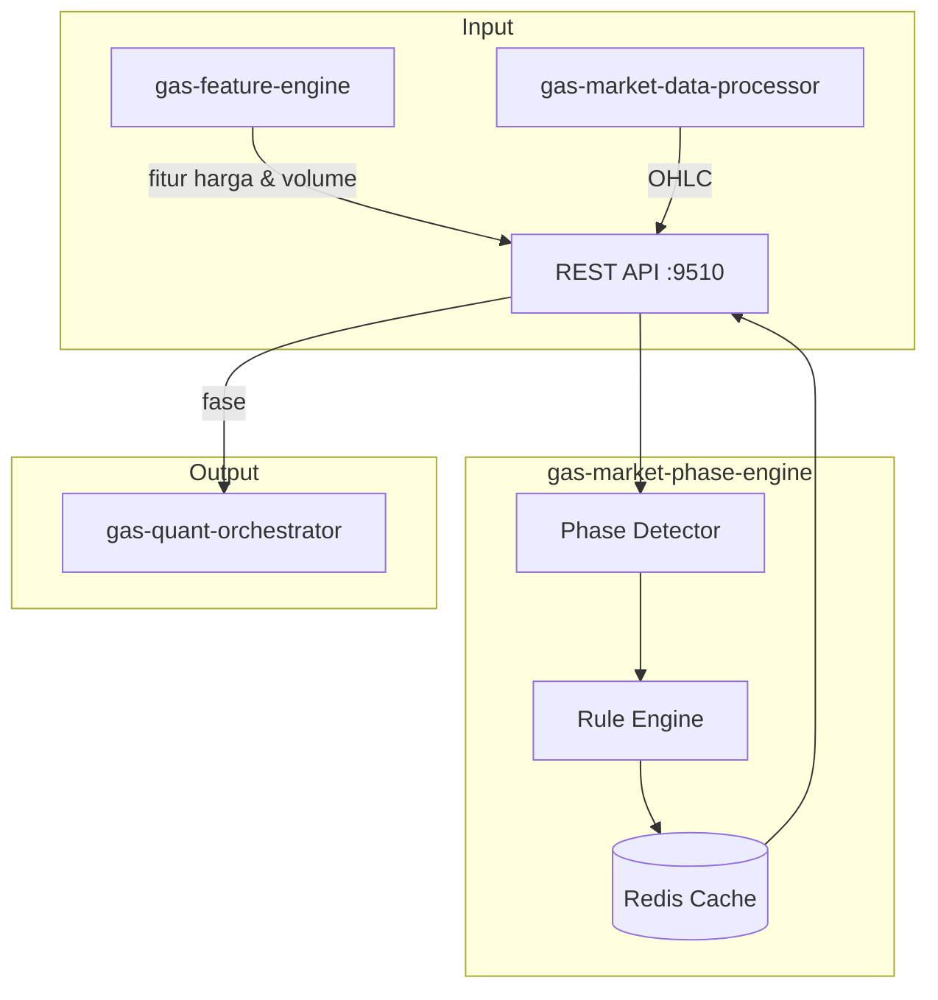

🚀 SERVICE TEMPLATE – @goldenaistrategy
📛 SERVICE NAME
gas-market-phase	API	9510	Deteksi fase pasar (Livermore)	Analisis breakout & volume (Akumulasi, Markup, dsb)	Fitur → PhaseEngine → Fase	Planned																

🧱 0. INSTALASI ENVIRONMENT
🐍 Python
<isi langkah instalasi python environment>
🐳 Docker
<isi langkah instalasi docker & docker compose>
⚙️ 1. TUTORIAL MANAGEMENT SERVICE
🐍 Python Mode
▶️ Run
<command run>
⛔ Stop
<command stop>
🔄 Restart
<command restart>
❌ Delete Environment
<command delete env>
🐳 Docker Mode
▶️ Build & Run
<command build & run>
📊 Check Status
<command cek status>
⛔ Stop
<command stop>
🔄 Restart
<command restart>
❌ Delete Container / Image
<command delete>

📦 2. SETUP GITHUB (FIRST TIME)
echo "# gas-market-phase" >> README.md
git init
git add README.md
git commit -m "first commit"
git branch -M main
git remote add origin https://github.com/Muhamadridwanjr/gas-market-phase.git
git push -u origin main
…or push an existing repository from the command line
git remote add origin https://github.com/Muhamadridwanjr/gas-market-phase.git
git branch -M main
git push -u origin main

📛 4. CONTAINER NAMING
<ketentuan nama container = nama project>
🌐 5. HEALTH CHECK (STATUS 200 OK)
Endpoint
<endpoint-url>
Expected Response
<response contoh>
🧪 6. DEBUG & LOGGING
Docker Logs
<command docker logs>
Application Logs
<setup logging>
Healthcheck Configuration
<docker healthcheck config>
🟢 7. CONTAINER STATUS
<expected: Up (healthy)>
🔗 8. INTEGRASI GAS-GATEWAY-API
Configuration
<env / config url>
Request Example
<request example>
🧠 9. INTEGRASI DENGAN @goldenaistrategy
<standarisasi service dalam ecosystem>
🔄 10. KOMUNIKASI ANTAR SERVICE
Network Configuration
<docker network config>
Service Communication
<contoh komunikasi antar service>
📁 STRUKTUR PROJECT
# 📊 GAS Market Phase Engine

**Bagian dari Ekosistem GAS (Gas Automatic Strategy) – Edge Legendary Layer (VPS 5)**  
Service yang terinspirasi dari **Jesse Livermore**, salah satu trader legendaris yang dikenal dengan pemahamannya tentang **fase pasar** (akumulasi, markup, distribusi, markdown). Service ini menganalisis data harga dan volume untuk menentukan fase pasar saat ini, memberikan konteks penting bagi strategi trading lainnya.

---

## 📋 Daftar Isi

- [Ikhtisar](#ikhtisar)
- [Arsitektur](#arsitektur)
- [Alur Kerja](#alur-kerja)
- [Fitur Utama](#fitur-utama)
- [Teknologi](#teknologi)
- [Struktur Direktori](#struktur-direktori)
- [Instalasi & Menjalankan](#instalasi--menjalankan)
- [Konfigurasi](#konfigurasi)
- [API Reference](#api-reference)
- [Integrasi dengan Service Lain](#integrasi-dengan-service-lain)
- [Pengujian](#pengujian)
- [Pengembangan](#pengembangan)
- [Kontribusi (Tim Internal)](#kontribusi-tim-internal)
- [Lisensi & Kredit](#lisensi--kredit)

---

## 🔍 Ikhtisar

**gas-market-phase-engine** mengimplementasikan konsep **empat fase pasar** yang dipopulerkan oleh Jesse Livermore dan kemudian diadopsi oleh banyak trader profesional:

1. **Akumulasi (Accumulation)** – Fase di mana "smart money" mulai membeli secara perlahan setelah harga mencapai titik terendah. Harga cenderung sideways dengan volume yang mulai meningkat.
2. **Markup** – Fase tren naik yang kuat, diikuti oleh publik. Harga membuat higher highs dan higher lows, volume biasanya tinggi.
3. **Distribusi** – Fase di mana smart money mulai menjual posisi mereka. Harga bergerak sideways atau sedikit turun dengan volume tinggi, seringkali disertai divergensi.
4. **Markdown** – Fase tren turun yang kuat, harga membuat lower lows dan lower highs.

Dengan mengetahui fase pasar, strategi trading dapat disesuaikan: misalnya, strategi trend following cocok di fase markup/markdown, sedangkan strategi mean reversion atau range-bound lebih cocok di fase akumulasi/distribusi.

Service ini menggunakan data OHLC dan volume, serta memanfaatkan fitur dari `gas-feature-engine` untuk mendeteksi breakout, volume spike, dan pola harga yang mengindikasikan perpindahan fase.

---

## 🏗️ Arsitektur



### Komponen Utama
- **REST API** (port 9510) – Menerima permintaan deteksi fase.
- **Phase Detector** – Inti logika: menganalisis fitur (breakout, volume, moving averages) untuk menentukan fase.
- **Rule Engine** – Kumpulan aturan (rule‑based) yang mendefinisikan kondisi untuk setiap fase.
- **Redis Cache** – Menyimpan hasil deteksi untuk periode tertentu (misal 1 menit) agar tidak perlu hitung ulang.

---

## 🔄 Alur Kerja

1. **Konsumen** (misal `gas-quant-orchestrator`) mengirim request `POST /phase` dengan parameter simbol dan timeframe.
2. Service mengambil fitur terkini dari `gas-feature-engine` (atau langsung dari market data) yang diperlukan, seperti:
   - Harga tertinggi/terendah periode tertentu.
   - Volume relatif terhadap rata‑rata.
   - Moving averages (misal EMA 20, 50).
   - ADX (untuk mengukur kekuatan tren).
3. **Phase Detector** menjalankan aturan secara berurutan untuk menentukan fase:
   - Apakah harga di atas EMA 50 dan ADX > 25 serta volume > rata‑rata? → Markup.
   - Apakah harga di bawah EMA 50 dan ADX > 25 serta volume > rata‑rata? → Markdown.
   - Apakah harga berkonsolidasi (range) dengan volume meningkat? → Akumulasi atau Distribusi, dibedakan dengan posisi harga relatif terhadap range sebelumnya.
4. Jika tidak ada kondisi yang terpenuhi, fase mungkin "Transisi" atau "Sideways".
5. Hasil (fase, confidence) dikembalikan ke pemanggil dan disimpan di cache.

**Contoh Request:**
```json
{
  "symbol": "XAUUSD",
  "timeframe": "H1"
}
```

**Contoh Response:**
```json
{
  "symbol": "XAUUSD",
  "timeframe": "H1",
  "phase": "MARKUP",
  "confidence": 0.85,
  "details": {
    "price_vs_ema50": "above",
    "adx": 28,
    "volume_ratio": 1.2,
    "breakout_detected": true
  }
}
```

---

## ✨ Fitur Utama

- **Deteksi 4 fase klasik**: Accumulation, Markup, Distribution, Markdown.
- **Tambahan fase**: Sideways, Transition (jika tidak jelas).
- **Rule‑based** (sederhana dan mudah dipahami) – dapat dikembangkan dengan ML nantinya.
- **Menggunakan fitur dari feature-engine** untuk konsistensi.
- **Confidence score** – berdasarkan seberapa kuat indikasi.
- **Caching** untuk efisiensi.

---

## 🛠️ Teknologi

- **Bahasa:** Python 3.11+
- **Web Framework:** FastAPI (REST)
- **Komputasi:** `numpy`, `pandas`
- **Cache:** Redis (`redis.asyncio`)
- **Market Data Client:** HTTP ke `gas-feature-engine` atau `gas-market-data-processor`
- **Container:** Docker, Docker Compose

---

## 📁 Struktur Direktori

```
gas-market-phase-engine/
├── src/
│   ├── __init__.py
│   ├── main.py                     # Entry point FastAPI
│   ├── config.py                    # Pydantic settings
│   ├── api/
│   │   ├── __init__.py
│   │   ├── routes.py                # Endpoint /phase
│   │   └── models.py                # Pydantic models
│   ├── core/
│   │   ├── __init__.py
│   │   ├── detector.py              # Logika utama deteksi fase
│   │   ├── rules.py                  # Aturan untuk setiap fase
│   │   └── exceptions.py
│   ├── clients/
│   │   ├── __init__.py
│   │   └── feature_client.py         # Ambil fitur dari feature-engine
│   ├── cache/
│   │   ├── __init__.py
│   │   └── redis_cache.py
│   ├── lib/
│   │   ├── logger.py
│   │   └── utils.py
│   └── workers/                      # (opsional) background tasks
├── tests/
├── Dockerfile
├── docker-compose.yml
├── .env.example
├── requirements.txt
└── README.md
```

---

## ⚙️ Instalasi & Menjalankan

### Prasyarat
- Python 3.11+
- Redis server
- `gas-feature-engine` (9499) berjalan (atau akses ke data pasar)

### Langkah Cepat (Development)

1. Clone repositori (internal):
   ```bash
   git clone https://github.com/gasstrategy/gas-market-phase-engine.git
   cd gas-market-phase-engine
   ```

2. Buat virtual environment:
   ```bash
   python -m venv venv
   source venv/bin/activate
   ```

3. Install dependencies:
   ```bash
   pip install -r requirements-dev.txt
   ```

4. Copy environment:
   ```bash
   cp .env.example .env
   # Isi REDIS_URL, FEATURE_ENGINE_URL, dll.
   ```

5. Jalankan Redis (jika belum):
   ```bash
   docker run -d -p 6379:6379 redis
   ```

6. Jalankan service:
   ```bash
   uvicorn src.main:app --reload --port 9510
   ```

### Dengan Docker Compose

```yaml
version: '3.8'
services:
  redis:
    image: redis:alpine
    ports:
      - "6379:6379"

  market-phase:
    build: .
    ports:
      - "9510:9510"
    environment:
      - REDIS_URL=redis://redis:6379
      - FEATURE_ENGINE_URL=http://gas-feature-engine:9499
    depends_on:
      - redis
```

Jalankan:
```bash
docker-compose up -d
```

---

## 🔧 Konfigurasi

Environment variables (file `.env`):

| Variabel | Default | Deskripsi |
|----------|---------|-----------|
| `PORT` | 9510 | Port REST API |
| `REDIS_URL` | redis://localhost:6379 | Koneksi Redis |
| `FEATURE_ENGINE_URL` | http://gas-feature-engine:9499 | URL feature-engine untuk ambil fitur |
| `FEATURE_ENGINE_API_KEY` | (opsional) | API key jika diperlukan |
| `CACHE_TTL` | 60 | TTL cache deteksi fase (detik) |
| `LOG_LEVEL` | INFO | Level logging |
| `ENVIRONMENT` | development | production/staging/development |

---

## 📡 API Reference

### `POST /phase` – Mendapatkan fase pasar untuk satu simbol

**Request Body:**
```json
{
  "symbol": "XAUUSD",
  "timeframe": "H1"
}
```

**Response:**
```json
{
  "symbol": "XAUUSD",
  "timeframe": "H1",
  "phase": "MARKUP",
  "confidence": 0.85,
  "details": {
    "price_vs_ema50": "above",
    "adx": 28,
    "volume_ratio": 1.2,
    "breakout_detected": true
  }
}
```

### `POST /phase/batch` – Untuk banyak simbol sekaligus

### `GET /health` – Health check

---

## 🔗 Integrasi dengan Service Lain

- **`gas-feature-engine` (9499)** – Menyediakan fitur yang diperlukan (EMA, ADX, volume ratio, dll).
- **`gas-quant-orchestrator` (9500)** – Konsumen utama hasil fase.
- **Redis** – Cache hasil.

---

## 🧪 Pengujian

```bash
pytest tests/ -v
# dengan coverage
pytest --cov=src tests/
```

Unit test mencakup:
- Logika aturan untuk setiap fase.
- Kombinasi fitur yang menghasilkan fase tertentu.
- Cache hit/miss.
- Validasi input.

---

## 👨‍💻 Pengembangan

### Menambah Aturan Baru
- Edit `core/rules.py` – tambahkan kondisi di dalam fungsi `detect_phase`.
- Pastikan untuk memperbarui confidence score sesuai.

### Contoh Aturan Sederhana
```python
def detect_phase(features):
    if features['price'] > features['ema50'] and features['adx'] > 25 and features['volume_ratio'] > 1.1:
        return "MARKUP", 0.7 + (features['adx']-25)/100
    elif features['price'] < features['ema50'] and features['adx'] > 25 and features['volume_ratio'] > 1.1:
        return "MARKDOWN", 0.7 + (features['adx']-25)/100
    elif features['volume_ratio'] > 1.2 and abs(features['price'] - features['ema50']) < 0.01:
        return "ACCUMULATION" if features['price'] > features['low_20'] else "DISTRIBUTION"
    else:
        return "SIDEWAYS", 0.5
```

### Aturan Kode
- Type hints wajib.
- Docstring untuk fungsi publik.
- Ikuti PEP 8 (black).
- Pastikan semua test lulus.

---

## 🔒 Kontribusi (Tim Internal)

Repositori ini bersifat **private** – hanya untuk tim internal GAS.  
Untuk berkontribusi:

1. Buat branch baru (`feature/`, `fix/`).
2. Commit dengan pesan jelas.
3. Buka Pull Request ke `develop`.
4. Tunggu review dan minimal satu approval.

**Aturan Penting:**
- Jangan commit kredensial.
- Gunakan environment variable untuk konfigurasi.
- Jangan sebarkan kode ke luar tim.

---

## 📄 Lisensi & Kredit

**Hak Cipta © 2025 Muhamad RidwanJr dan Tim GAS.**  
Seluruh hak cipta dilindungi undang-undang. Tidak untuk disebarluaskan tanpa izin tertulis.

Service ini dikembangkan sebagai bagian dari ekosistem **Golden AI Strategy**, terinspirasi dari warisan Jesse Livermore.

---

**🔥 GAS Market Phase Engine – Memahami Jiwa Pasar ala Legenda**
✅ FINAL CHECKLIST
[ ] Container name sesuai project  
[ ] Status container: Up (healthy)  
[ ] Endpoint mengembalikan 200 OK  
[ ] Tidak ada error pada logs  
[ ] Terintegrasi dengan GAS Gateway API  
[ ] Antar service dapat saling berkomunikasi  