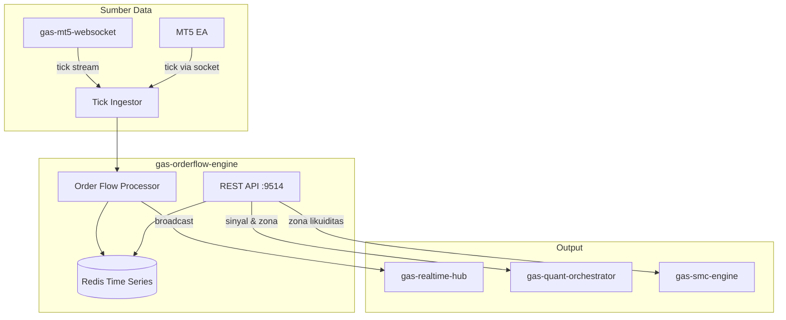

🚀 SERVICE TEMPLATE – @goldenaistrategy
📛 SERVICE NAME
gas-orderflow	API	9514	Order Flow & Liquidity	Delta, Imbalance, & Liquidity Zone hunting	Tick Data → OrderFlow → Sinyal Tekanan	Planned																

🧱 0. INSTALASI ENVIRONMENT
🐍 Python
<isi langkah instalasi python environment>
🐳 Docker
<isi langkah instalasi docker & docker compose>
⚙️ 1. TUTORIAL MANAGEMENT SERVICE
🐍 Python Mode
▶️ Run
<command run>
⛔ Stop
<command stop>
🔄 Restart
<command restart>
❌ Delete Environment
<command delete env>
🐳 Docker Mode
▶️ Build & Run
<command build & run>
📊 Check Status
<command cek status>
⛔ Stop
<command stop>
🔄 Restart
<command restart>
❌ Delete Container / Image
<command delete>

📦 2. SETUP GITHUB (FIRST TIME)
echo "# gas-orderflow" >> README.md
git init
git add README.md
git commit -m "first commit"
git branch -M main
git remote add origin https://github.com/Muhamadridwanjr/gas-orderflow.git
git push -u origin main
…or push an existing repository from the command line
git remote add origin https://github.com/Muhamadridwanjr/gas-orderflow.git
git branch -M main
git push -u origin main
📛 4. CONTAINER NAMING
<ketentuan nama container = nama project>
🌐 5. HEALTH CHECK (STATUS 200 OK)
Endpoint
<endpoint-url>
Expected Response
<response contoh>
🧪 6. DEBUG & LOGGING
Docker Logs
<command docker logs>
Application Logs
<setup logging>
Healthcheck Configuration
<docker healthcheck config>
🟢 7. CONTAINER STATUS
<expected: Up (healthy)>
🔗 8. INTEGRASI GAS-GATEWAY-API
Configuration
<env / config url>
Request Example
<request example>
🧠 9. INTEGRASI DENGAN @goldenaistrategy
<standarisasi service dalam ecosystem>
🔄 10. KOMUNIKASI ANTAR SERVICE
Network Configuration
<docker network config>
Service Communication
<contoh komunikasi antar service>
📁 STRUKTUR PROJECT
# 📊 GAS Order Flow Engine

**Bagian dari Ekosistem GAS (Gas Automatic Strategy) – Edge Legendary Layer (VPS 5)**  
Service yang menganalisis **order flow** (aliran order) secara real‑time untuk mendeteksi tekanan beli/jual, ketidakseimbangan (imbalance), dan zona likuiditas. Terinspirasi dari konsep **smart money** dan **order flow trading** yang digunakan oleh hedge fund modern untuk melihat “niat” pasar di balik pergerakan harga.

---

## 📋 Daftar Isi

- [Ikhtisar](#ikhtisar)
- [Arsitektur](#arsitektur)
- [Alur Kerja](#alur-kerja)
- [Fitur Utama](#fitur-utama)
- [Teknologi](#teknologi)
- [Struktur Direktori](#struktur-direktori)
- [Instalasi & Menjalankan](#instalasi--menjalankan)
- [Konfigurasi](#konfigurasi)
- [API Reference](#api-reference)
- [Integrasi dengan Service Lain](#integrasi-dengan-service-lain)
- [Pengujian](#pengujian)
- [Pengembangan](#pengembangan)
- [Kontribusi (Tim Internal)](#kontribusi-tim-internal)
- [Lisensi & Kredit](#lisensi--kredit)

---

## 🔍 Ikhtisar

**gas-orderflow-engine** adalah service yang menerima **data tick** (setiap perubahan harga dan volume) secara real‑time dari `gas-mt5-websocket` (atau sumber lain), lalu menghitung metrik order flow seperti:

- **Delta** : selisih antara volume transaksi pada harga *ask* (buy) dan *bid* (sell) dalam periode tertentu.
- **Cumulative Delta** : akumulasi delta sejak awal sesi atau periode tertentu.
- **Imbalance Ratio** : perbandingan antara volume buy dan total volume.
- **Bid/Ask Volume** : total volume yang terjadi di harga bid dan ask.
- **Liquidity Zones** : level harga di mana terjadi akumulasi volume besar (order book thick), yang bisa menjadi support/resistance atau target stop hunt.

Dengan metrik ini, service dapat menghasilkan **sinyal tekanan** (buy pressure / sell pressure) yang dapat digunakan oleh engine lain (misal `gas-quant-orchestrator`) untuk mengonfirmasi sinyal atau sebagai entry trigger mandiri.

Order flow adalah salah satu rahasia smart money – mereka tidak hanya melihat harga, tapi juga **siapa yang melakukan transaksi** (buyer/seller) dan seberapa agresif.

---

## 🏗️ Arsitektur



### Komponen Utama
- **Tick Ingestor** – Menerima aliran tick (bisa via WebSocket, Redis pub/sub, atau REST). Setiap tick berisi: timestamp, harga bid, harga ask, volume (opsional), dan arah (buy/sell jika bisa ditentukan).
- **Order Flow Processor** – Mengakumulasi tick per periode (misal per detik, per menit) dan menghitung metrik: delta, cumulative delta, imbalance, volume bid/ask.
- **Redis Time Series** – Menyimpan data order flow historis (beberapa jam terakhir) untuk query cepat.
- **REST API** – Menyediakan endpoint untuk mengambil metrik terkini, sinyal tekanan, dan zona likuiditas.

---

## 🔄 Alur Kerja

1. **Tick Masuk**: Setiap kali ada transaksi baru di MT5, EA mengirimkan tick ke `gas-mt5-websocket`, yang kemudian mempublikasikannya ke Redis channel `market:ticks`. Atau, `gas-orderflow-engine` bisa langsung berlangganan ke channel tersebut.
2. **Ingest & Parsing**: Setiap tick diparse, dicatat timestamp, harga, dan volume. Jika data mencakup arah (buy/sell), itu digunakan; jika tidak, arah bisa diperkirakan dari tick (misal jika harga naik, diasumsikan buy).
3. **Agregasi**: Tick diakumulasi dalam bucket waktu (misal 1 detik) untuk menghitung:
   - Volume Buy = total volume tick dengan arah buy.
   - Volume Sell = total volume tick dengan arah sell.
   - Delta = Volume Buy - Volume Sell.
   - Imbalance = (Volume Buy - Volume Sell) / (Volume Buy + Volume Sell) jika total > 0.
4. **Cumulative Delta**: Delta per bucket diakumulasi sejak awal sesi atau periode yang ditentukan (misal 1 jam).
5. **Liquidity Zones**: Service melacak level harga di mana terjadi lonjakan volume (baik buy maupun sell). Level-level ini disimpan sebagai zona likuiditas (misal dengan metode clustering).
6. **Sinyal Tekanan**: Jika delta positif dan besar dalam periode singkat, dan/atau imbalance > 0.3, maka sinyal **BUY PRESSURE** dihasilkan. Sebaliknya untuk **SELL PRESSURE**.
7. **Penyimpanan**: Data agregat per detik disimpan di Redis dengan struktur time series (misal menggunakan RedisTimeSeries module) untuk query rentang waktu.
8. **Broadcast**: Data terkini (misal delta 1 detik terakhir) dikirim ke `gas-realtime-hub` untuk didistribusikan ke klien (terminal, dashboard).
9. **Serving via API**: Service lain dapat meminta:
   - Delta terkini atau cumulative delta.
   - Zona likuiditas.
   - Sinyal tekanan.

**Contoh Tick (format JSON):**
```json
{
  "symbol": "XAUUSD",
  "time": 1700000000,
  "bid": 2000.1,
  "ask": 2000.2,
  "last": 2000.15,
  "volume": 1.5,
  "side": "buy"   // atau "sell", bisa ditentukan oleh EA
}
```

**Contoh Output Sinyal:**
```json
{
  "symbol": "XAUUSD",
  "timestamp": 1700000005,
  "delta": 250,
  "cumulative_delta": 1200,
  "imbalance": 0.4,
  "pressure": "BUY",
  "strength": 0.8
}
```

---

## ✨ Fitur Utama

- **Real‑time Order Flow Metrics**: Delta, cumulative delta, imbalance ratio, volume buy/sell.
- **Liquidity Zone Detection**: Identifikasi level harga dengan volume tinggi yang mungkin menjadi area support/resistance atau stop hunt.
- **Pressure Signals**: Menghasilkan sinyal beli/jual berdasarkan tekanan order.
- **Integrasi dengan Realtime Hub**: Data order flow dapat ditampilkan di terminal secara real‑time (misal sebagai indikator di chart atau panel terpisah).
- **Historical Query**: Dapat mengambil data order flow untuk periode tertentu (misal 1 jam terakhir).
- **Multi‑symbol**: Dapat menangani banyak simbol sekaligus.

---

## 🛠️ Teknologi

- **Bahasa:** Python 3.11+
- **Web Framework:** FastAPI (REST)
- **WebSocket Client:** `websockets` atau `aioredis` untuk subscribe ke Redis
- **Komputasi:** `numpy`, `pandas` (untuk agregasi dan clustering)
- **Database Time Series:** Redis dengan module RedisTimeSeries (atau bisa menggunakan Redis biasa dengan struktur sorted set)
- **Cache:** Redis (juga)
- **Container:** Docker, Docker Compose

---

## 📁 Struktur Direktori

```
gas-orderflow-engine/
├── src/
│   ├── __init__.py
│   ├── main.py                     # Entry point FastAPI
│   ├── config.py                    # Pydantic settings
│   ├── ingest/
│   │   ├── __init__.py
│   │   ├── redis_listener.py        # Subscribe ke Redis channel
│   │   └── parser.py                 # Parsing tick
│   ├── core/
│   │   ├── __init__.py
│   │   ├── accumulator.py            # Agregasi tick per periode
│   │   ├── metrics.py                 # Hitung delta, imbalance
│   │   ├── liquidity.py                # Deteksi zona likuiditas
│   │   ├── signals.py                   # Generate sinyal tekanan
│   │   └── exceptions.py
│   ├── storage/
│   │   ├── __init__.py
│   │   └── redis_ts.py                # Simpan & query time series di Redis
│   ├── api/
│   │   ├── __init__.py
│   │   ├── routes.py                   # Endpoint REST
│   │   └── models.py                   # Pydantic models
│   ├── broadcast/
│   │   ├── __init__.py
│   │   └── hub_client.py                # Kirim data ke gas-realtime-hub
│   ├── lib/
│   │   ├── logger.py
│   │   └── utils.py
│   └── workers/                         # (opsional) background tasks
├── tests/
├── Dockerfile
├── docker-compose.yml
├── .env.example
├── requirements.txt
└── README.md
```

---

## ⚙️ Instalasi & Menjalankan

### Prasyarat
- Python 3.11+
- Redis server dengan module RedisTimeSeries (bisa menggunakan Redis Stack)
- `gas-mt5-websocket` yang mengirim tick ke Redis (atau bisa langsung dari EA)
- `gas-realtime-hub` jika ingin broadcast

### Langkah Cepat (Development)

1. Clone repositori (internal):
   ```bash
   git clone https://github.com/gasstrategy/gas-orderflow-engine.git
   cd gas-orderflow-engine
   ```

2. Buat virtual environment:
   ```bash
   python -m venv venv
   source venv/bin/activate
   ```

3. Install dependencies:
   ```bash
   pip install -r requirements-dev.txt
   ```

4. Copy environment:
   ```bash
   cp .env.example .env
   # Isi REDIS_URL, TICK_CHANNEL, dll.
   ```

5. Jalankan Redis Stack (dengan TimeSeries):
   ```bash
   docker run -d --name redis-stack -p 6379:6379 redis/redis-stack:latest
   ```

6. Jalankan service:
   ```bash
   uvicorn src.main:app --reload --port 9514
   ```

### Dengan Docker Compose

```yaml
version: '3.8'
services:
  redis-stack:
    image: redis/redis-stack:latest
    ports:
      - "6379:6379"

  orderflow:
    build: .
    ports:
      - "9514:9514"
    environment:
      - REDIS_URL=redis://redis-stack:6379
      - TICK_CHANNEL=market:ticks
      - BROADCAST_URL=http://gas-realtime-hub:8111
    depends_on:
      - redis-stack
```

Jalankan:
```bash
docker-compose up -d
```

---

## 🔧 Konfigurasi

Environment variables (file `.env`):

| Variabel | Default | Deskripsi |
|----------|---------|-----------|
| `PORT` | 9514 | Port REST API |
| `REDIS_URL` | redis://localhost:6379 | Koneksi Redis (harus dengan module TimeSeries) |
| `TICK_CHANNEL` | market:ticks | Channel Redis tempat tick dipublikasikan |
| `SYMBOLS` | ["XAUUSD","BTCUSD","EURUSD"] | Daftar simbol yang dipantau (JSON array) |
| `AGGREGATION_WINDOW` | 1 | Periode agregasi dalam detik (default 1 detik) |
| `DELTA_THRESHOLD` | 100 | Ambang delta untuk sinyal tekanan |
| `IMBALANCE_THRESHOLD` | 0.3 | Ambang imbalance untuk sinyal tekanan |
| `LIQUIDITY_ZONE_VOLUME` | 1000 | Volume minimum untuk dianggap zona likuiditas |
| `BROADCAST_URL` | http://gas-realtime-hub:8111 | URL untuk mengirim data ke hub |
| `BROADCAST_INTERVAL` | 1 | Interval broadcast data agregat (detik) |
| `LOG_LEVEL` | INFO | Level logging |
| `ENVIRONMENT` | development | production/staging/development |

---

## 📡 API Reference

### `GET /orderflow/{symbol}/current` – Mendapatkan metrik order flow terkini

**Response:**
```json
{
  "symbol": "XAUUSD",
  "timestamp": 1700000005,
  "delta": 250,
  "cumulative_delta": 1200,
  "buy_volume": 1500,
  "sell_volume": 1250,
  "imbalance": 0.09,
  "pressure": "BUY"
}
```

### `GET /orderflow/{symbol}/history` – Data historis (time series)

**Parameter Query:**
- `from` (int) – timestamp awal
- `to` (int) – timestamp akhir
- `resolution` (int) – resolusi dalam detik (misal 60 untuk per menit)

**Response:** array dari object seperti di atas.

### `GET /orderflow/{symbol}/liquidity` – Zona likuiditas

**Response:**
```json
{
  "symbol": "XAUUSD",
  "zones": [
    {"price": 1995.5, "volume": 5000, "type": "support"},
    {"price": 2010.0, "volume": 4500, "type": "resistance"}
  ]
}
```

### `GET /orderflow/{symbol}/signal` – Sinyal tekanan terkini (sama dengan current tapi difokuskan pada sinyal)

### `GET /health` – Health check

---

## 🔗 Integrasi dengan Service Lain

- **`gas-mt5-websocket` (8110)** – Sumber data tick. Pastikan mengirim tick ke Redis channel yang sama dengan `TICK_CHANNEL`.
- **`gas-realtime-hub` (8111)** – Menerima data order flow agregat untuk disiarkan ke klien (terminal, dashboard). Data dikirim via REST atau Redis pub/sub.
- **`gas-quant-orchestrator` (9500)** – Menggunakan sinyal tekanan sebagai salah satu input scoring.
- **`gas-smc-engine` (8006)** – Zona likuiditas dapat digunakan untuk mengonfirmasi Order Block atau FVG.
- **`gas-feature-engine` (9499)** – (Opsional) dapat menggunakan delta sebagai fitur tambahan.
- **`gas-journal-service` (8107)** – Mencatat sinyal order flow untuk evaluasi.

---

## 🧪 Pengujian

```bash
pytest tests/ -v
# dengan coverage
pytest --cov=src tests/
```

Unit test mencakup:
- Agregasi tick.
- Perhitungan delta dan imbalance.
- Deteksi zona likuiditas.
- Logika sinyal.
- Endpoint API.

---

## 👨‍💻 Pengembangan

### Menambah Metrik Baru
- Tambahkan fungsi di `core/metrics.py`.
- Perbarui accumulator untuk menghitung metrik baru.
- Sertakan dalam output API.

### Aturan Kode
- Type hints wajib.
- Docstring untuk fungsi publik.
- Ikuti PEP 8 (black).
- Pastikan semua test lulus.

---

## 🔒 Kontribusi (Tim Internal)

Repositori ini bersifat **private** – hanya untuk tim internal GAS.  
Untuk berkontribusi:

1. Buat branch baru (`feature/`, `fix/`).
2. Commit dengan pesan jelas.
3. Buka Pull Request ke `develop`.
4. Tunggu review dan minimal satu approval.

**Aturan Penting:**
- Jangan commit kredensial.
- Gunakan environment variable untuk konfigurasi.
- Jangan sebarkan kode ke luar tim.

---

## 📄 Lisensi & Kredit

**Hak Cipta © 2025 Muhamad RidwanJr dan Tim GAS.**  
Seluruh hak cipta dilindungi undang-undang. Tidak untuk disebarluaskan tanpa izin tertulis.

Service ini dikembangkan sebagai bagian dari ekosistem **Golden AI Strategy**, terinspirasi dari teknik order flow yang digunakan oleh hedge fund modern.

---

**🔥 GAS Order Flow Engine – Membaca Niat Pasar di Balik Harga**
✅ FINAL CHECKLIST
[ ] Container name sesuai project  
[ ] Status container: Up (healthy)  
[ ] Endpoint mengembalikan 200 OK  
[ ] Tidak ada error pada logs  
[ ] Terintegrasi dengan GAS Gateway API  
[ ] Antar service dapat saling berkomunikasi  