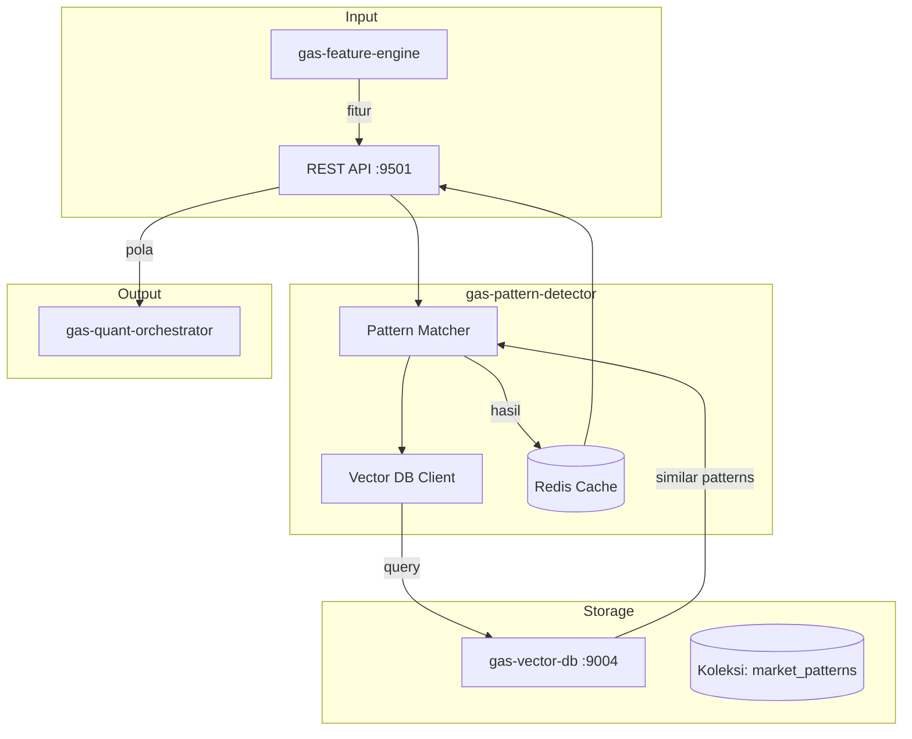

🚀 SERVICE TEMPLATE – @goldenaistrategy
📛 SERVICE NAME
	gas-pattern-detector	API	9501	Pattern Recognition	Hidden patterns & Similarity search (Vector DB)	Fitur → PatternDetector → Pola	Planned																			
🧱 0. INSTALASI ENVIRONMENT
🐍 Python
<isi langkah instalasi python environment>
🐳 Docker
<isi langkah instalasi docker & docker compose>
⚙️ 1. TUTORIAL MANAGEMENT SERVICE
🐍 Python Mode
▶️ Run
<command run>
⛔ Stop
<command stop>
🔄 Restart
<command restart>
❌ Delete Environment
<command delete env>
🐳 Docker Mode
▶️ Build & Run
<command build & run>
📊 Check Status
<command cek status>
⛔ Stop
<command stop>
🔄 Restart
<command restart>
❌ Delete Container / Image
<command delete>

📦 2. SETUP GITHUB (FIRST TIME)

echo "# gas-pattern-detector" >> README.md
git init
git add README.md
git commit -m "first commit"
git branch -M main
git remote add origin https://github.com/Muhamadridwanjr/gas-pattern-detector.git
git push -u origin main
…or push an existing repository from the command line
git remote add origin https://github.com/Muhamadridwanjr/gas-pattern-detector.git
git branch -M main
git push -u origin main
📛 4. CONTAINER NAMING
<ketentuan nama container = nama project>
🌐 5. HEALTH CHECK (STATUS 200 OK)
Endpoint
<endpoint-url>
Expected Response
<response contoh>
🧪 6. DEBUG & LOGGING
Docker Logs
<command docker logs>
Application Logs
<setup logging>
Healthcheck Configuration
<docker healthcheck config>
🟢 7. CONTAINER STATUS
<expected: Up (healthy)>
🔗 8. INTEGRASI GAS-GATEWAY-API
Configuration
<env / config url>
Request Example
<request example>
🧠 9. INTEGRASI DENGAN @goldenaistrategy
<standarisasi service dalam ecosystem>
🔄 10. KOMUNIKASI ANTAR SERVICE
Network Configuration
<docker network config>
Service Communication
<contoh komunikasi antar service>
📁 STRUKTUR PROJECT
# 🔍 GAS Pattern Detector

**Bagian dari Ekosistem GAS (Gas Automatic Strategy) – Quant Layer (VPS 5)**  
Service yang bertugas menemukan **pola tersembunyi** dalam data pasar dengan pendekatan statistik dan similarity search menggunakan vector database. Pola yang ditemukan dapat berupa kondisi berulang yang diikuti oleh pergerakan harga tertentu (misal: probabilitas naik 70% setelah pola tertentu). Hasilnya digunakan oleh `gas-quant-orchestrator` untuk menghasilkan sinyal trading berbasis statistik.

---

## 📋 Daftar Isi

- [Ikhtisar](#ikhtisar)
- [Arsitektur](#arsitektur)
- [Alur Kerja](#alur-kerja)
- [Fitur Utama](#fitur-utama)
- [Teknologi](#teknologi)
- [Struktur Direktori](#struktur-direktori)
- [Instalasi & Menjalankan](#instalasi--menjalankan)
- [Konfigurasi](#konfigurasi)
- [API Reference](#api-reference)
- [Integrasi dengan Service Lain](#integrasi-dengan-service-lain)
- [Pengujian](#pengujian)
- [Pengembangan](#pengembangan)
- [Kontribusi (Tim Internal)](#kontribusi-tim-internal)
- [Lisensi & Kredit](#lisensi--kredit)

---

## 🔍 Ikhtisar

**gas-pattern-detector** adalah mesin pencari pola yang tidak terlihat oleh indikator biasa. Ia bekerja dengan:

- Mengambil fitur numerik dari `gas-feature-engine` (returns, volatilitas, z‑score, dll.) untuk suatu periode.
- Mencari di `gas-vector-db` pola historis yang paling mirip dengan kondisi saat ini.
- Menghitung distribusi return setelah pola tersebut (expected return, probabilitas arah).
- Mengembalikan sinyal beserta confidence.

Pendekatan ini meniru cara Renaissance Technologies menemukan anomali statistik yang dapat dieksploitasi.

---

## 🏗️ Arsitektur



### Komponen Utama
- **REST API** (port 9501) – Menerima permintaan deteksi pola.
- **Pattern Matcher** – Logika untuk mencocokkan fitur saat ini dengan pola di vector DB.
- **Vector DB Client** – Antarmuka ke `gas-vector-db` untuk query similarity.
- **Redis Cache** – Menyimpan hasil deteksi untuk periode tertentu.

---

## 🔄 Alur Kerja

### **Offline Training (Background)**
1. Secara periodik (misal setiap hari), `gas-pattern-detector` mengambil data historis dari `gas-market-data-processor`.
2. Data dibagi menjadi sliding window (misal panjang 20 candle).
3. Untuk setiap window, ekstrak fitur (menggunakan `gas-feature-engine`).
4. Hitung distribusi return setelah window (misal 5, 10 candle ke depan).
5. Simpan ke vector DB sebagai dokumen dengan:
   - `embedding`: vektor fitur window.
   - `metadata`: simbol, timeframe, waktu, distribusi return, expected return, probabilitas.
   - `text`: deskripsi (opsional).

### **Online Detection**
1. Konsumen mengirim request `POST /detect` dengan fitur terkini.
2. Service mencari di vector DB 10 pola paling mirip (top‑k) dengan embedding fitur tersebut.
3. Agregasi hasil: hitung rata‑rata expected return, probabilitas arah, dan confidence.
4. Jika confidence di atas threshold, kembalikan sinyal.
5. Cache hasil untuk beberapa menit.

**Contoh Request:**
```json
{
  "symbol": "XAUUSD",
  "timeframe": "H1",
  "features": [0.12, -0.05, 0.33, ...],  // embedding dari feature-engine
  "top_k": 10
}
```

**Contoh Response:**
```json
{
  "pattern_id": null,  // jika ada pola spesifik
  "confidence": 0.72,
  "expected_return": 0.0008,
  "direction": "BUY",   // jika probabilitas naik > 60%
  "probability_up": 0.68,
  "details": {
    "matched_patterns": 8,
    "avg_confidence": 0.72
  }
}
```

---

## ✨ Fitur Utama

- **Similarity search** dengan vector DB – temukan pola historis yang mirip.
- **Distribusi return** – hitung expected return dan probabilitas dari sampel.
- **Multi‑timeframe** – pola dapat dicari di berbagai timeframe.
- **Online & offline mode** – pola dapat di‑update secara periodik.
- **Confidence score** – berdasarkan jumlah sampel dan kemiripan.
- **Extensible** – mudah menambah metrik pola baru.

---

## 🛠️ Teknologi

- **Bahasa:** Python 3.11+
- **Web Framework:** FastAPI (REST)
- **Komputasi:** `numpy`, `pandas`, `scipy`
- **Vector DB Client:** HTTP client ke `gas-vector-db` (port 9004)
- **Cache:** Redis (`redis.asyncio`)
- **Embedding:** Menggunakan fitur numerik langsung (tanpa embedding model terpisah) – bisa juga jika ingin menggunakan model seperti `sentence-transformers` untuk teks, tapi di sini fitur numerik sudah cukup.
- **Container:** Docker, Docker Compose

---

## 📁 Struktur Direktori

```
gas-pattern-detector/
├── src/
│   ├── __init__.py
│   ├── main.py                     # Entry point FastAPI
│   ├── config.py                    # Pydantic settings
│   ├── api/
│   │   ├── __init__.py
│   │   ├── routes.py                # Endpoint /detect
│   │   └── models.py                # Pydantic models
│   ├── core/
│   │   ├── __init__.py
│   │   ├── matcher.py               # Logika pencocokan pola
│   │   ├── aggregator.py            # Agregasi hasil dari beberapa pola
│   │   ├── pattern_builder.py       # (offline) Membangun pola dari data historis
│   │   └── exceptions.py
│   ├── vector/
│   │   ├── __init__.py
│   │   └── client.py                 # Client ke gas-vector-db
│   ├── cache/
│   │   ├── __init__.py
│   │   └── redis_cache.py
│   ├── lib/
│   │   ├── logger.py
│   │   └── utils.py
│   └── workers/
│       └── pattern_updater.py        # Background job untuk update pola
├── tests/
├── Dockerfile
├── docker-compose.yml
├── .env.example
├── requirements.txt
└── README.md
```

---

## ⚙️ Instalasi & Menjalankan

### Prasyarat
- Python 3.11+
- Redis server
- `gas-vector-db` berjalan (port 9004)
- `gas-feature-engine` berjalan (sebagai penyedia fitur, opsional untuk online mode)

### Langkah Cepat (Development)

1. Clone repositori (internal):
   ```bash
   git clone https://github.com/gasstrategy/gas-pattern-detector.git
   cd gas-pattern-detector
   ```

2. Buat virtual environment:
   ```bash
   python -m venv venv
   source venv/bin/activate
   ```

3. Install dependencies:
   ```bash
   pip install -r requirements-dev.txt
   ```

4. Copy environment:
   ```bash
   cp .env.example .env
   # Isi REDIS_URL, VECTOR_DB_URL, dll.
   ```

5. Jalankan Redis (jika belum):
   ```bash
   docker run -d -p 6379:6379 redis
   ```

6. Jalankan service:
   ```bash
   uvicorn src.main:app --reload --port 9501
   ```

### Dengan Docker Compose

```yaml
version: '3.8'
services:
  redis:
    image: redis:alpine
    ports:
      - "6379:6379"

  pattern-detector:
    build: .
    ports:
      - "9501:9501"
    environment:
      - REDIS_URL=redis://redis:6379
      - VECTOR_DB_URL=http://gas-vector-db:9004
    depends_on:
      - redis
```

Jalankan:
```bash
docker-compose up -d
```

---

## 🔧 Konfigurasi

Environment variables (file `.env`):

| Variabel | Default | Deskripsi |
|----------|---------|-----------|
| `PORT` | 9501 | Port REST API |
| `REDIS_URL` | redis://localhost:6379 | Koneksi Redis untuk cache |
| `VECTOR_DB_URL` | http://gas-vector-db:9004 | URL gas-vector-db |
| `VECTOR_DB_COLLECTION` | market_patterns | Nama koleksi di vector DB |
| `CACHE_TTL` | 300 | TTL cache deteksi (detik) |
| `DEFAULT_TOP_K` | 10 | Jumlah pola mirip yang diambil |
| `MIN_CONFIDENCE` | 0.6 | Confidence minimum untuk mengembalikan sinyal |
| `LOG_LEVEL` | INFO | Level logging |
| `ENVIRONMENT` | development | production/staging/development |

---

## 📡 API Reference

### `POST /detect` – Mendeteksi pola berdasarkan fitur

**Request Body:**
```json
{
  "symbol": "XAUUSD",
  "timeframe": "H1",
  "features": [0.12, -0.05, 0.33, 0.01, -0.22],   // embedding vektor
  "top_k": 10,
  "min_confidence": 0.6
}
```

**Response:**
```json
{
  "symbol": "XAUUSD",
  "timeframe": "H1",
  "confidence": 0.72,
  "expected_return": 0.0008,
  "direction": "BUY",
  "probability_up": 0.68,
  "details": {
    "matched_patterns": 8,
    "avg_similarity": 0.85
  }
}
```

### `POST /detect/batch` – Untuk banyak simbol/request sekaligus.

### `GET /health` – Health check
```json
{"status": "ok"}
```

### `POST /patterns/update` – (Internal) Trigger update pola dari data historis
Bisa dipanggil oleh scheduler untuk menjalankan offline training.

---

## 🔗 Integrasi dengan Service Lain

- **`gas-feature-engine` (9499)** – Menyediakan fitur (embedding) untuk query.
- **`gas-vector-db` (9004)** – Menyimpan dan mencari pola historis.
- **`gas-quant-orchestrator` (9500)** – Konsumen utama hasil deteksi pola.
- **`gas-market-data-processor`** – Untuk mengambil data historis saat offline training.
- **Redis** – Cache hasil deteksi.

---

## 🧪 Pengujian

```bash
pytest tests/ -v
# dengan coverage
pytest --cov=src tests/
```

Unit test mencakup:
- Query ke vector DB (mock).
- Agregasi hasil.
- Confidence calculation.
- Validasi input.

---

## 👨‍💻 Pengembangan

### Menambahkan Metode Agregasi Baru
Di `core/aggregator.py`, tambahkan fungsi baru, lalu panggil di `matcher.py`.

### Offline Pattern Builder
File `workers/pattern_updater.py` berisi logic untuk:
- Ambil data historis (misal 1 tahun).
- Bagi jadi window.
- Hitung fitur (dengan panggil `gas-feature-engine` atau kalkulasi internal).
- Hitung return setelah window.
- Simpan ke vector DB dengan format:
  ```json
  {
    "id": "pattern_123",
    "embedding": [fitur],
    "metadata": {
      "symbol": "XAUUSD",
      "timeframe": "H1",
      "time": 1700000000,
      "expected_return": 0.0005,
      "prob_up": 0.65,
      "sample_size": 150
    }
  }
  ```

Jalankan updater secara periodik (cron) atau via scheduler.

### Aturan Kode
- Type hints wajib.
- Docstring untuk fungsi publik.
- Ikuti PEP 8 (black).
- Pastikan semua test lulus.

---

## 🔒 Kontribusi (Tim Internal)

Repositori ini bersifat **private** – hanya untuk tim internal GAS.  
Untuk berkontribusi:

1. Buat branch baru (`feature/`, `fix/`).
2. Commit dengan pesan jelas.
3. Buka Pull Request ke `develop`.
4. Tunggu review dan minimal satu approval.

**Aturan Penting:**
- Jangan commit kredensial.
- Gunakan environment variable untuk konfigurasi.
- Jangan sebarkan kode ke luar tim.

---

## 📄 Lisensi & Kredit

**Hak Cipta © 2025 Muhamad RidwanJr dan Tim GAS.**  
Seluruh hak cipta dilindungi undang-undang. Tidak untuk disebarluaskan tanpa izin tertulis.

Service ini dikembangkan sebagai bagian dari ekosistem **Golden AI Strategy**.

---

**🔥 GAS Pattern Detector – Menemukan Peluang di Balik Data**
✅ FINAL CHECKLIST
[ ] Container name sesuai project  
[ ] Status container: Up (healthy)  
[ ] Endpoint mengembalikan 200 OK  
[ ] Tidak ada error pada logs  
[ ] Terintegrasi dengan GAS Gateway API  
[ ] Antar service dapat saling berkomunikasi  