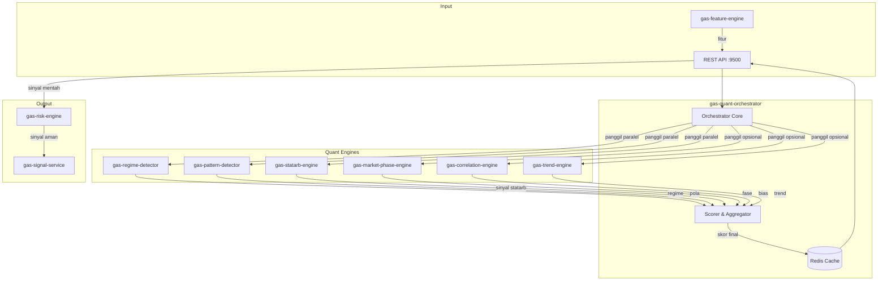

🚀 SERVICE TEMPLATE – @goldenaistrategy
📛 SERVICE NAME
gas-quant-orch	API	9500	Quant Orchestrator	Otak utama: Scoring & Gabung sinyal	Fitur → QuantOrch → Sinyal Final	Planned																
🧱 0. INSTALASI ENVIRONMENT
🐍 Python
<isi langkah instalasi python environment>
🐳 Docker
<isi langkah instalasi docker & docker compose>
⚙️ 1. TUTORIAL MANAGEMENT SERVICE
🐍 Python Mode
▶️ Run
<command run>
⛔ Stop
<command stop>
🔄 Restart
<command restart>
❌ Delete Environment
<command delete env>
🐳 Docker Mode
▶️ Build & Run
<command build & run>
📊 Check Status
<command cek status>
⛔ Stop
<command stop>
🔄 Restart
<command restart>
❌ Delete Container / Image
<command delete>

📦 2. SETUP GITHUB (FIRST TIME)

echo "# gas-quant-orch" >> README.md
git init
git add README.md
git commit -m "first commit"
git branch -M main
git remote add origin https://github.com/Muhamadridwanjr/gas-quant-orch.git
git push -u origin main
…or push an existing repository from the command line
git remote add origin https://github.com/Muhamadridwanjr/gas-quant-orch.git
git branch -M main
git push -u origin main
📛 4. CONTAINER NAMING
<ketentuan nama container = nama project>
🌐 5. HEALTH CHECK (STATUS 200 OK)
Endpoint
<endpoint-url>
Expected Response
<response contoh>
🧪 6. DEBUG & LOGGING
Docker Logs
<command docker logs>
Application Logs
<setup logging>
Healthcheck Configuration
<docker healthcheck config>
🟢 7. CONTAINER STATUS
<expected: Up (healthy)>
🔗 8. INTEGRASI GAS-GATEWAY-API
Configuration
<env / config url>
Request Example
<request example>
🧠 9. INTEGRASI DENGAN @goldenaistrategy
<standarisasi service dalam ecosystem>
🔄 10. KOMUNIKASI ANTAR SERVICE
Network Configuration
<docker network config>
Service Communication
<contoh komunikasi antar service>
📁 STRUKTUR PROJECT
# 🧠 GAS Quant Orchestrator

**Bagian dari Ekosistem GAS (Gas Automatic Strategy) – Quant Layer (VPS 5)**  
Service otak utama yang menerima fitur dari `gas-feature-engine`, mengumpulkan sinyal dari berbagai engine quant (`gas-regime-detector`, `gas-pattern-detector`, `gas-statarb-engine`, dan engine edge lainnya), melakukan agregasi dan scoring, lalu menghasilkan **sinyal final** yang siap dikirim ke `gas-risk-engine` dan `gas-signal-service` untuk eksekusi.

---

## 📋 Daftar Isi

- [Ikhtisar](#ikhtisar)
- [Arsitektur](#arsitektur)
- [Alur Kerja](#alur-kerja)
- [Fitur Utama](#fitur-utama)
- [Teknologi](#teknologi)
- [Struktur Direktori](#struktur-direktori)
- [Instalasi & Menjalankan](#instalasi--menjalankan)
- [Konfigurasi](#konfigurasi)
- [API Reference](#api-reference)
- [Integrasi dengan Service Lain](#integrasi-dengan-service-lain)
- [Pengujian](#pengujian)
- [Pengembangan](#pengembangan)
- [Kontribusi (Tim Internal)](#kontribusi-tim-internal)
- [Lisensi & Kredit](#lisensi--kredit)

---

## 🔍 Ikhtisar

**gas-quant-orchestrator** adalah pusat komando untuk semua strategi kuantitatif di ekosistem GAS. Tugas utamanya:

- Mengumpulkan fitur terkini dari `gas-feature-engine`.
- Memanggil secara paralel engine‑engine quant:
  - `gas-regime-detector` – untuk mengetahui kondisi pasar (trending, ranging, high‑vol, dll.)
  - `gas-pattern-detector` – untuk mencari pola tersembunyi.
  - `gas-statarb-engine` – untuk sinyal pairs trading.
  - (Opsional) engine lain seperti `gas-market-phase-engine`, `gas-correlation-engine`, `gas-trend-engine`.
- Melakukan **scoring** berdasarkan regime dan aturan yang telah ditentukan (bisa rule‑based atau model ML).
- Menghasilkan sinyal final (BUY, SELL, NEUTRAL) beserta confidence dan metadata.
- Mengirim sinyal ke `gas-risk-engine` untuk validasi risiko, lalu ke `gas-signal-service` untuk didistribusikan.

Dengan adanya orchestrator ini, semua engine quant dapat bekerja secara independen dan hasilnya disatukan menjadi satu keputusan trading yang koheren.

---

## 🏗️ Arsitektur



### Komponen Utama
- **REST API** (port 9500) – Menerima permintaan analisis quant (biasanya dari scheduler atau dari pengguna via gateway).
- **Orchestrator Core** – Mengatur pemanggilan paralel ke engine quant, mengelola timeout, error handling.
- **Scorer & Aggregator** – Menggabungkan sinyal dari berbagai engine dengan aturan scoring yang telah ditentukan (bisa berbasis regime).
- **Redis Cache** – Menyimpan hasil analisis untuk periode singkat (misal 1 detik) agar tidak perlu menghitung ulang jika ada permintaan beruntun.

---

## 🔄 Alur Kerja

1. **Scheduler** (atau service lain) mengirim request `POST /analyze` ke `gas-quant-orchestrator` dengan parameter simbol, timeframe, dan mungkin list engine yang diinginkan.
2. Orchestrator mengambil fitur terkini dari `gas-feature-engine` (jika tidak disertakan dalam request).
3. Orchestrator memanggil secara paralel semua engine quant yang terdaftar (bisa dikonfigurasi) dengan fitur tersebut.
4. Setiap engine mengembalikan sinyal/regime masing‑masing.
5. **Scorer** menerapkan aturan:
   - Misal: jika regime = "TRENDING", bobot untuk sinyal trend lebih besar; jika "RANGING", bobot untuk sinyal statarb lebih besar.
   - Setiap sinyal diberi skor (misal -1 sampai 1) dan dikalikan bobot.
   - Total skor dihitung. Jika melebihi threshold positif → sinyal BUY; jika di bawah threshold negatif → sinyal SELL; lainnya NEUTRAL.
   - Confidence dihitung berdasarkan konsensus dan besarnya skor.
6. Hasil final (sinyal, confidence, metadata) disimpan di cache dan dikembalikan ke pemanggil.
7. (Opsional) Pemanggil kemudian mengirim sinyal ke `gas-risk-engine` untuk validasi lebih lanjut.

**Contoh Request:**
```json
{
  "symbol": "XAUUSD",
  "timeframe": "H1",
  "features": { ... },  // opsional, jika tidak disertakan akan diambil dari feature-engine
  "engines": ["regime", "pattern", "statarb", "phase"] // opsional, default semua
}
```

**Contoh Response:**
```json
{
  "symbol": "XAUUSD",
  "timeframe": "H1",
  "signal": "BUY",
  "confidence": 0.78,
  "score": 0.65,
  "details": {
    "regime": { "regime": "TRENDING", "confidence": 0.9 },
    "pattern": { "direction": "BUY", "confidence": 0.72 },
    "statarb": { "signal": "NEUTRAL", "confidence": 0.5 },
    "phase": { "phase": "MARKUP", "confidence": 0.8 }
  }
}
```

---

## ✨ Fitur Utama

- **Multi‑engine orchestration** – Memanggil beberapa engine quant secara paralel.
- **Scoring adaptif** – Bobot sinyal dapat berubah tergantung regime pasar.
- **Caching** – Hasil analisis disimpan untuk periode singkat (configurable) untuk menghindari perhitungan ulang.
- **Timeout handling** – Jika ada engine yang lambat, tetap dapatkan hasil dari yang lain.
- **Konfigurasi fleksibel** – Engine mana yang aktif, bobot default, threshold sinyal dapat diatur via environment.
- **Extensible** – Mudah menambah engine baru.

---

## 🛠️ Teknologi

- **Bahasa:** Python 3.11+
- **Web Framework:** FastAPI (REST)
- **Async HTTP Client:** `httpx` untuk memanggil engine lain secara paralel.
- **Cache:** Redis (`redis.asyncio`)
- **Container:** Docker, Docker Compose

---

## 📁 Struktur Direktori

```
gas-quant-orchestrator/
├── src/
│   ├── __init__.py
│   ├── main.py                     # Entry point FastAPI
│   ├── config.py                    # Pydantic settings
│   ├── api/
│   │   ├── __init__.py
│   │   ├── routes.py                # Endpoint /analyze
│   │   └── models.py                # Pydantic models
│   ├── core/
│   │   ├── __init__.py
│   │   ├── orchestrator.py          # Logika pemanggilan paralel
│   │   ├── scorer.py                 # Agregasi & scoring
│   │   ├── engine_clients.py        # HTTP client untuk tiap engine
│   │   └── exceptions.py
│   ├── cache/
│   │   ├── __init__.py
│   │   └── redis_cache.py
│   ├── lib/
│   │   ├── logger.py
│   │   └── utils.py
│   └── workers/                      # (opsional) background tasks
├── tests/
├── Dockerfile
├── docker-compose.yml
├── .env.example
├── requirements.txt
└── README.md
```

---

## ⚙️ Instalasi & Menjalankan

### Prasyarat
- Python 3.11+
- Redis server
- Semua engine quant yang akan dipanggil harus berjalan (feature-engine, regime, pattern, statarb, dll.)

### Langkah Cepat (Development)

1. Clone repositori (internal):
   ```bash
   git clone https://github.com/gasstrategy/gas-quant-orchestrator.git
   cd gas-quant-orchestrator
   ```

2. Buat virtual environment:
   ```bash
   python -m venv venv
   source venv/bin/activate
   ```

3. Install dependencies:
   ```bash
   pip install -r requirements-dev.txt
   ```

4. Copy environment:
   ```bash
   cp .env.example .env
   # Isi REDIS_URL, URL masing-masing engine, bobot, dll.
   ```

5. Jalankan Redis (jika belum):
   ```bash
   docker run -d -p 6379:6379 redis
   ```

6. Jalankan service:
   ```bash
   uvicorn src.main:app --reload --port 9500
   ```

### Dengan Docker Compose

```yaml
version: '3.8'
services:
  redis:
    image: redis:alpine
    ports:
      - "6379:6379"

  quant-orchestrator:
    build: .
    ports:
      - "9500:9500"
    environment:
      - REDIS_URL=redis://redis:6379
      - FEATURE_ENGINE_URL=http://gas-feature-engine:9499
      - REGIME_DETECTOR_URL=http://gas-regime-detector:9503
      - PATTERN_DETECTOR_URL=http://gas-pattern-detector:9501
      - STATARB_ENGINE_URL=http://gas-statarb-engine:9502
      - PHASE_ENGINE_URL=http://gas-market-phase-engine:9510   # opsional
      - CORRELATION_ENGINE_URL=http://gas-correlation-engine:9512 # opsional
      - TREND_ENGINE_URL=http://gas-trend-engine:9513         # opsional
    depends_on:
      - redis
```

Jalankan:
```bash
docker-compose up -d
```

---

## 🔧 Konfigurasi

Environment variables (file `.env`):

| Variabel | Default | Deskripsi |
|----------|---------|-----------|
| `PORT` | 9500 | Port REST API |
| `REDIS_URL` | redis://localhost:6379 | Koneksi Redis |
| `CACHE_TTL` | 5 | TTL cache hasil analisis (detik) |
| `FEATURE_ENGINE_URL` | http://gas-feature-engine:9499 | URL feature-engine |
| `REGIME_DETECTOR_URL` | http://gas-regime-detector:9503 | URL regime detector |
| `PATTERN_DETECTOR_URL` | http://gas-pattern-detector:9501 | URL pattern detector |
| `STATARB_ENGINE_URL` | http://gas-statarb-engine:9502 | URL statarb engine |
| `PHASE_ENGINE_URL` | (opsional) | URL market-phase-engine |
| `CORRELATION_ENGINE_URL` | (opsional) | URL correlation-engine |
| `TREND_ENGINE_URL` | (opsional) | URL trend-engine |
| `REQUEST_TIMEOUT` | 2.0 | Timeout panggilan ke engine (detik) |
| `SIGNAL_THRESHOLD` | 0.5 | Threshold skor untuk menghasilkan sinyal BUY/SELL |
| `WEIGHT_REGIME` | 1.0 | Bobot untuk sinyal regime dalam scoring (tidak langsung, digunakan dalam logika) |
| `WEIGHT_PATTERN` | 1.5 | Bobot untuk pattern |
| `WEIGHT_STATARB` | 1.0 | Bobot untuk statarb |
| `WEIGHT_PHASE` | 0.8 | Bobot untuk phase engine |
| `WEIGHT_CORRELATION` | 0.5 | Bobot untuk correlation |
| `WEIGHT_TREND` | 1.2 | Bobot untuk trend engine |
| `LOG_LEVEL` | INFO | Level logging |
| `ENVIRONMENT` | development | production/staging/development |

---

## 📡 API Reference

### `POST /analyze` – Analisis quant untuk satu simbol

**Request Body:**
```json
{
  "symbol": "XAUUSD",
  "timeframe": "H1",
  "features": { ... },           // opsional, akan diambil dari feature-engine jika tidak ada
  "engines": ["regime", "pattern", "statarb"] // opsional, default semua yang tersedia
}
```

**Response:**
```json
{
  "symbol": "XAUUSD",
  "timeframe": "H1",
  "signal": "BUY",
  "confidence": 0.78,
  "score": 0.65,
  "details": {
    "regime": { "regime": "TRENDING", "confidence": 0.9 },
    "pattern": { "direction": "BUY", "confidence": 0.72 },
    "statarb": { "signal": "NEUTRAL", "confidence": 0.5 }
  }
}
```

### `POST /analyze/batch` – Analisis untuk banyak simbol sekaligus
Request: `{"requests": [ {...}, {...} ]}`

### `GET /health` – Health check
```json
{"status": "ok"}
```

### `GET /engines` – Mendapatkan daftar engine yang aktif beserta statusnya

---

## 🔗 Integrasi dengan Service Lain

- **`gas-feature-engine` (9499)** – Menyediakan fitur untuk analisis.
- **`gas-regime-detector` (9503)** – Memberikan regime pasar.
- **`gas-pattern-detector` (9501)** – Memberikan sinyal pola.
- **`gas-statarb-engine` (9502)** – Memberikan sinyal pairs trading.
- **`gas-market-phase-engine` (9510)** – Memberikan fase pasar (opsional).
- **`gas-correlation-engine` (9512)** – Memberikan bias korelasi (opsional).
- **`gas-trend-engine` (9513)** – Memberikan sinyal trend (opsional).
- **`gas-risk-engine` (9511)** – Menerima sinyal untuk validasi risiko (tidak langsung dipanggil oleh orchestrator, tetapi oleh caller).
- **`gas-signal-service` (8106)** – Menerima sinyal final setelah melewati risk engine.

---

## 🧪 Pengujian

```bash
pytest tests/ -v
# dengan coverage
pytest --cov=src tests/
```

Unit test mencakup:
- Pemanggilan paralel (mock).
- Logika scoring.
- Caching.
- Error handling (timeout, engine down).

---

## 👨‍💻 Pengembangan

### Menambahkan Engine Quant Baru
1. Tambahkan URL dan bobot di konfigurasi.
2. Buat client baru di `core/engine_clients.py` (fungsi async yang memanggil API engine).
3. Tambahkan pemanggilan di `orchestrator.py` (dalam fungsi `call_engines`).
4. Perbarui `scorer.py` untuk menggabungkan hasil engine baru.

### Aturan Scoring
Scoring dapat diimplementasikan sebagai aturan sederhana atau model ML. Di `scorer.py`, kita bisa membuat fungsi yang menerima dictionary hasil engine dan mengembalikan skor akhir.

Contoh sederhana:
```python
def calculate_score(regime_result, pattern_result, statarb_result, weights):
    score = 0
    if regime_result['regime'] == 'TRENDING':
        score += weights['trend'] * pattern_result['score']
    else:
        score += weights['mean_reversion'] * statarb_result['score']
    return score
```

### Aturan Kode
- Type hints wajib.
- Docstring untuk fungsi publik.
- Ikuti PEP 8 (black).
- Pastikan semua test lulus.

---

## 🔒 Kontribusi (Tim Internal)

Repositori ini bersifat **private** – hanya untuk tim internal GAS.  
Untuk berkontribusi:

1. Buat branch baru (`feature/`, `fix/`).
2. Commit dengan pesan jelas.
3. Buka Pull Request ke `develop`.
4. Tunggu review dan minimal satu approval.

**Aturan Penting:**
- Jangan commit kredensial.
- Gunakan environment variable untuk konfigurasi.
- Jangan sebarkan kode ke luar tim.

---

## 📄 Lisensi & Kredit

**Hak Cipta © 2025 Muhamad RidwanJr dan Tim GAS.**  
Seluruh hak cipta dilindungi undang-undang. Tidak untuk disebarluaskan tanpa izin tertulis.

Service ini dikembangkan sebagai bagian dari ekosistem **Golden AI Strategy**.

---

**🔥 GAS Quant Orchestrator – Otak Strategi Kuantitatif GAS**
✅ FINAL CHECKLIST
[ ] Container name sesuai project  
[ ] Status container: Up (healthy)  
[ ] Endpoint mengembalikan 200 OK  
[ ] Tidak ada error pada logs  
[ ] Terintegrasi dengan GAS Gateway API  
[ ] Antar service dapat saling berkomunikasi  