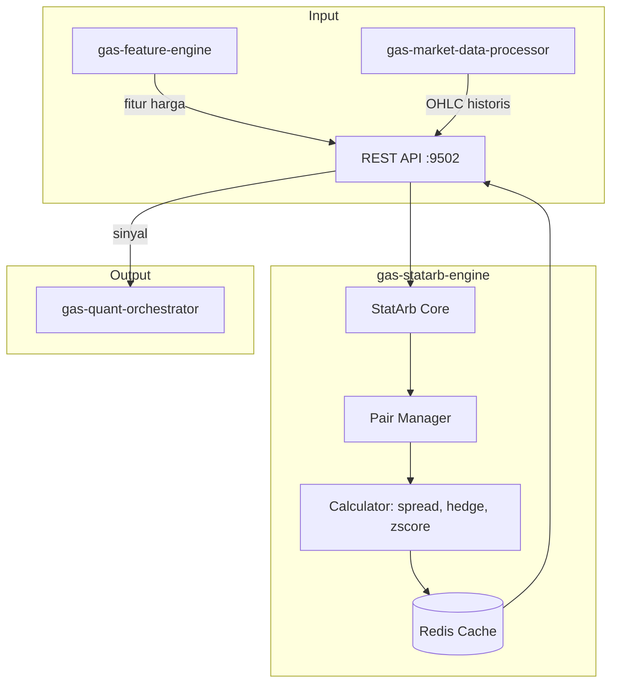

🚀 SERVICE TEMPLATE – @goldenaistrategy
📛 SERVICE NAME
		gas-statarb-engine	API	9502	Statistical Arbitrage	Pairs trading, Cointegration, Hedge ratio	Fitur → StatArb → Sinyal	Planned																													
🧱 0. INSTALASI ENVIRONMENT
🐍 Python
<isi langkah instalasi python environment>
🐳 Docker
<isi langkah instalasi docker & docker compose>
⚙️ 1. TUTORIAL MANAGEMENT SERVICE
🐍 Python Mode
▶️ Run
<command run>
⛔ Stop
<command stop>
🔄 Restart
<command restart>
❌ Delete Environment
<command delete env>
🐳 Docker Mode
▶️ Build & Run
<command build & run>
📊 Check Status
<command cek status>
⛔ Stop
<command stop>
🔄 Restart
<command restart>
❌ Delete Container / Image
<command delete>

📦 2. SETUP GITHUB (FIRST TIME)
echo "# gas-statarb-engine" >> README.md
git init
git add README.md
git commit -m "first commit"
git branch -M main
git remote add origin https://github.com/Muhamadridwanjr/gas-statarb-engine.git
git push -u origin main
…or push an existing repository from the command line
git remote add origin https://github.com/Muhamadridwanjr/gas-statarb-engine.git
git branch -M main
git push -u origin main
📛 4. CONTAINER NAMING
<ketentuan nama container = nama project>
🌐 5. HEALTH CHECK (STATUS 200 OK)
Endpoint
<endpoint-url>
Expected Response
<response contoh>
🧪 6. DEBUG & LOGGING
Docker Logs
<command docker logs>
Application Logs
<setup logging>
Healthcheck Configuration
<docker healthcheck config>
🟢 7. CONTAINER STATUS
<expected: Up (healthy)>
🔗 8. INTEGRASI GAS-GATEWAY-API
Configuration
<env / config url>
Request Example
<request example>
🧠 9. INTEGRASI DENGAN @goldenaistrategy
<standarisasi service dalam ecosystem>
🔄 10. KOMUNIKASI ANTAR SERVICE
Network Configuration
<docker network config>
Service Communication
<contoh komunikasi antar service>
📁 STRUKTUR PROJECT


# 📈 GAS StatArb Engine

**Bagian dari Ekosistem GAS (Gas Automatic Strategy) – Quant Layer (VPS 5)**  
Service yang mengkhususkan diri pada **statistical arbitrage** – mencari dan mengeksploitasi mispricing antar aset yang secara statistik memiliki hubungan jangka panjang. Dengan memanfaatkan fitur dari `gas-feature-engine` dan data harga, service ini menghitung spread, melakukan uji kointegrasi, menentukan hedge ratio, dan menghasilkan sinyal beli/jual untuk pasangan aset (pairs trading) atau basket.

---

## 📋 Daftar Isi

- [Ikhtisar](#ikhtisar)
- [Arsitektur](#arsitektur)
- [Alur Kerja](#alur-kerja)
- [Fitur Utama](#fitur-utama)
- [Teknologi](#teknologi)
- [Struktur Direktori](#struktur-direktori)
- [Instalasi & Menjalankan](#instalasi--menjalankan)
- [Konfigurasi](#konfigurasi)
- [API Reference](#api-reference)
- [Integrasi dengan Service Lain](#integrasi-dengan-service-lain)
- [Pengujian](#pengujian)
- [Pengembangan](#pengembangan)
- [Kontribusi (Tim Internal)](#kontribusi-tim-internal)
- [Lisensi & Kredit](#lisensi--kredit)

---

## 🔍 Ikhtisar

**gas-statarb-engine** mengimplementasikan strategi **pairs trading** dan **statistical arbitrage** yang menjadi salah satu pilar keberhasilan hedge fund kuantitatif. Konsep dasarnya: dua aset yang secara historis bergerak bersama (cointegrated) akan cenderung kembali ke hubungan keseimbangannya jika terjadi penyimpangan sementara. Dengan membeli aset yang undervalued dan menjual yang overvalued, trader dapat meraih profit kecil namun konsisten.

Service ini bertugas:
- Menentukan pasangan aset yang berpotensi (dapat dikonfigurasi atau ditemukan secara otomatis).
- Menghitung **hedge ratio** optimal (misal dengan OLS) untuk membuat posisi market‑neutral.
- Memantau **spread** dan menghitung **z‑score**.
- Menghasilkan sinyal beli (long spread) saat spread terlalu rendah, dan jual (short spread) saat spread terlalu tinggi.
- Mengelola beberapa pasangan sekaligus.

---

## 🏗️ Arsitektur



### Komponen Utama
- **REST API** (port 9502) – Menerima permintaan sinyal untuk pasangan tertentu.
- **Pair Manager** – Mengelola daftar pasangan yang aktif, menyimpan parameter (beta, mean spread, dll.) di database atau cache.
- **Calculator** – Menghitung spread, hedge ratio, rolling mean/std, z‑score.
- **Redis Cache** – Menyimpan state pasangan (mean, std) untuk akses cepat.

---

## 🔄 Alur Kerja

### **Initialisasi / Training**
1. Secara periodik (misal setiap hari), service mengambil data historis untuk pasangan yang dikonfigurasi.
2. Melakukan uji kointegrasi (misal Engle‑Granger) untuk memastikan hubungan jangka panjang.
3. Menghitung hedge ratio (β) dengan regresi OLS: `y = α + βx + ε`.
4. Menghitung spread = `y - βx`. Simpan mean dan std dev spread historis.
5. Simpan parameter (β, mean, std) di Redis dengan TTL panjang.

### **Online Detection**
1. Konsumen (misal `gas-quant-orchestrator`) mengirim request `POST /signal` dengan simbol pasangan (atau otomatis untuk semua pasangan).
2. Service mengambil harga terkini dari `gas-feature-engine` (atau langsung dari market data).
3. Hitung spread terkini = `price_y - β * price_x`.
4. Hitung z‑score = `(spread - mean) / std`.
5. Jika z‑score > threshold (misal 2) → sinyal SHORT spread (jual y, beli x). Jika z‑score < -threshold → sinyal LONG spread (beli y, jual x).
6. Kembalikan sinyal beserta confidence (misal berdasarkan besarnya z‑score).

**Contoh Request:**
```json
{
  "pair": "XAUUSD_DXY",   // atau bisa juga "symbols": ["XAUUSD", "DXY"]
  "lookback": 20           // periode rolling untuk mean/std (opsional, default pakai parameter tersimpan)
}
```

**Contoh Response:**
```json
{
  "pair": "XAUUSD_DXY",
  "signal": "SHORT_SPREAD",   // atau "LONG_SPREAD", "NEUTRAL"
  "zscore": 2.3,
  "hedge_ratio": 0.85,
  "spread": 15.2,
  "entry_prices": {
    "XAUUSD": 1950.5,
    "DXY": 105.2
  },
  "confidence": 0.85
}
```

---

## ✨ Fitur Utama

- **Pairs trading** untuk pasangan yang telah ditentukan (misal XAUUSD vs DXY, EURUSD vs GBPUSD).
- **Cointegration test** (opsional) untuk memvalidasi hubungan.
- **Rolling statistics** – mean dan std spread dapat dihitung secara rolling untuk adaptasi terhadap perubahan rezim.
- **Multi‑pair management** – dapat menangani banyak pasangan sekaligus.
- **Sinyal dengan confidence** – berdasarkan z‑score dan stabilitas hubungan.
- **Caching** – parameter dan statistik tersimpan di Redis untuk akses cepat.

---

## 🛠️ Teknologi

- **Bahasa:** Python 3.11+
- **Web Framework:** FastAPI (REST)
- **Komputasi:** `numpy`, `pandas`, `statsmodels` (untuk uji kointegrasi, OLS)
- **Cache:** Redis (`redis.asyncio`)
- **Market Data Client:** HTTP ke `gas-feature-engine` atau `gas-mt5-data-service`
- **Container:** Docker, Docker Compose

---

## 📁 Struktur Direktori

```
gas-statarb-engine/
├── src/
│   ├── __init__.py
│   ├── main.py                     # Entry point FastAPI
│   ├── config.py                    # Pydantic settings
│   ├── api/
│   │   ├── __init__.py
│   │   ├── routes.py                # Endpoint /signal, /pairs
│   │   └── models.py                # Pydantic models
│   ├── core/
│   │   ├── __init__.py
│   │   ├── engine.py                 # Logika utama stat arb
│   │   ├── pair_manager.py           # Kelola pasangan, parameter
│   │   ├── calculator.py             # Hitung spread, hedge ratio, zscore
│   │   ├── cointegration.py          # Uji kointegrasi
│   │   └── exceptions.py
│   ├── cache/
│   │   ├── __init__.py
│   │   └── redis_cache.py            # Baca/tulis parameter pasangan
│   ├── clients/
│   │   ├── __init__.py
│   │   └── market_data.py             # Client ke feature-engine / mt5-data
│   ├── lib/
│   │   ├── logger.py
│   │   └── utils.py
│   └── workers/
│       └── pair_updater.py            # Background update parameter
├── tests/
├── Dockerfile
├── docker-compose.yml
├── .env.example
├── requirements.txt
└── README.md
```

---

## ⚙️ Instalasi & Menjalankan

### Prasyarat
- Python 3.11+
- Redis server
- `gas-feature-engine` (9499) atau akses ke data harga
- `gas-market-data-processor` untuk data historis

### Langkah Cepat (Development)

1. Clone repositori (internal):
   ```bash
   git clone https://github.com/gasstrategy/gas-statarb-engine.git
   cd gas-statarb-engine
   ```

2. Buat virtual environment:
   ```bash
   python -m venv venv
   source venv/bin/activate
   ```

3. Install dependencies:
   ```bash
   pip install -r requirements-dev.txt
   ```

4. Copy environment:
   ```bash
   cp .env.example .env
   # Isi REDIS_URL, MARKET_DATA_URL, daftar pasangan default, dll.
   ```

5. Jalankan Redis (jika belum):
   ```bash
   docker run -d -p 6379:6379 redis
   ```

6. Jalankan service:
   ```bash
   uvicorn src.main:app --reload --port 9502
   ```

### Dengan Docker Compose

```yaml
version: '3.8'
services:
  redis:
    image: redis:alpine
    ports:
      - "6379:6379"

  statarb-engine:
    build: .
    ports:
      - "9502:9502"
    environment:
      - REDIS_URL=redis://redis:6379
      - MARKET_DATA_URL=http://gas-feature-engine:9499
    depends_on:
      - redis
```

Jalankan:
```bash
docker-compose up -d
```

---

## 🔧 Konfigurasi

Environment variables (file `.env`):

| Variabel | Default | Deskripsi |
|----------|---------|-----------|
| `PORT` | 9502 | Port REST API |
| `REDIS_URL` | redis://localhost:6379 | Koneksi Redis |
| `MARKET_DATA_URL` | http://gas-feature-engine:9499 | URL untuk ambil harga terkini |
| `DEFAULT_PAIRS` | [["XAUUSD","DXY"],["EURUSD","GBPUSD"]] | Daftar pasangan default (JSON) |
| `ZSCORE_THRESHOLD` | 2.0 | Ambang batas z‑score untuk sinyal |
| `LOOKBACK_PERIOD` | 20 | Periode rolling untuk mean/std spread |
| `UPDATE_INTERVAL` | 3600 | Interval update parameter (detik) |
| `LOG_LEVEL` | INFO | Level logging |
| `ENVIRONMENT` | development | production/staging/development |

---

## 📡 API Reference

### `GET /pairs` – Mendapatkan daftar pasangan yang dikelola
Response:
```json
[
  {
    "pair": "XAUUSD_DXY",
    "hedge_ratio": 0.85,
    "mean_spread": 10.2,
    "std_spread": 2.1,
    "last_updated": 1700000000
  }
]
```

### `POST /signal` – Mendapatkan sinyal untuk satu pasangan

**Request Body:**
```json
{
  "pair": "XAUUSD_DXY",
  "lookback": 20,        // opsional, override default
  "threshold": 2.0       // opsional
}
```

**Response:** seperti contoh di atas.

### `POST /signal/batch` – Untuk banyak pasangan
Request: `{"pairs": ["XAUUSD_DXY", "EURUSD_GBPUSD"]}`

Response: objek dengan key pair dan value sinyal.

### `POST /pairs/add` – (Admin) Menambahkan pasangan baru
**Body:**
```json
{
  "pair": "BTCUSD_ETHUSD",
  "symbol_x": "BTCUSD",
  "symbol_y": "ETHUSD"
}
```
Service akan mengambil data historis, menghitung hedge ratio, dan menyimpannya.

### `GET /health` – Health check

---

## 🔗 Integrasi dengan Service Lain

- **`gas-feature-engine` (9499)** – Menyediakan harga terkini untuk kedua aset.
- **`gas-market-data-processor` (8100)** – Untuk mengambil data historis saat training/update.
- **`gas-quant-orchestrator` (9500)** – Konsumen utama sinyal stat arb.
- **Redis** – Menyimpan parameter pasangan dan statistik.
- **`gas-vector-db` (9004)** – (Opsional) bisa digunakan untuk menyimpan pola spread.

---

## 🧪 Pengujian

```bash
pytest tests/ -v
# dengan coverage
pytest --cov=src tests/
```

Unit test mencakup:
- Perhitungan hedge ratio dengan OLS.
- Uji kointegrasi.
- Rolling mean/std.
- Z‑score dan sinyal.
- Cache operations.

---

## 👨‍💻 Pengembangan

### Menambahkan Pasangan Baru
Secara otomatis melalui endpoint `/pairs/add` atau dengan konfigurasi di file.

### Menambahkan Metode Hedge Ratio
Selain OLS, bisa ditambahkan metode seperti Total Least Squares atau Kalman filter. Implementasi di `calculator.py`.

### Aturan Kode
- Type hints wajib.
- Docstring untuk fungsi publik.
- Ikuti PEP 8 (black).
- Pastikan semua test lulus.

---

## 🔒 Kontribusi (Tim Internal)

Repositori ini bersifat **private** – hanya untuk tim internal GAS.  
Untuk berkontribusi:

1. Buat branch baru (`feature/`, `fix/`).
2. Commit dengan pesan jelas.
3. Buka Pull Request ke `develop`.
4. Tunggu review dan minimal satu approval.

**Aturan Penting:**
- Jangan commit kredensial.
- Gunakan environment variable untuk konfigurasi.
- Jangan sebarkan kode ke luar tim.

---

## 📄 Lisensi & Kredit

**Hak Cipta © 2025 Muhamad RidwanJr dan Tim GAS.**  
Seluruh hak cipta dilindungi undang-undang. Tidak untuk disebarluaskan tanpa izin tertulis.

Service ini dikembangkan sebagai bagian dari ekosistem **Golden AI Strategy**.

---

**🔥 GAS StatArb Engine – Menangkap Peluang dari Ketidakseimbangan Pasar**


✅ FINAL CHECKLIST
[ ] Container name sesuai project  
[ ] Status container: Up (healthy)  
[ ] Endpoint mengembalikan 200 OK  
[ ] Tidak ada error pada logs  
[ ] Terintegrasi dengan GAS Gateway API  
[ ] Antar service dapat saling berkomunikasi  