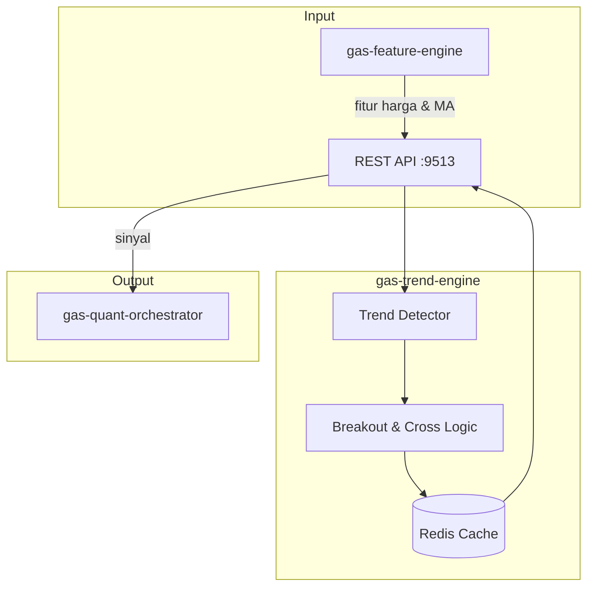

🚀 SERVICE TEMPLATE – @goldenaistrategy
📛 SERVICE NAME
gas-trend-engine	API	9513	Trend Following (Richard Dennis)	Pure Breakout & Moving Average Cross	Fitur → TrendEngine → Sinyal	Planned																

🧱 0. INSTALASI ENVIRONMENT
🐍 Python
<isi langkah instalasi python environment>
🐳 Docker
<isi langkah instalasi docker & docker compose>
⚙️ 1. TUTORIAL MANAGEMENT SERVICE
🐍 Python Mode
▶️ Run
<command run>
⛔ Stop
<command stop>
🔄 Restart
<command restart>
❌ Delete Environment
<command delete env>
🐳 Docker Mode
▶️ Build & Run
<command build & run>
📊 Check Status
<command cek status>
⛔ Stop
<command stop>
🔄 Restart
<command restart>
❌ Delete Container / Image
<command delete>

📦 2. SETUP GITHUB (FIRST TIME)
echo "# gas-trend-engine" >> README.md
git init
git add README.md
git commit -m "first commit"
git branch -M main
git remote add origin https://github.com/Muhamadridwanjr/gas-trend-engine.git
git push -u origin main
…or push an existing repository from the command line
git remote add origin https://github.com/Muhamadridwanjr/gas-trend-engine.git
git branch -M main
git push -u origin main
📛 4. CONTAINER NAMING
<ketentuan nama container = nama project>
🌐 5. HEALTH CHECK (STATUS 200 OK)
Endpoint
<endpoint-url>
Expected Response
<response contoh>
🧪 6. DEBUG & LOGGING
Docker Logs
<command docker logs>
Application Logs
<setup logging>
Healthcheck Configuration
<docker healthcheck config>
🟢 7. CONTAINER STATUS
<expected: Up (healthy)>
🔗 8. INTEGRASI GAS-GATEWAY-API
Configuration
<env / config url>
Request Example
<request example>
🧠 9. INTEGRASI DENGAN @goldenaistrategy
<standarisasi service dalam ecosystem>
🔄 10. KOMUNIKASI ANTAR SERVICE
Network Configuration
<docker network config>
Service Communication
<contoh komunikasi antar service>
📁 STRUKTUR PROJECT
# 📈 GAS Trend Engine

**Bagian dari Ekosistem GAS (Gas Automatic Strategy) – Edge Legendary Layer (VPS 5)**  
Service yang terinspirasi dari **Richard Dennis** dan eksperimen **Turtle Traders**, yang membuktikan bahwa **trend following** sederhana bisa sangat profitabel jika dieksekusi dengan disiplin. Service ini menghasilkan sinyal trading berdasarkan aturan trend following murni: **breakout** dari level tertinggi/terendah periode tertentu dan **persilangan moving average** (MA cross). Sinyal ini dapat digunakan sebagai komponen dalam `gas-quant-orchestrator` atau sebagai strategi mandiri.

---

## 📋 Daftar Isi

- [Ikhtisar](#ikhtisar)
- [Arsitektur](#arsitektur)
- [Alur Kerja](#alur-kerja)
- [Fitur Utama](#fitur-utama)
- [Teknologi](#teknologi)
- [Struktur Direktori](#struktur-direktori)
- [Instalasi & Menjalankan](#instalasi--menjalankan)
- [Konfigurasi](#konfigurasi)
- [API Reference](#api-reference)
- [Integrasi dengan Service Lain](#integrasi-dengan-service-lain)
- [Pengujian](#pengujian)
- [Pengembangan](#pengembangan)
- [Kontribusi (Tim Internal)](#kontribusi-tim-internal)
- [Lisensi & Kredit](#lisensi--kredit)

---

## 🔍 Ikhtisar

**gas-trend-engine** mengimplementasikan strategi trend following klasik yang telah teruji waktu. Dengan memanfaatkan fitur dari `gas-feature-engine` (seperti harga tertinggi/terendah dalam periode tertentu, moving averages), service ini menghasilkan sinyal:

- **Breakout**: Beli ketika harga menembus level tertinggi N periode, jual ketika menembus level terendah N periode.
- **Moving Average Cross**: Beli ketika MA cepat (misal EMA 10) melintasi di atas MA lambat (misal EMA 30), jual ketika sebaliknya.

Sinyal ini disertai dengan **kekuatan tren** (berdasarkan ADX, jarak harga dari MA, atau volume) sehingga dapat digunakan untuk memfilter sinyal lemah.

---

## 🏗️ Arsitektur



### Komponen Utama
- **REST API** (port 9513) – Menerima permintaan sinyal trend.
- **Trend Detector** – Inti logika: mengevaluasi kondisi breakout dan MA cross.
- **Rules** – Aturan spesifik (breakout period, MA periods).
- **Redis Cache** – Menyimpan hasil deteksi untuk periode tertentu (misal 1 menit).

---

## 🔄 Alur Kerja

1. **Konsumen** (misal `gas-quant-orchestrator`) mengirim request `POST /trend` dengan parameter simbol, timeframe, dan mungkin preferensi metode (breakout, MA cross, atau keduanya).
2. Service mengambil fitur terkini dari `gas-feature-engine` yang diperlukan, seperti:
   - Harga tertinggi/terendah dalam periode tertentu (misal 20, 50, 100).
   - Moving averages (misal EMA 10, EMA 30, SMA 50).
   - ADX (untuk mengukur kekuatan tren).
   - Volume (opsional).
3. **Trend Detector** menjalankan aturan:
   - Jika menggunakan breakout:
     - `signal = BUY` jika `close > highest(high, period)`.
     - `signal = SELL` jika `close < lowest(low, period)`.
   - Jika menggunakan MA cross:
     - `signal = BUY` jika `ma_fast > ma_slow`.
     - `signal = SELL` jika `ma_fast < ma_slow`.
   - Hitung kekuatan sinyal berdasarkan ADX atau jarak harga dari MA.
4. Jika tidak ada sinyal, kembalikan `NEUTRAL`.
5. Hasil (sinyal, kekuatan, entry price, stop loss rekomendasi) dikembalikan ke pemanggil dan disimpan di cache.

**Contoh Request:**
```json
{
  "symbol": "XAUUSD",
  "timeframe": "H1",
  "method": "breakout",          // "breakout", "ma_cross", "both"
  "breakout_period": 20,
  "ma_fast": 10,
  "ma_slow": 30,
  "adx_threshold": 25
}
```

**Contoh Response (breakout):**
```json
{
  "symbol": "XAUUSD",
  "timeframe": "H1",
  "signal": "BUY",
  "strength": 0.8,
  "method": "breakout",
  "entry_price": 2005.5,
  "stop_loss": 1990.0,
  "take_profit": 2025.0,
  "details": {
    "highest_20": 2005.5,
    "adx": 28,
    "volume_spike": true
  }
}
```

---

## ✨ Fitur Utama

- **Dua metode klasik**: Breakout (Donchian channel) dan MA Cross.
- **Kekuatan sinyal**: Berdasarkan ADX, jarak harga dari MA, atau konfirmasi volume.
- **Fleksibilitas periode**: Pengguna dapat menentukan periode breakout, MA fast/slow.
- **Multi‑timeframe**: Dapat beroperasi pada berbagai kerangka waktu.
- **Stop loss & take profit rekomendasi**: Berdasarkan ATR atau swing terdekat.
- **Caching** untuk efisiensi.

---

## 🛠️ Teknologi

- **Bahasa:** Python 3.11+
- **Web Framework:** FastAPI (REST)
- **Komputasi:** `numpy`, `pandas` (opsional, jika perlu perhitungan rolling)
- **Cache:** Redis (`redis.asyncio`)
- **Market Data Client:** HTTP ke `gas-feature-engine`
- **Container:** Docker, Docker Compose

---

## 📁 Struktur Direktori

```
gas-trend-engine/
├── src/
│   ├── __init__.py
│   ├── main.py                     # Entry point FastAPI
│   ├── config.py                    # Pydantic settings
│   ├── api/
│   │   ├── __init__.py
│   │   ├── routes.py                # Endpoint /trend
│   │   └── models.py                # Pydantic models
│   ├── core/
│   │   ├── __init__.py
│   │   ├── trend_detector.py        # Logika utama
│   │   ├── breakout.py               # Aturan breakout
│   │   ├── ma_cross.py                # Aturan MA cross
│   │   ├── strength.py                # Hitung kekuatan sinyal
│   │   └── exceptions.py
│   ├── clients/
│   │   ├── __init__.py
│   │   └── feature_client.py         # Ambil fitur dari feature-engine
│   ├── cache/
│   │   ├── __init__.py
│   │   └── redis_cache.py
│   ├── lib/
│   │   ├── logger.py
│   │   └── utils.py
│   └── workers/                      # (opsional) background tasks
├── tests/
├── Dockerfile
├── docker-compose.yml
├── .env.example
├── requirements.txt
└── README.md
```

---

## ⚙️ Instalasi & Menjalankan

### Prasyarat
- Python 3.11+
- Redis server
- `gas-feature-engine` (9499) berjalan (untuk fitur)

### Langkah Cepat (Development)

1. Clone repositori (internal):
   ```bash
   git clone https://github.com/gasstrategy/gas-trend-engine.git
   cd gas-trend-engine
   ```

2. Buat virtual environment:
   ```bash
   python -m venv venv
   source venv/bin/activate
   ```

3. Install dependencies:
   ```bash
   pip install -r requirements-dev.txt
   ```

4. Copy environment:
   ```bash
   cp .env.example .env
   # Isi REDIS_URL, FEATURE_ENGINE_URL, dll.
   ```

5. Jalankan Redis (jika belum):
   ```bash
   docker run -d -p 6379:6379 redis
   ```

6. Jalankan service:
   ```bash
   uvicorn src.main:app --reload --port 9513
   ```

### Dengan Docker Compose

```yaml
version: '3.8'
services:
  redis:
    image: redis:alpine
    ports:
      - "6379:6379"

  trend-engine:
    build: .
    ports:
      - "9513:9513"
    environment:
      - REDIS_URL=redis://redis:6379
      - FEATURE_ENGINE_URL=http://gas-feature-engine:9499
    depends_on:
      - redis
```

Jalankan:
```bash
docker-compose up -d
```

---

## 🔧 Konfigurasi

Environment variables (file `.env`):

| Variabel | Default | Deskripsi |
|----------|---------|-----------|
| `PORT` | 9513 | Port REST API |
| `REDIS_URL` | redis://localhost:6379 | Koneksi Redis |
| `FEATURE_ENGINE_URL` | http://gas-feature-engine:9499 | URL untuk ambil fitur |
| `FEATURE_ENGINE_API_KEY` | (opsional) | API key jika diperlukan |
| `DEFAULT_BREAKOUT_PERIOD` | 20 | Periode default untuk breakout |
| `DEFAULT_MA_FAST` | 10 | Periode default MA cepat |
| `DEFAULT_MA_SLOW` | 30 | Periode default MA lambat |
| `ADX_THRESHOLD` | 25 | Ambang ADX untuk sinyal kuat |
| `CACHE_TTL` | 60 | TTL cache (detik) |
| `LOG_LEVEL` | INFO | Level logging |
| `ENVIRONMENT` | development | production/staging/development |

---

## 📡 API Reference

### `POST /trend` – Mendapatkan sinyal trend untuk satu simbol

**Request Body:**
```json
{
  "symbol": "XAUUSD",
  "timeframe": "H1",
  "method": "breakout",          // "breakout", "ma_cross", "both"
  "breakout_period": 20,
  "ma_fast": 10,
  "ma_slow": 30,
  "adx_threshold": 25
}
```

**Response:**
```json
{
  "symbol": "XAUUSD",
  "timeframe": "H1",
  "signal": "BUY",
  "strength": 0.8,
  "method": "breakout",
  "entry_price": 2005.5,
  "stop_loss": 1990.0,
  "take_profit": 2025.0,
  "details": {
    "highest_20": 2005.5,
    "adx": 28,
    "volume_spike": true
  }
}
```

### `POST /trend/batch` – Untuk banyak simbol sekaligus

### `GET /health` – Health check

---

## 🔗 Integrasi dengan Service Lain

- **`gas-feature-engine` (9499)** – Menyediakan fitur (highest, lowest, MA, ADX).
- **`gas-quant-orchestrator` (9500)** – Menggunakan sinyal trend sebagai input.
- **`gas-regime-detector` (9503)** – Sinyal trend lebih valid jika regime = trending.
- **`gas-risk-engine` (9511)** – Untuk validasi risiko.
- **Redis** – Cache hasil.

---

## 🧪 Pengujian

```bash
pytest tests/ -v
# dengan coverage
pytest --cov=src tests/
```

Unit test mencakup:
- Logika breakout dan MA cross.
- Perhitungan strength.
- Validasi input.

---

## 👨‍💻 Pengembangan

### Menambah Metode Trend Baru
- Tambahkan file baru di `core/` (misal `ichimoku.py`).
- Implementasikan fungsi yang mengembalikan sinyal.
- Panggil di `trend_detector.py` berdasarkan parameter `method`.

### Aturan Kode
- Type hints wajib.
- Docstring untuk fungsi publik.
- Ikuti PEP 8 (black).
- Pastikan semua test lulus.

---

## 🔒 Kontribusi (Tim Internal)

Repositori ini bersifat **private** – hanya untuk tim internal GAS.  
Untuk berkontribusi:

1. Buat branch baru (`feature/`, `fix/`).
2. Commit dengan pesan jelas.
3. Buka Pull Request ke `develop`.
4. Tunggu review dan minimal satu approval.

**Aturan Penting:**
- Jangan commit kredensial.
- Gunakan environment variable untuk konfigurasi.
- Jangan sebarkan kode ke luar tim.

---

## 📄 Lisensi & Kredit

**Hak Cipta © 2025 Muhamad RidwanJr dan Tim GAS.**  
Seluruh hak cipta dilindungi undang-undang. Tidak untuk disebarluaskan tanpa izin tertulis.

Service ini dikembangkan sebagai bagian dari ekosistem **Golden AI Strategy**, terinspirasi dari warisan Richard Dennis dan Turtle Traders.

---

**🔥 GAS Trend Engine – Mengikuti Tren ala Legenda**
✅ FINAL CHECKLIST
[ ] Container name sesuai project  
[ ] Status container: Up (healthy)  
[ ] Endpoint mengembalikan 200 OK  
[ ] Tidak ada error pada logs  
[ ] Terintegrasi dengan GAS Gateway API  
[ ] Antar service dapat saling berkomunikasi  