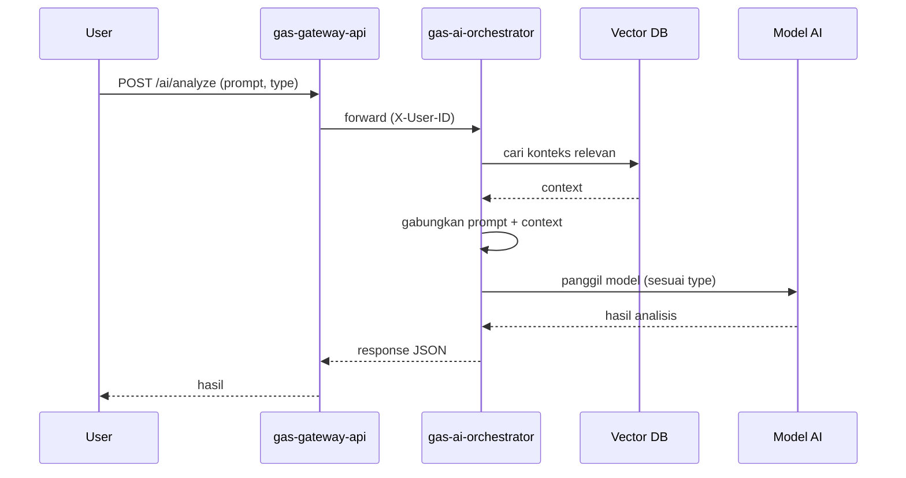

# 🧠 GAS AI Orchestrator

**Bagian dari Ekosistem GAS (Gas Automatic Strategy) – VPS 3 (AI Layer)**

> **Orkestrator cerdas yang menghubungkan permintaan analisis dengan model AI dan RAG.**  
> Service ini menerima prompt dari pengguna (via gateway), memanggil model AI yang sesuai (teknikal, makro, atau general), menggabungkan konteks dari basis pengetahuan (RAG), dan mengembalikan hasil analisis yang siap digunakan oleh engine lain atau ditampilkan ke pengguna.

---

## 📋 Daftar Isi

- [Ikhtisar](#ikhtisar)
- [Arsitektur](#arsitektur)
- [Alur Kerja](#alur-kerja)
- [Fitur Utama](#fitur-utama)
- [Teknologi](#teknologi)
- [Struktur Direktori](#struktur-direktori)
- [Instalasi & Menjalankan](#instalasi--menjalankan)
- [Konfigurasi](#konfigurasi)
- [API Reference](#api-reference)
- [Pengujian](#pengujian)
- [Pengembangan](#pengembangan)
- [Kontribusi (Tim Internal)](#kontribusi-tim-internal)
- [Lisensi & Hak Cipta](#lisensi--hak-cipta)

---

## 🔍 Ikhtisar

**gas-ai-orchestrator** adalah service yang menyediakan antarmuka terpadu untuk berbagai kemampuan AI dalam ekosistem GAS. Tugas utamanya:

- Menerima permintaan analisis dalam bentuk teks (prompt) atau parameter terstruktur.
- Menentukan model AI yang tepat berdasarkan jenis permintaan (teknikal, makro, berita, dll).
- Mengambil konteks relevan dari **vector database** (RAG) untuk memperkaya prompt.
- Memanggil model AI (lokal atau eksternal seperti OpenAI, Gemini, atau model custom) dan mengembalikan respons.
- Menggabungkan hasil dengan data pasar terkini jika diperlukan.

---

## 🏗️ Arsitektur

```
┌─────────────────┐     ┌────────────────────────────────────┐
│  gas-gateway-api│────▶│        gas-ai-orchestrator        │
│   (Port 8000)   │     │  ┌──────────┐  ┌───────────────┐  │
└─────────────────┘     │  │   REST   │  │  Orchestrator │  │
                        │  │  API     │──│    Core       │  │
                        │  └──────────┘  └───────┬───────┘  │
                        │                         │          │
                        │                         ▼          │
                        │  ┌─────────────────────────────┐  │
                        │  │      Model Router           │  │
                        │  │  (teknikal, macro, general) │  │
                        │  └─────────────┬───────────────┘  │
                        │                │                   │
                        │                ▼                   │
                        │  ┌─────────────────────────────┐  │
                        │  │   RAG Engine (vector DB)    │  │
                        │  └─────────────────────────────┘  │
                        └────────────────────────────────────┘
```

---

## 🔄 Alur Kerja



---

## ✨ Fitur Utama

- **Multi‑model support**: Teknikal, makro, general.
- **RAG (Retrieval-Augmented Generation)**: Tingkatkan kualitas jawaban dengan konteks historis.
- **Konfigurasi fleksibel**: Model dapat ditambahkan/diubah via konfigurasi.
- **Integrasi dengan gateway**: Autentikasi via header `X-User-ID`.

---

## 🛠️ Teknologi

| Komponen | Pilihan |
|---|---|
| Bahasa | Python 3.11+ |
| Web Framework | FastAPI |
| Vector DB | Chroma |
| Cache | Redis (opsional) |
| Model AI | OpenAI / Gemini / Custom HTTP |
| Testing | pytest |

---

## 📁 Struktur Direktori

```
.
├── src/
│   ├── api/
│   │   ├── dependencies.py      # X-User-ID header extraction
│   │   ├── models.py            # Pydantic request/response schemas
│   │   └── routes/
│   │       └── analyze.py       # /analyze, /embed, /health endpoints
│   ├── core/
│   │   ├── exceptions.py        # Custom exception classes
│   │   ├── model_router.py      # Routes request to correct AI client
│   │   └── orchestrator.py      # Main orchestration logic
│   ├── rag/
│   │   ├── vector_store.py      # ChromaDB client
│   │   └── retriever.py         # RAG context retrieval helper
│   ├── models/
│   │   ├── base.py              # Abstract BaseModelClient
│   │   ├── technical.py         # Technical AI model client
│   │   ├── macro.py             # Macro/Sentiment model client
│   │   └── general.py           # OpenAI/General model client
│   ├── lib/
│   │   ├── logger.py            # Structured logging setup
│   │   └── utils.py             # Prompt builder utilities
│   ├── config.py                # Pydantic settings (env vars)
│   └── main.py                  # FastAPI app entry point
├── tests/
│   └── test_api.py
├── docker-compose.yml
├── Dockerfile
├── .env.example
├── requirements.txt
└── README.md
```

---

## ⚙️ Instalasi & Menjalankan

### 🐍 Python Mode

#### Instalasi Environment

```bash
python -m venv venv
source venv/bin/activate
pip install -r requirements.txt
cp .env.example .env
# Edit .env sesuai konfigurasi
```

#### ▶️ Run
```bash
uvicorn src.main:app --reload --port 9003
```

#### ⛔ Stop
```bash
# Tekan Ctrl+C di terminal
```

#### 🔄 Restart
```bash
# Stop dulu, lalu jalankan kembali
uvicorn src.main:app --reload --port 9003
```

#### ❌ Delete Environment
```bash
deactivate
rm -rf venv
```

---

### 🐳 Docker Mode

#### ▶️ Build & Run
```bash
docker-compose up --build -d
```

#### 📊 Check Status
```bash
docker-compose ps
docker inspect --format='{{.State.Health.Status}}' gas-ai-orchestrator
```

#### ⛔ Stop
```bash
docker-compose stop
```

#### 🔄 Restart
```bash
docker-compose restart
```

#### ❌ Delete Container / Image
```bash
docker-compose down
docker rmi gas-ai-orchestrator
```

---

## 📦 Setup GitHub (First Time)

```bash
echo "# gas-ai-orchestrator" >> README.md
git init
git add README.md
git commit -m "first commit"
git branch -M main
git remote add origin https://github.com/Muhamadridwanjr/gas-ai-orchestrator.git
git push -u origin main
```

**…or push an existing repository:**
```bash
git remote add origin https://github.com/Muhamadridwanjr/gas-ai-orchestrator.git
git branch -M main
git push -u origin main
```

---

## 🔁 Update Project (Commit & Push)

```bash
git add .
git commit -m "feat: deskripsi perubahan"
git push origin main
```

---

## 📛 Container Naming

| Ketentuan | Nilai |
|---|---|
| Container Name | `gas-ai-orchestrator` |

---

## 🌐 Health Check (Status 200 OK)

**Endpoint:**
```
GET http://localhost:9003/health
```

**Expected Response:**
```json
{
  "status": "ok",
  "service": "gas-ai-orchestrator"
}
```

---

## 🧪 Debug & Logging

#### Docker Logs
```bash
docker logs gas-ai-orchestrator
docker logs -f gas-ai-orchestrator --tail 50
```

#### Application Logs
Logs ditulis ke stdout menggunakan format standar:
```
2025-02-25 12:00:00 - src.core.orchestrator - INFO - Received analyze request from user U123 for type: technical
```

#### Healthcheck Configuration
```yaml
healthcheck:
  test: ["CMD-SHELL", "curl -f http://localhost:9003/health || exit 1"]
  interval: 30s
  timeout: 10s
  retries: 3
```

---

## 🟢 Container Status

```
NAME                    STATUS
gas-ai-orchestrator     Up (healthy)
gas-vector-db (chroma)  Up
gas-redis               Up
```

---

## 🔧 Konfigurasi

| Variabel | Default | Deskripsi |
|---|---|---|
| `PORT` | 9003 | Port REST API |
| `VECTOR_DB_TYPE` | chroma | Jenis vector DB |
| `VECTOR_DB_URL` | http://localhost:8001 | URL vector DB |
| `VECTOR_DB_API_KEY` | (opsional) | API key Pinecone |
| `OPENAI_API_KEY` | (opsional) | API key OpenAI |
| `GEMINI_API_KEY` | (opsional) | API key Gemini |
| `TECHNICAL_MODEL_URL` | http://localhost:8501 | URL model teknikal |
| `MACRO_MODEL_URL` | http://localhost:8502 | URL model makro |
| `REDIS_URL` | redis://localhost:6379/0 | Redis cache |
| `LOG_LEVEL` | INFO | Level logging |
| `ENVIRONMENT` | development | development/staging/production |

---

## 📡 API Reference

### `POST /analyze`

**Headers:** `X-User-ID: <user_id>`

**Request:**
```json
{
  "type": "technical",
  "prompt": "Apa sinyal untuk XAUUSD dalam 4 jam ke depan?",
  "context": {
    "symbol": "XAUUSD",
    "timeframe": "H4"
  },
  "model_params": {
    "temperature": 0.7
  }
}
```

**Response:**
```json
{
  "id": "analysis_a1b2c3d4",
  "type": "technical",
  "result": {
    "summary": "Harga diperkirakan naik menuju resistensi 2020...",
    "confidence": 0.90,
    "levels": {
      "support": null,
      "resistance": null
    }
  },
  "sources": [],
  "created_at": "2025-02-25T12:00:00+00:00"
}
```

### `POST /embed`

Menambahkan dokumen ke RAG vector database.

### `GET /health`

Health check endpoint.

---

## 🔗 Integrasi gas-gateway-api

**Configuration (`.env`):**
```
# Di gateway: set upstream AI service URL
AI_ORCHESTRATOR_URL=http://gas-ai-orchestrator:9003
```

**Request Example (dari gateway):**
```bash
curl -X POST http://localhost:9003/analyze \
  -H "Content-Type: application/json" \
  -H "X-User-ID: user123" \
  -d '{"type":"general","prompt":"Analisis XAUUSD saat ini"}'
```

---

## 🧠 Integrasi dengan @goldenaistrategy

Service ini berjalan di **VPS 3 – AI Layer**, dapat dijangkau dari service lain dalam jaringan `gas_network` di Docker melalui hostname `gas-ai-orchestrator` pada port `9003`.

---

## 🔄 Komunikasi Antar Service

**Network Configuration:**
```yaml
networks:
  gas_network:
    name: gas_network
    driver: bridge
```

**Service Communication:**
```
gas-gateway-api → http://gas-ai-orchestrator:9003/analyze
gas-ai-orchestrator → http://gas-vector-db:8000 (ChromaDB)
gas-ai-orchestrator → redis://gas-redis:6379/0 (Redis)
```

---

## 🧪 Pengujian

```bash
pytest tests/ -v
pytest --cov=src tests/
```

---

## 🔒 Kontribusi (Tim Internal)

Repositori private – hanya tim internal GAS.

1. Buat branch (`feature/`, `fix/`).
2. Commit dengan pesan jelas.
3. Buka Pull Request ke `develop`.
4. Tunggu review.

---

## 📄 Lisensi & Hak Cipta

**Hak Cipta © 2025 Muhamad RidwanJr dan Tim GAS.**  
Seluruh hak cipta dilindungi undang-undang.

Hubungi: ridwan@gasstrategy.io

---

**🔥 GAS Strategy – Kecerdasan Buatan untuk Analisis Pasar**
