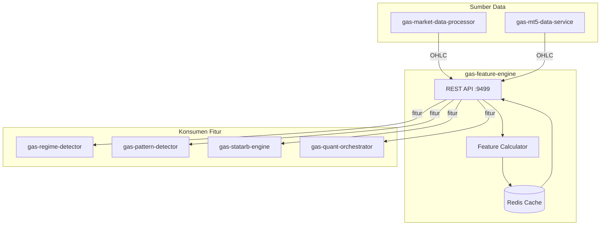

# 📊 GAS Feature Engine

**Bagian dari Ekosistem GAS (Gas Automatic Strategy) – Quant Layer (VPS 5)**  
Service yang bertugas mengubah data OHLC mentah menjadi fitur numerik siap pakai untuk engine quant lainnya. Fitur yang dihasilkan mencakup returns, volatilitas, z‑score, momentum, dan berbagai indikator statistik yang menjadi bahan baku bagi `gas-pattern-detector`, `gas-regime-detector`, `gas-statarb-engine`, dan `gas-quant-orchestrator`.

📛 **SERVICE NAME**
`gas-feature-engine` | API | 9499 | Feature Engineering | Returns, Volatilitas, Z-score, dll | Market Data → FeatureEngine → Fitur | Active

---

## 📋 Daftar Isi

- [Ikhtisar](#ikhtisar)
- [Arsitektur](#arsitektur)
- [Alur Kerja](#alur-kerja)
- [Fitur Utama](#fitur-utama)
- [Teknologi](#teknologi)
- [Instalasi & Menjalankan](#instalasi--menjalankan)
- [API Reference](#api-reference)

---

## 🔍 Ikhtisar

**gas-feature-engine** adalah fondasi dari semua analisis kuantitatif di ekosistem GAS. Data OHLC mentah dari `gas-market-data-processor` atau `gas-mt5-data-service` diubah menjadi deret fitur yang terstandarisasi. Fitur‑fitur ini kemudian digunakan oleh engine lain untuk mendeteksi regime, mencari pola tersembunyi, melakukan stat arb, dan menghasilkan sinyal trading.

---

## 🏗️ Arsitektur



---

## ⚙️ Instalasi & Menjalankan

### 🐳 Docker Mode
▶️ **Build & Run**
```bash
docker-compose up -d --build
```
📊 **Check Status**
```bash
docker ps | grep gas-feature-engine
```
⛔ **Stop**
```bash
docker-compose down
```

---

## 🌐 HEALTH CHECK (STATUS 200 OK)

**Endpoint:** `http://localhost:9499/health`
```json
{
  "status": "ok",
  "service": "gas-feature-engine"
}
```

---

## 📡 API Reference

### `POST /features` – Mendapatkan fitur untuk satu simbol

**Request Body:**
```json
{
  "symbol": "XAUUSD",
  "timeframe": "H1",
  "features": ["return_1", "volatility_20", "zscore_20", "rsi_14"],
  "limit": 100
}
```

**Response:**
```json
{
  "symbol": "XAUUSD",
  "timeframe": "H1",
  "data": [
    {
      "time": 1700000000,
      "return_1": 0.00012,
      "volatility_20": 0.0015,
      "zscore_20": -1.2,
      "rsi_14": 45.3
    }
  ]
}
```
