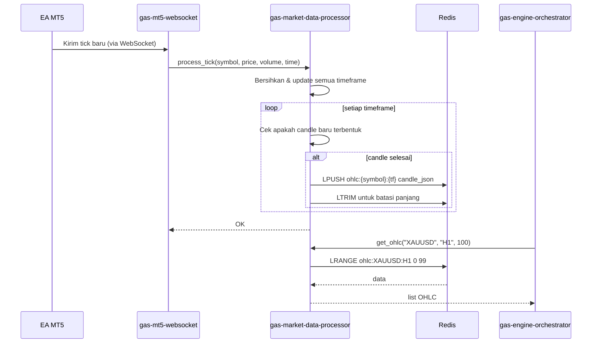

# 📊 GAS Market Data Processor

**Bagian dari Ekosistem GAS (Gas Automatic Strategy) – VPS 2 (Engine Layer)**

> **Pembersih, pengolah, dan penyedia data OHLC siap pakai dari MT5.**  
> Library internal ini bertugas menerima data mentah dari MT5 (melalui EA yang terhubung ke server lokal), membersihkannya, meresample ke berbagai timeframe, menangani data hilang, dan menyimpannya ke Redis cache untuk digunakan oleh engine lain (`gas-indicator-engine`, `gas-smc-engine`, dll). Juga menyediakan fungsi untuk mengambil data historis.

---

## 📋 Daftar Isi

- [Ikhtisar](#ikhtisar)
- [Arsitektur](#arsitektur)
- [Alur Kerja](#alur-kerja)
- [Fitur Utama](#fitur-utama)
- [Teknologi](#teknologi)
- [Struktur Direktori](#struktur-direktori)
- [Instalasi & Penggunaan](#instalasi--penggunaan)
- [Konfigurasi](#konfigurasi)
- [API Reference](#api-reference)
- [Pengujian](#pengujian)
- [Pengembangan](#pengembangan)
- [Kontribusi (Tim Internal)](#kontribusi-tim-internal)
- [Lisensi & Hak Cipta](#lisensi--hak-cipta)
- [Tutorial Lengkap: Run, Stop, Restart, Delete](#tutorial-lengkap-run-stop-restart-delete)

---

## 🔍 Ikhtisar

**gas-market-data-processor** adalah library internal (bukan service mandiri) yang menjadi **sumber kebenaran data pasar** di ekosistem GAS. Data mentah berasal dari **EA MT5** yang berjalan di VPS lokal dan mengirimkan tick/OHLC baru ke sistem. Processor akan:

- Menerima data tick atau OHLC mentah (misal setiap detik atau setiap candle baru).
- Membersihkan data (menghapus outlier, memastikan urutan waktu benar).
- Meresample tick menjadi OHLC dengan timeframe yang diinginkan (M1, M5, M15, H1, H4, D1, W1, MN).
- Menyimpan hasilnya ke **Redis cache** dengan struktur key yang terstandar.
- Menyediakan fungsi untuk mengambil data historis (dari Redis atau database jangka panjang jika ada).
- Menangani data hilang dengan interpolasi sederhana atau mengisi dengan nilai sebelumnya.

Library ini dipanggil oleh:
- `gas-mt5-websocket` (atau service penerima data dari EA) untuk menyimpan data baru.
- `gas-engine-orchestrator` (via `gas-market-data-processor`) untuk mengambil data OHLC sebelum analisis.
- Engine lain yang membutuhkan data pasar.

---

## 🏗️ Arsitektur

```
┌─────────────┐     ┌──────────────────────────────────────────┐
│   EA MT5    │     │         gas-market-data-processor        │
│ (Lokal VPS) │────▶│  ┌──────────┐  ┌──────────┐  ┌────────┐ │
└─────────────┘     │  │ Ingest   │─▶│ Cleanse  │─▶│Resample│ │
                    │  │ Handler  │  │          │  │        │ │
                    │  └──────────┘  └──────────┘  └───┬────┘ │
                    │                                   │      │
                    │                                   ▼      │
                    │  ┌──────────────────────────────────┐    │
                    │  │         Redis Storage            │    │
                    │  │  Key: ohlc:{symbol}:{timeframe}  │    │
                    │  └──────────────────────────────────┘    │
                    └──────────────────────────────────────────┘
                                      │
                                      ▼
                    ┌──────────────────────────────────┐
                    │  gas-engine-orchestrator         │
                    │  gas-indicator-engine             │
                    │  gas-smc-engine                   │
                    └──────────────────────────────────┘
```

### Aliran Data

1. **EA MT5** (berjalan di VPS yang sama atau berbeda) mengirimkan data realtime ke sistem. Bisa melalui:
   - WebSocket (gas-mt5-websocket) yang kemudian memanggil library ini.
   - REST API (jika ada) atau langsung menulis ke Redis (tidak disarankan).
2. **Ingest Handler** menerima data mentah: bisa berupa tick (price, volume) atau OHLC sederhana.
3. **Cleanse** memvalidasi: urutan waktu, harga wajar (tidak negatif, tidak loncat aneh).
4. **Resample** mengkonversi tick ke OHLC untuk semua timeframe yang dibutuhkan (konfigurasi). Jika data sudah OHLC, cukup disesuaikan.
5. **Redis Storage** menyimpan OHLC terbaru untuk setiap simbol dan timeframe. Biasanya berupa list dengan panjang terbatas (misal 1000 candle) atau disimpan sebagai sorted set.

---

## 🔄 Alur Kerja Lengkap

### 1. **Menerima Data Baru (Tick atau OHLC)**
   - Fungsi `process_tick(symbol, price, volume, timestamp)` dipanggil.
   - Atau `process_ohlc(symbol, timeframe, open, high, low, close, volume, timestamp)`.

### 2. **Pembersihan Data**
   - Periksa apakah timestamp lebih besar dari yang terakhir (urutan).
   - Jika tick: harga > 0, volume >= 0.
   - Jika OHLC: open, high, low, close masuk akal (high >= low, dll).

### 3. **Resampling (khusus tick)**
   - Untuk setiap timeframe yang dikonfigurasi (misal `["M1","M5","M15","H1","H4","D1"]`), update candle berjalan.
   - Gunakan struktur data in-memory (misal dictionary) untuk menyimpan candle sementara per (symbol, timeframe).
   - Ketika candle selesai (waktu melewati batas), simpan ke Redis dan reset.

### 4. **Penyimpanan ke Redis**
   - Key format: `ohlc:{symbol}:{timeframe}`.
   - Gunakan Redis List atau Sorted Set. List lebih sederhana: `LPUSH` lalu `LTRIM` untuk menjaga panjang maksimum.
   - Setiap entry adalah string JSON atau protobuf (untuk efisiensi).
   - Simpan juga metadata terakhir di key terpisah (misal `ohlc:{symbol}:{timeframe}:last`).

### 5. **Pengambilan Data Historis**
   - Fungsi `get_ohlc(symbol, timeframe, count, from_time, to_time)`.
   - Ambil dari Redis (jika cukup), atau dari database jangka panjang (jika ada).
   - Kembalikan dalam bentuk list of dicts.

### Diagram Alur



---

## ✨ Fitur Utama

- **Multi‑timeframe resampling** dari tick (M1, M5, M15, H1, H4, D1, W1, MN – dapat dikonfigurasi).
- **Pembersihan data otomatis** (urut, nilai wajar).
- **Handling missing data** (opsional: interpolasi linear atau isi dengan nilai sebelumnya).
- **Penyimpanan di Redis** dengan manajemen memori (batas jumlah candle per key).
- **Fungsi pengambilan fleksibel** (jumlah candle terakhir, rentang waktu).
- **Dukungan untuk banyak simbol** sekaligus.
- **Stateless** – library tidak menyimpan state sendiri, hanya menggunakan Redis sebagai penyimpanan bersama.

---

## 🛠️ Teknologi

- **Bahasa:** Python 3.11+
- **Komunikasi:** Library dipanggil langsung (tidak perlu gRPC/REST). Untuk penerimaan data dari EA, biasanya melalui service terpisah (`gas-mt5-websocket`) yang meng-import library ini.
- **Penyimpanan:** Redis (`redis-py` asinkron atau sinkron).
- **Struktur data:** Menggunakan `numpy`/`pandas` opsional untuk resampling cepat, tetapi bisa juga murni Python.
- **Pengujian:** pytest.

---

## 📁 Struktur Direktori

```
.
├── src/
│   ├── __init__.py
│   ├── core/
│   │   ├── __init__.py
│   │   ├── ingestor.py          # Menerima tick/OHLC dari luar
│   │   ├── cleaner.py            # Validasi & pembersihan
│   │   ├── resampler.py          # Resampling tick ke berbagai timeframe
│   │   └── storage.py            # Simpan & ambil dari Redis
│   ├── models/
│   │   ├── __init__.py
│   │   └── ohlc.py                # Pydantic model untuk OHLC
│   ├── config.py                  # Konfigurasi (timeframes, redis, dll)
│   ├── main.py                    # Wrapper FastAPI untuk Healthcheck Docker & Gateway
│   └── lib/
│       ├── logger.py
│       └── utils.py
├── scripts/
│   ├── 01-start.sh
│   ├── 02-stop.sh
│   ├── 03-restart.sh
│   └── 04-delete.sh
├── tests/
│   ├── unit/
│   │   ├── test_cleaner.py
│   │   ├── test_resampler.py
│   │   └── test_storage.py
│   └── conftest.py
├── docker-compose.yml
├── Dockerfile
├── .env.example
├── .gitignore
├── requirements.txt
├── requirements-dev.txt
├── setup.py
└── README.md
```

---

## ⚙️ Instalasi & Penggunaan

### Prasyarat
- Python 3.11+
- Redis server
- Docker & Docker Compose (untuk menjalankan secara terisolasi)

### Instalasi sebagai Library (Development)

```bash
git clone https://github.com/Muhamadridwanjr/gas-market-data-processor.git
cd gas-market-data-processor
python3 -m venv venv
source venv/bin/activate
pip install -e .
```

Jika ingin menggunakan numpy (direkomendasikan):
```bash
pip install -e .[numpy]
```

### Konfigurasi

Buat file `.env` (atau copy dari `.env.example`):

```bash
cp .env.example .env
```

Isi `.env` sesuai dengan konfigurasi:
```bash
REDIS_HOST=redis
REDIS_PORT=6379
REDIS_PASSWORD=
REDIS_DB=0
DEFAULT_TIMEFRAMES='["M1","M5","M15","H1","H4","D1"]'
MAX_CANDLES_PER_KEY=1000
LOG_LEVEL=INFO
PORT=8010
```

---

## 📡 API Reference

Library ini tidak menyediakan endpoint API penuh, tetapi fungsi-fungsi Python berikut dapat dipanggil oleh service lain setelah di-import:

### `async process_tick(symbol, price, volume, timestamp, redis_client, timeframes, max_candles)`
### `async process_ohlc(symbol, timeframe, open, high, low, close, volume, timestamp, redis_client, max_candles)`
### `async get_ohlc(symbol, timeframe, count=100, from_time=None, to_time=None, redis_client)`
### `async get_last_candle(symbol, timeframe, redis_client)`
### `async get_all_symbols(redis_client)`

> **Catatan Endpoint API:** Container juga menyediakan endpoint REST di `http://localhost:8010/health` yang akan mengembalikan status `200 OK` guna membuktikan container "Up (healthy)" dan terhubung ke ekosistem (termasuk validasi oleh API Gateway).

---

## 🧪 Pengujian

```bash
pytest tests/ -v
# dengan coverage
pytest --cov=src tests/
```

---

## 👨💻 Pengembangan

### Menambahkan Timeframe Baru
Tambahkan ke daftar `DEFAULT_TIMEFRAMES` di konfigurasi `.env`. Jika memanggil library, pass ke argumen fungsi `timeframes`.

---

## 🔒 Kontribusi (Tim Internal)

Repositori ini bersifat **private** dan hanya untuk tim internal GAS.
1. Buat branch baru (`feature/`, `fix/`).
2. Lakukan perubahan sesuai pedoman.
3. Commit dengan pesan jelas.
4. Buka Pull Request ke `main` (atau `develop`).

---

## 🚀 Tutorial Lengkap: Run, Stop, Restart, Delete

Karena aplikasi ini dapat dieksekusi baik menggunakan Python murni ataupun menggunakan Docker, berikut adalah tutorial super detailnya.

### A. Menggunakan Docker (Direkomendasikan untuk Production)

Eksekusi dengan Docker sangat disarankan karena memastikan dependencies terisolasi dan proses otomatis menyala kembali jika crash (melalui `docker-compose`).

Kami telah menyediakan skrip *shortcut* bash di dalam folder `scripts/` untuk mempermudah.

Pindah ke root directory project:
```bash
cd /path/to/gas-market-data-processor
chmod +x scripts/*.sh
```

#### 1. Run (Menjalankan Container)
Menjalankan daemon background:
```bash
./scripts/01-start.sh
```
*Atau perintah manual:*
```bash
docker-compose up -d --build
```
**Cek Status:** Perintah `docker ps -a | grep gas-market-data-processor` akan memunculkan status `Up (healthy)`.

#### 2. Stop (Menghentikan Container)
Menghentikan sementara aplikasi (data container tetap aman):
```bash
./scripts/02-stop.sh
```
*Atau perintah manual:*
```bash
docker-compose stop
```

#### 3. Restart (Menjalankan Ulang)
Sering digunakan setelah mengganti konfigurasi di `.env`:
```bash
./scripts/03-restart.sh
```
*Atau perintah manual:*
```bash
docker-compose restart
```

#### 4. Delete (Menghapus Container dan Volume)
Gunakan ini jika ingin menghapus log, container lama, dan volume cache redis local:
```bash
./scripts/04-delete.sh
```
*Atau perintah manual:*
```bash
docker-compose down -v --rmi all
```

---

### B. Menggunakan Python (Development Lokal)

Jika Anda ingin menguji secara langsung tanpa docker di local terminal Anda.

#### 1. Persiapan Awal
Pastikan berada di root directory project dan virtual environment sudah menyala:
```bash
python3 -m venv venv
source venv/bin/activate
pip install -r requirements.txt
pip install -e .
```

#### 2. Run
Untuk me-run wrapper healthcheck secara lokal:
```bash
uvicorn src.main:app --host 0.0.0.0 --port 8010 --reload
```
Aplikasi akan menyala dan log realtime muncul di terminal Anda. Cek browser di `http://127.0.0.1:8010/health`.

#### 3. Stop
Anda hanya perlu menekan `CTRL+C` pada terminal yang menjalankan `uvicorn`. Proses otomatis mati.

#### 4. Restart
Jika tidak menggunakan `--reload`, tekan `CTRL+C` lalu jalankan ulang perintah `uvicorn src.main:app ...`. Jika menggunakan `--reload`, setiap perubahan kode otomatis disadari dan server merestart sendiri!

#### 5. Delete (Clean up Environment)
Menghapus folder virtual environment dan cache:
```bash
rm -rf venv
find . -type d -name "__pycache__" -exec rm -rf {} +
```

---

## 📄 Lisensi & Hak Cipta

**Hak Cipta © 2025 Muhamad RidwanJr dan Tim GAS. Seluruh hak cipta dilindungi undang-undang.**

Repositori ini dan seluruh kode di dalamnya adalah milik eksklusif **Muhamad RidwanJr** dan tim **GAS (Gas Automatic Strategy)**.  
Tidak untuk disebarluaskan tanpa izin tertulis.

Untuk keperluan lisensi, kemitraan, atau pertanyaan, hubungi:  
📧 **ridwan@gasstrategy.io**

---

**🔥 GAS Strategy – Data Pasar Bersih dan Siap Analisis**
