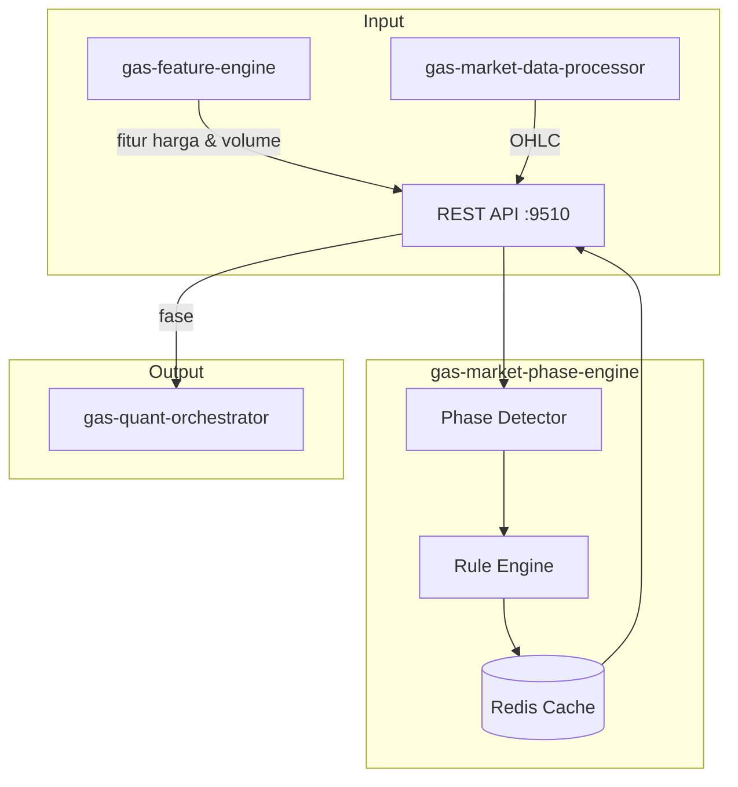

# 📊 GAS Market Phase Engine

**Bagian dari Ekosistem GAS (Gas Automatic Strategy) – Edge Legendary Layer (VPS 5)**  
Service yang terinspirasi dari **Jesse Livermore**, salah satu trader legendaris yang dikenal dengan pemahamannya tentang **fase pasar** (akumulasi, markup, distribusi, markdown). Service ini menganalisis data harga dan volume untuk menentukan fase pasar saat ini, memberikan konteks penting bagi strategi trading lainnya.

📛 **SERVICE NAME**
`gas-market-phase` | API | 9510 | Deteksi fase pasar (Livermore) | Analisis breakout & volume | Fitur → PhaseEngine → Fase | Active

---

## 📋 Daftar Isi

- [Ikhtisar](#ikhtisar)
- [Arsitektur](#arsitektur)
- [Instalasi & Menjalankan](#instalasi--menjalankan)
- [API Reference](#api-reference)

---

## 🏗️ Arsitektur



---

## ⚙️ Instalasi & Menjalankan

### 🐳 Docker Mode
▶️ **Build & Run**
```bash
docker-compose up -d --build
```
📊 **Check Status**
```bash
docker ps | grep market-phase
```
⛔ **Stop**
```bash
docker-compose down
```

---

## 🌐 HEALTH CHECK (STATUS 200 OK)

**Endpoint:** `http://localhost:9510/health`
```json
{
  "status": "ok",
  "service": "gas-market-phase"
}
```

---

## 📡 API Reference

### `POST /phase` – Mendapatkan fase pasar

**Request Body:**
```json
{
  "symbol": "XAUUSD",
  "timeframe": "H1"
}
```

**Response:**
```json
{
  "symbol": "XAUUSD",
  "timeframe": "H1",
  "phase": "MARKUP",
  "confidence": 0.85,
  "details": {
    "price_vs_ema50": "above",
    "adx": 28,
    "volume_ratio": 1.2,
    "breakout_detected": true
  }
}
```
