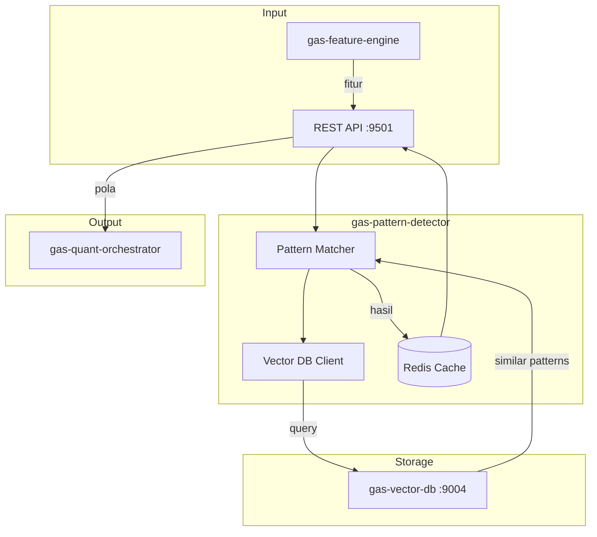

# 🔍 GAS Pattern Detector

**Bagian dari Ekosistem GAS (Gas Automatic Strategy) – Quant Layer (VPS 5)**  
Service yang bertugas menemukan **pola tersembunyi** dalam data pasar dengan pendekatan statistik dan similarity search menggunakan vector database. Pola yang ditemukan dapat berupa kondisi berulang yang diikuti oleh pergerakan harga tertentu.

📛 **SERVICE NAME**
`gas-pattern-detector` | API | 9501 | Pattern Recognition | Hidden patterns & Similarity search (Vector DB) | Fitur → PatternDetector → Pola | Active

---

## 📋 Daftar Isi

- [Ikhtisar](#ikhtisar)
- [Arsitektur](#arsitektur)
- [Instalasi & Menjalankan](#instalasi--menjalankan)
- [API Reference](#api-reference)

---

## 🏗️ Arsitektur



---

## ⚙️ Instalasi & Menjalankan

### 🐳 Docker Mode
▶️ **Build & Run**
```bash
docker-compose up -d --build
```
📊 **Check Status**
```bash
docker ps | grep pattern-detector
```
⛔ **Stop**
```bash
docker-compose down
```

---

## 🌐 HEALTH CHECK (STATUS 200 OK)

**Endpoint:** `http://localhost:9501/health`
```json
{
  "status": "ok",
  "service": "gas-pattern-detector"
}
```

---

## 📡 API Reference

### `POST /detect` – Mendeteksi pola berdasarkan fitur

**Request Body:**
```json
{
  "symbol": "XAUUSD",
  "timeframe": "H1",
  "features": [0.12, -0.05, 0.33, 0.01, -0.22],
  "top_k": 10,
  "min_confidence": 0.6
}
```

**Response:**
```json
{
  "symbol": "XAUUSD",
  "timeframe": "H1",
  "confidence": 0.72,
  "expected_return": 0.0008,
  "direction": "BUY",
  "probability_up": 0.68,
  "details": {
    "matched_patterns": 8,
    "avg_similarity": 0.85
  }
}
```
