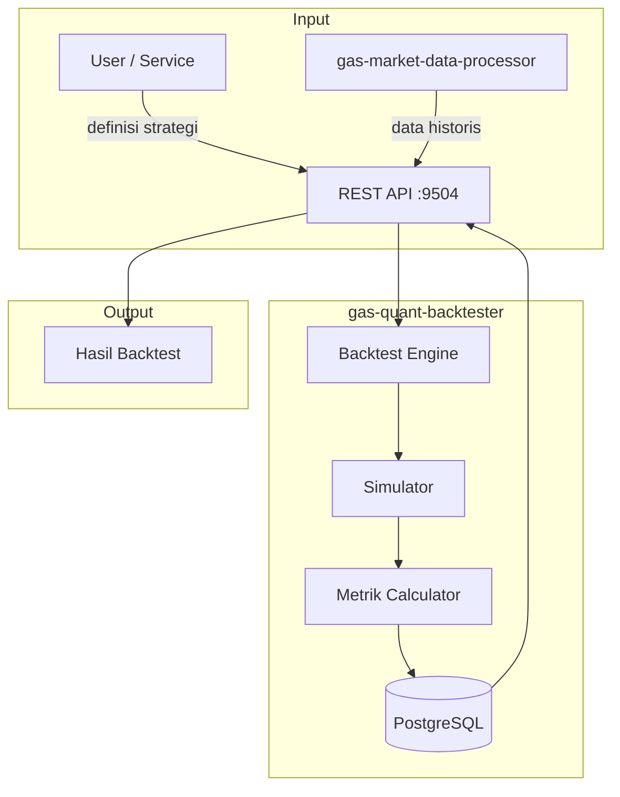

# 📊 GAS Quant Backtester

**Bagian dari Ekosistem GAS (Gas Automatic Strategy) – Quant Layer (VPS 5)**  
Service yang menyediakan fasilitas **backtesting** untuk strategi kuantitatif dan algoritmik. Dengan menggunakan data historis dari `gas-market-data-processor` (atau sumber lain), service ini menjalankan simulasi strategi, menghitung metrik kinerja seperti Sharpe ratio, drawdown, win rate, dan menghasilkan laporan komprehensif untuk evaluasi strategi sebelum diterapkan secara live.

📛 **SERVICE NAME**
`gas-quant-backtester` | API | 9504 | Backtesting Hub | Simulasi historis, Sharpe Ratio, Drawdown | Backtest → MarketData → Hasil | Active

---

## 📋 Daftar Isi

- [Ikhtisar](#ikhtisar)
- [Arsitektur](#arsitektur)
- [Instalasi & Menjalankan](#instalasi--menjalankan)
- [API Reference](#api-reference)

---

## 🏗️ Arsitektur



---

## ⚙️ Instalasi & Menjalankan

### 🐳 Docker Mode
▶️ **Build & Run**
```bash
docker-compose up -d --build
```
📊 **Check Status**
```bash
docker ps | grep quant-backtester
```
⛔ **Stop**
```bash
docker-compose down
```

---

## 🌐 HEALTH CHECK (STATUS 200 OK)

**Endpoint:** `http://localhost:9504/health`
```json
{
  "status": "ok",
  "service": "gas-quant-backtester"
}
```

---

## 📡 API Reference

### `POST /backtest` – Menjalankan backtest

**Request Body:**
```json
{
  "strategy": {
    "type": "rule_based",
    "rules": [
      {"indicator": "rsi_14", "operator": "<", "value": 30, "action": "BUY"},
      {"indicator": "rsi_14", "operator": ">", "value": 70, "action": "SELL"}
    ],
    "position_size": 0.1,
    "stop_loss": 50,
    "take_profit": 100
  },
  "symbol": "XAUUSD",
  "timeframe": "H1",
  "from_date": "2025-01-01",
  "to_date": "2025-12-31",
  "initial_capital": 10000,
  "commission": 0.001,
  "slippage": 0.0001,
  "save_result": false
}
```

**Response:**
```json
{
  "backtest_id": "bt_123456",
  "status": "completed",
  "summary": {
    "total_return": 0.1523,
    "annualized_return": 0.18,
    "sharpe_ratio": 1.45,
    "max_drawdown": 0.08,
    "win_rate": 0.55,
    "profit_factor": 1.8,
    "total_trades": 120
  }
}
```
