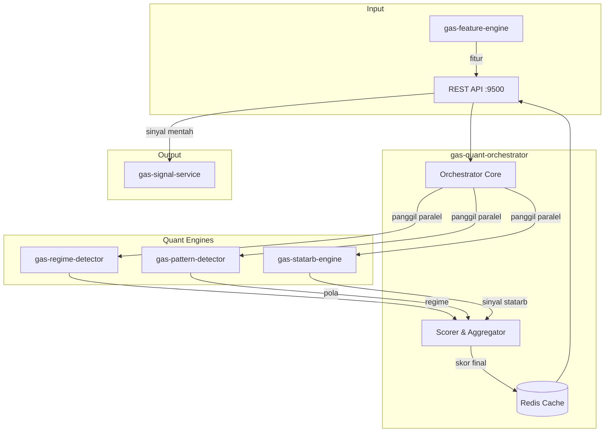

# 🧠 GAS Quant Orchestrator

**Bagian dari Ekosistem GAS (Gas Automatic Strategy) – Quant Layer (VPS 5)**  
Service otak utama yang menerima fitur dari `gas-feature-engine`, mengumpulkan sinyal dari berbagai engine quant (`gas-regime-detector`, `gas-pattern-detector`, `gas-statarb-engine`, dan engine edge lainnya), melakukan agregasi dan scoring, lalu menghasilkan **sinyal final** yang siap dikirim ke `gas-risk-engine` dan `gas-signal-service` untuk eksekusi.

📛 **SERVICE NAME**
`gas-quant-orch` | API | 9500 | Quant Orchestrator | Otak utama: Scoring & Gabung sinyal | Fitur → QuantOrch → Sinyal Final | Active

---

## 📋 Daftar Isi

- [Ikhtisar](#ikhtisar)
- [Arsitektur](#arsitektur)
- [Instalasi & Menjalankan](#instalasi--menjalankan)
- [API Reference](#api-reference)

---

## 🏗️ Arsitektur



---

## ⚙️ Instalasi & Menjalankan

### 🐳 Docker Mode
▶️ **Build & Run**
```bash
docker-compose up -d --build
```
📊 **Check Status**
```bash
docker ps | grep quant-orch
```
⛔ **Stop**
```bash
docker-compose down
```

---

## 🌐 HEALTH CHECK (STATUS 200 OK)

**Endpoint:** `http://localhost:9500/health`
```json
{
  "status": "ok",
  "service": "gas-quant-orchestrator"
}
```

---

## 📡 API Reference

### `POST /analyze` – Analisis quant untuk satu simbol

**Request Body:**
```json
{
  "symbol": "XAUUSD",
  "timeframe": "H1",
  "engines": ["regime", "pattern", "statarb"]
}
```

**Response:**
```json
{
  "symbol": "XAUUSD",
  "timeframe": "H1",
  "signal": "BUY",
  "confidence": 0.78,
  "score": 0.65,
  "details": {
    "regime": { "regime": "TRENDING", "confidence": 0.9 },
    "pattern": { "direction": "BUY", "confidence": 0.72 },
    "statarb": { "signal": "NEUTRAL", "confidence": 0.5 }
  }
}
```
