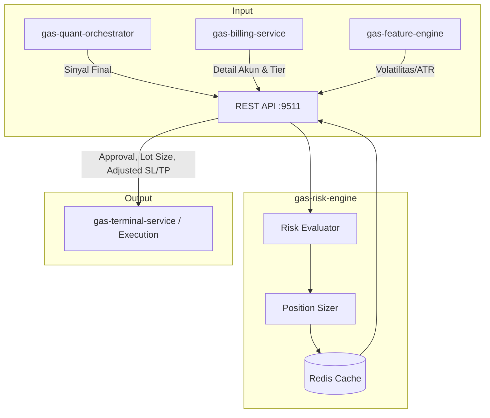

# 🛡️ GAS Risk Engine

**Bagian dari Ekosistem GAS (Gas Automatic Strategy) – Edge Legendary Layer (VPS 5)**  
Service yang terinspirasi dari **Paul Tudor Jones**, yang sangat terkenal dengan prinsip manajemen risikonya yang ketat: "The most important rule of trading is to play great defense, not great offense." Service ini berfungsi sebagai "penjaga gawang" sebelum suatu sinyal dari engine lain dieksekusi. 

📛 **SERVICE NAME**
`gas-risk-engine` | API | 9511 | Risk Mgmt (Tudor Jones) | Cek drawdown, hitung lot dinamis, volatility SL | Sinyal + Akun → RiskEngine → Izin/Lot | Active

---

## 📋 Daftar Isi

- [Ikhtisar](#ikhtisar)
- [Arsitektur](#arsitektur)
- [Instalasi & Menjalankan](#instalasi--menjalankan)
- [API Reference](#api-reference)

---

## 🏗️ Arsitektur



---

## ⚙️ Instalasi & Menjalankan

### 🐳 Docker Mode
▶️ **Build & Run**
```bash
docker-compose up -d --build
```
📊 **Check Status**
```bash
docker ps | grep risk-engine
```
⛔ **Stop**
```bash
docker-compose down
```

---

## 🌐 HEALTH CHECK (STATUS 200 OK)

**Endpoint:** `http://localhost:9511/health`
```json
{
  "status": "ok",
  "service": "gas-risk-engine"
}
```

---

## 📡 API Reference

### `POST /risk/evaluate` – Evaluasi sinyal dan tentukan parameter posisi

**Request Body:**
```json
{
  "account_id": "ACC123",
  "symbol": "XAUUSD",
  "signal": "BUY",
  "entry_price": 2005.0,
  "confidence": 0.85,
  "account_balance": 10000,
  "current_drawdown": 2.5
}
```

**Response:**
```json
{
  "approved": true,
  "lot_size": 0.15,
  "adjusted_sl": 1990.0,
  "adjusted_tp": 2030.0,
  "reason": "Risk parameters within limits",
  "risk_amount": 225.0
}
```
