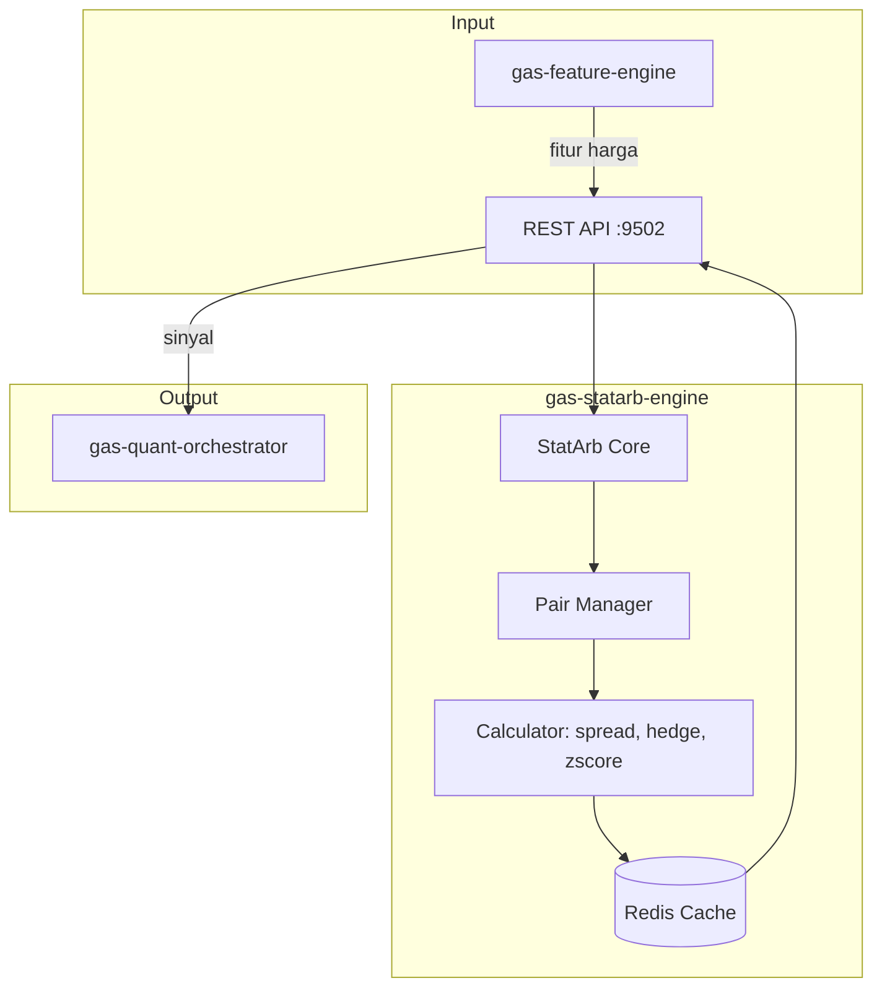

# 📈 GAS StatArb Engine

**Bagian dari Ekosistem GAS (Gas Automatic Strategy) – Quant Layer (VPS 5)**  
Service yang mengkhususkan diri pada **statistical arbitrage** – mencari dan mengeksploitasi mispricing antar aset yang secara statistik memiliki hubungan jangka panjang. Dengan memanfaatkan fitur dari `gas-feature-engine` dan data harga, service ini menghitung spread, melakukan uji kointegrasi, menentukan hedge ratio, dan menghasilkan sinyal beli/jual untuk pasangan aset (pairs trading) atau basket.

📛 **SERVICE NAME**
`gas-statarb-engine` | API | 9502 | Statistical Arbitrage | Pairs trading, Cointegration, Hedge ratio | Fitur → StatArb → Sinyal | Active

---

## 📋 Daftar Isi

- [Ikhtisar](#ikhtisar)
- [Arsitektur](#arsitektur)
- [Fitur Utama](#fitur-utama)
- [Instalasi & Menjalankan](#instalasi--menjalankan)
- [Konfigurasi](#konfigurasi)
- [API Reference](#api-reference)

---

## 🏗️ Arsitektur



---

## ⚙️ Instalasi & Menjalankan

### 🐳 Docker Mode
▶️ **Build & Run**
```bash
docker-compose up -d --build
```
📊 **Check Status**
```bash
docker ps | grep statarb-engine
```
⛔ **Stop**
```bash
docker-compose down
```

---

## 🌐 HEALTH CHECK (STATUS 200 OK)

**Endpoint:** `http://localhost:9502/health`
```json
{
  "status": "ok",
  "service": "gas-statarb-engine"
}
```

---

## 📡 API Reference

### `POST /signal` – Mendapatkan sinyal untuk satu pasangan

**Request Body:**
```json
{
  "pair": "XAUUSD_DXY",
  "lookback": 20,
  "threshold": 2.0
}
```

**Response:**
```json
{
  "pair": "XAUUSD_DXY",
  "signal": "SHORT_SPREAD",
  "zscore": 2.3,
  "hedge_ratio": 0.85,
  "spread": 15.2,
  "confidence": 0.85
}
```
