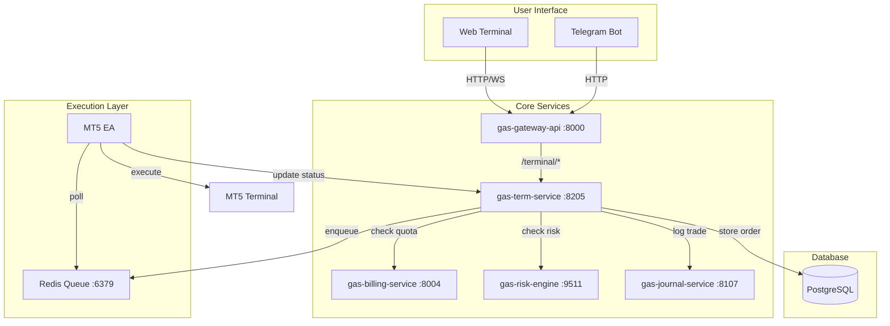

# 💻 GAS Terminal Service

**Bagian dari Ekosistem GAS (Gas Automatic Strategy) – Terminal Layer**  
Service yang menangani perintah trading dari pengguna (buy/sell/close/modify), melakukan validasi (billing, risiko), dan menempatkan order ke dalam antrean Redis untuk dieksekusi oleh EA MT5. Juga menyediakan informasi posisi terbuka, riwayat order, dan status eksekusi.

📛 **SERVICE NAME**
`gas-term-service` | Terminal | 8205 | Execution | Command Buy/Sell & Order Mgmt | User → Term → Redis → MT5 | Active

---

## 📋 Daftar Isi

- [Ikhtisar](#ikhtisar)
- [Arsitektur](#arsitektur)
- [Alur Kerja](#alur-kerja)
- [Fitur Utama](#fitur-utama)
- [Teknologi](#teknologi)
- [Struktur Direktori](#struktur-direktori)
- [Instalasi & Menjalankan](#instalasi--menjalankan)
- [Konfigurasi](#konfigurasi)
- [API Reference](#api-reference)
- [Integrasi dengan Service Lain](#integrasi-dengan-service-lain)
- [Pengujian](#pengujian)
- [Pengembangan](#pengembangan)
- [Kontribusi (Tim Internal)](#kontribusi-tim-internal)
- [Lisensi & Kredit](#lisensi--kredit)

---

## 🔍 Ikhtisar

**gas-terminal-service** adalah komponen utama yang menerima perintah trading dari pengguna (melalui `gas-gateway-api`) dan mengelola siklus hidup order. Tugas utamanya meliputi:

- Validasi **quota & level** dengan `gas-billing-service`.
- Validasi **risiko** (ukuran lot, drawdown) dengan `gas-risk-engine`.
- Membuat order, memasukkannya ke antrean Redis (`execution:queue`), dan mencatatnya di database.
- Memantau status order (pending, executed, failed) melalui update dari EA MT5.
- Menyediakan daftar posisi terbuka dan riwayat order untuk pengguna.
- Menangani pembatalan atau modifikasi order (jika didukung broker).

Service ini menjadi jembatan antara antarmuka pengguna (web, telegram) dan eksekusi nyata di MT5, memastikan setiap order diproses secara aman dan sesuai aturan.

---

## 🏗️ Arsitektur



---

## 🧱 0. INSTALASI ENVIRONMENT

### 🐍 Python
```bash
python -m venv venv
source venv/bin/activate
pip install -r requirements.txt
```

### 🐳 Docker
Pastikan Docker dan Docker Compose telah terinstal.
```bash
docker-compose up -d --build
```

---

## ⚙️ 1. TUTORIAL MANAGEMENT SERVICE

### 🐍 Python Mode
▶️ **Run API**
```bash
uvicorn src.main:app --host 0.0.0.0 --port 8205 --reload
```
▶️ **Run Listener Worker**
```bash
python -m src.workers.status_listener
```
⛔ **Stop**
`Ctrl + C` pada terminal.

🔄 **Restart**
Hentikan lalu jalankan ulang perintah Run.

### 🐳 Docker Mode
▶️ **Build & Run**
```bash
docker-compose up -d --build
```
📊 **Check Status**
```bash
docker ps | grep term-
```
⛔ **Stop**
```bash
docker-compose down
```
🔄 **Restart**
```bash
docker-compose restart gas-term-service gas-term-listener
```
❌ **Delete Container / Image**
```bash
docker-compose down -v
```

---

## 📦 2. SETUP GITHUB (FIRST TIME)

```bash
echo "# gas-term-service" >> README.md
git init
git add README.md
git commit -m "first commit"
git branch -M main
git remote add origin https://github.com/Muhamadridwanjr/gas-term-service.git
git push -u origin main
```

---

## 📛 4. CONTAINER NAMING

- Nama container: `gas-term-service-api` dan `gas-term-service-listener`
- Network: Menggunakan default bridge `gas-network`

---

## 🌐 5. HEALTH CHECK (STATUS 200 OK)

**Endpoint:** `http://localhost:8205/health`

**Expected Response:**
```json
{
  "status": "ok",
  "service": "gas-term-service"
}
```

---

## 🔗 8. INTEGRASI GAS-GATEWAY-API

Semua endpoint untuk `buy/sell/position` di mapping dan di-routing melalui **gas-gateway-api**. Validasi JWT dilakukan di gateway dan `X-User-ID` diteruskan ke `gas-term-service`.

---

## 📡 API Reference

### **Public Endpoints (via Gateway)**

#### `POST /trade` – Menempatkan order baru

**Request Body:**
```json
{
  "symbol": "XAUUSD",
  "action": "BUY",              
  "order_type": "MARKET",        
  "volume": 0.1,
  "price": 0,                    
  "stop_loss": 1990.0,
  "take_profit": 2020.0,
  "comment": "Scalping signal"
}
```

**Response:**
```json
{
  "order_id": "ord_123456",
  "status": "pending",
  "message": "Order placed successfully"
}
```

---

## 📄 Lisensi & Kredit

**Hak Cipta © 2026 Muhamad RidwanJr dan Tim GAS.**  
Seluruh hak cipta dilindungi undang-undang. Tidak untuk disebarluaskan tanpa izin tertulis.
