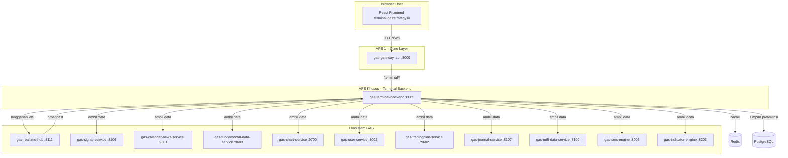

# 🖥️ GAS Terminal – Arsitektur Final & Integrasi

Bro, setelah kita bahas panjang lebar, berikut adalah **arsitektur final** untuk **Terminal GAS** (`terminal.gasstrategy.io`). Terminal terdiri dari dua komponen utama:

1. **Frontend** – Aplikasi React (yang lo kirimkan) berjalan di browser user.
2. **Backend Service `gas-terminal-backend`** – Service khusus yang menyediakan data agregat untuk frontend, berkomunikasi dengan seluruh service GAS lainnya.

Keduanya **terpisah** (bukan satu service) dan terhubung melalui **`gas-gateway-api`**. Frontend tidak boleh langsung memanggil service internal selain gateway. Ini memastikan keamanan, autentikasi terpusat, dan logging.

---

## 🧱 Arsitektur Terminal GAS (Final)



### Penjelasan Alur
1. **User** membuka `terminal.gasstrategy.io` di browser.
2. **Frontend React** memanggil API melalui gateway (`https://api.gasstrategy.io/terminal/...`).
3. **Gateway** memverifikasi JWT, menambahkan header `X-User-ID`, lalu meneruskan request ke `gas-terminal-backend`.
4. **`gas-terminal-backend`** mengumpulkan data dari berbagai service internal (sinyal, berita, fundamental, chart, dll.) sesuai kebutuhan endpoint.
5. Untuk data real‑time, frontend membuka koneksi WebSocket ke gateway (`wss://api.gasstrategy.io/terminal/ws`), gateway meneruskannya ke `gas-terminal-backend`, dan backend berlangganan ke `gas-realtime-hub`.
6. **`gas-realtime-hub`** menyiarkan update harga, sinyal baru, dan notifikasi ke backend, yang kemudian diteruskan ke frontend.

Dengan arsitektur ini, **frontend tetap ringan**, **backend service terfokus**, dan **seluruh ekosistem GAS dapat dimanfaatkan**.

---

## 📦 Service `gas-terminal-backend` – Mapping Final

| Nama Service | Type | Port | Fungsi Utama | Detail Teknis | Alur Singkat | STATUS |
|--------------|------|------|--------------|---------------|--------------|--------|
| **gas-terminal-backend** | API + WebSocket | 8085 | Agregator data untuk frontend terminal | Menyediakan endpoint REST untuk data agregat (overview, pairs, sinyal, berita, kalender, dll) dan mengelola koneksi WebSocket untuk update real‑time. Berkomunikasi dengan seluruh service GAS yang diperlukan. | `Frontend → Gateway → TerminalBackend → (panggil service lain) → respons` | **Planned** |

### Detail Teknis
- **Bahasa:** Python 3.11+ / FastAPI
- **Endpoint Utama:**
  - `GET /terminal/overview` – Ringkasan dashboard (harga, sinyal, berita, indeks, makro).
  - `GET /terminal/pairs` – Daftar pair dengan harga terkini.
  - `GET /terminal/signal/latest?pair=...` – Sinyal terbaru.
  - `GET /terminal/news` – Berita terkini.
  - `GET /terminal/calendar` – Kalender ekonomi.
  - `GET /terminal/chart/{symbol}` – Data chart (proxy ke `gas-chart-service`).
  - `POST /terminal/user/preferences` – Simpan preferensi user.
  - `GET /terminal/user/preferences` – Ambil preferensi user.
  - WebSocket `/terminal/ws` – Update real‑time.
- **Integrasi dengan service lain** melalui HTTP client (httpx) dan Redis pub/sub untuk WebSocket.
- **Cache** menggunakan Redis untuk data yang tidak berubah cepat (misal daftar pair, berita).
- **Database** PostgreSQL untuk menyimpan preferensi user (jika tidak menggunakan `gas-user-service`).

---

## 🔗 Integrasi dengan Semua Service GAS

| Service | Digunakan Untuk |
|---------|-----------------|
| **`gas-realtime-hub`** (8111) | Update harga, sinyal, notifikasi real‑time via WebSocket. |
| **`gas-signal-service`** (8106) | Mendapatkan sinyal terbaru untuk ditampilkan di dashboard. |
| **`gas-calendar-news-service`** (9601) | Berita dan kalender ekonomi. |
| **`gas-fundamental-data-service`** (9603) | Data makro (suku bunga, CPI, dll) untuk panel fundamental. |
| **`gas-chart-service`** (9700) | Data OHLC + indikator untuk chart. |
| **`gas-user-service`** (8002) | Preferensi user (favorit, pengaturan) – bisa juga disimpan lokal. |
| **`gas-tradingplan-service`** (9602) | Rencana trading user (jika ditampilkan di terminal). |
| **`gas-journal-service`** (8107) | Riwayat trade untuk panel portofolio. |
| **`gas-mt5-data-service`** (8100) | Data harga langsung (jika tidak via chart service). |
| **`gas-smc-engine`** (8006) | Marker SMC untuk chart. |
| **`gas-indicator-engine`** (8203) | Nilai indikator untuk chart. |

---

## 🧩 Frontend `terminal.gasstrategy.io`

- **Teknologi:** React + Vite (seperti kode yang lo kirim).
- **Komunikasi:** 
  - REST API via gateway (`/terminal/*`).
  - WebSocket via gateway (`/terminal/ws`).
- **Autentikasi:** JWT dikirim di header `Authorization` (untuk REST) dan sebagai query parameter `token` untuk WebSocket.
- **State Management:** Bisa menggunakan React Context atau Zustand untuk menyimpan data global (harga, sinyal, dll).

### Contoh Koneksi WebSocket di Frontend (menggunakan hook custom)
```javascript
const wsUrl = `${import.meta.env.VITE_WS_BASE_URL}?token=${jwtToken}`;
const { isConnected, send } = useWebSocket(wsUrl, (data) => {
  if (data.type === 'price') updatePrice(data.symbol, data.price);
  if (data.type === 'signal') setCurrentSignal(data.signal);
});
```

---

## 🌐 Deployment

- **Frontend** di‑deploy ke **Vercel / Netlify** atau diserve oleh `gas-web-backend` (8005).
- **Gateway** dan semua service backend berjalan di VPS dalam Docker network yang sama.
- Pastikan CORS di gateway mengizinkan domain frontend.

---

## ✅ Kesimpulan

- `gas-terminal-backend` dan frontend **terpisah**.
- Frontend hanya bicara ke gateway.
- `gas-terminal-backend` menjadi **otak data** untuk terminal, memanggil semua service GAS yang diperlukan.
- Dengan arsitektur ini, terminal GAS siap menjadi **Bloomberg‑like command center** yang powerful.

Kalau ada yang kurang jelas atau butuh detail implementasi salah satu bagian, tinggal tunjuk, bro! 🔥